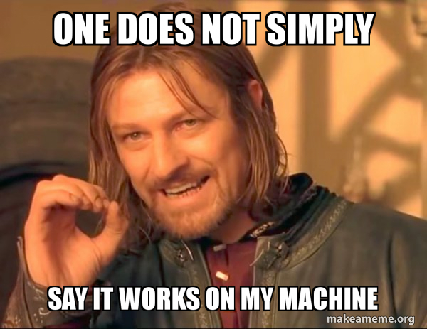
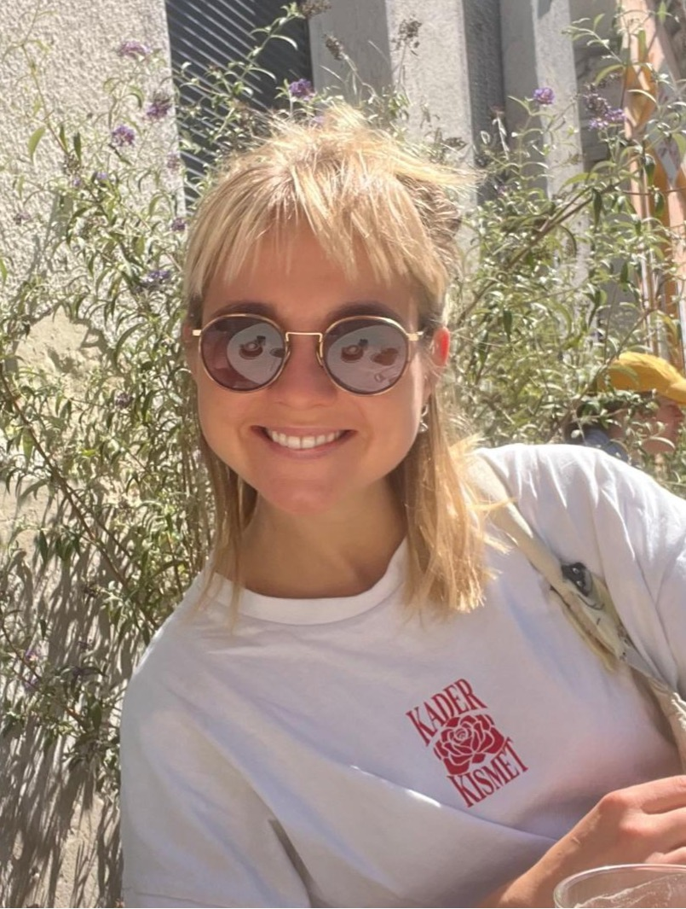

```{r set-options, echo=FALSE, cache=FALSE, warning=FALSE}
options(width = 100)
library(knitr)
library(purrr)
```


# Welcome to Introduction to Programming!


## The reality of economics research and work

<div style="margin-top: 3em;"></div>

#### Whether you're working with data or with economic models, ...

  - You will write **code** and **documents** on your own machine.
  - You will **collaborate** with colleagues, for your thesis, research projects, and in industry.
  - You will **share**, **publish** and **reuse** your code.

#### ... and ...

  - **Someone else** will need to run your code, understand it, and build on it.


## This course is about programming

<div style="margin-top: 3em;"></div>

##### Learning to program has become comparatively easy

<div style="margin-top: 1em;"></div>

  - Learn a programming language like **R** or **Python**,
  - Write code that works on your machine,
  - Solve problems with models or data

#### ... are now the A-B-C of an economist's toolkit.


## ... and programming with reproducibility

<div style="margin-top: 3em;"></div>

##### Learning to program in a way that is reproducible, reusable and collaborative is harder

<div style="margin-top: 1em;"></div>

:::{.columns style="align-items: flex-start;"}
::: {.column width="60%"}

<div style="margin-top: 2em;"></div>

  - Design and execute projects in a systematic and reproducible way.
  - Write code that is reusable, maintainable and easy to share.
  - Apply collaborative code development practices.

:::
::: {.column width="40%"}

:::
:::


## Skills you'll develop in this course

- Write **modular code**, **document functions**, implement **error handling**.
- Collaborate using **Git** and **version control**, manage shared code.
- Structure data in **relational databases** and query with **SQL** for systematic data workflows.
- Produce code that works not just on your machine, but in settings that reflect real work in research and industry.


## Let's get to work!

- Learn essential programming practices in **Python**.
- Build tools using **object oriented programming**.
- Learn **git** and **github**.
- Learn **SQL** and **relational databases**.

<div style="margin-top: 1em;"></div>

#### At the end of this course, you will be able to produce structured and impactful work as an economist.


## This course is introductory, and it is not...

<div style="margin-top: 3em;"></div>

#### Introductory yes ✅, but not in the traditional sense of the term ❌.

<div style="margin-top: 1em;"></div>

- As said, learning a new programming language (Python) has become comparatively easier.
- We will cover the basics of Python, but always with the goal of learning to program in a way that is reproducible, reusable and collaborative.
- All of you know R because of Data Handling, many of you did DSF, you are learning Econometrics this semester: an introduction to programming is beyond the point.

<div style="margin-top: 3em;"></div>

- We want you to develop a **mindset**!


## Fair warning

- Version `1.0` of this course. This is the first time we give this course.
- Materials and syllabus are brand new.
- We will be learning and improving the course together with you.


# About us


## About us
<br>

<div class="custom-table">

| | | | | | |
|:---:|:---:|:---:|:---:|:---:|:---:|
|  |  |  |  |  |  |
| <span style="font-size: 0.8em;">Aurélien<br>Sallin</span> | <span style="font-size: 0.8em;">Franziska<br>Bender</span> | <span style="font-size: 0.8em;">Lea<br>Tschan</span> | <span style="font-size: 0.8em;">Valentina<br>Sontheim</span> | <span style="font-size: 0.8em;">Andrija<br>Lukovic</span> | <span style="font-size: 0.8em;">Johannes<br>Cordier</span> |

</div>
<style>
.custom-table table {
    width: auto;
    table-layout: auto;
}
.custom-table table th,
.custom-table table td {
    width: auto;
    border-top: 0px;
    border-bottom: 0px;
    white-space: nowrap;
}
.custom-table tbody tr:first-child td {
    padding-bottom: 0em !important;
}
.custom-table tbody tr:last-child td {
    padding-top: 0em !important;
    text-align: left !important;
    vertical-align: top;
}
.custom-table tbody tr:last-child {
    line-height: 0.8;
}
.custom-table img {
    max-width: none;
    width: auto;
    display: block;
    margin-bottom: 0.1em;
}
.custom-table thead th, .custom-table tr:nth-child(1) {
    background-color: white;
}
</style>


# Course structure and Syllabus

## Course concept: lectures

- 11 Lectures (Friday morning)
  - Background/Concepts
  - Some classes will be focused on programming together, others will be more theoretical.


## Course concept: exercises

- 8 weekly exercise sessions
  - Hands-on exercises/tutorials with exercise sheets handed out every other week
  - Two groups, 4 teaching assistants. One assistant leads the session, the other one assists you personally.
  - **Starts at 12:30** without break until 14:00.

\

- Q&A sessions for the group project: **08.05.2026** and **15.05.2026**.


## Course structure: part 1

<div style="margin-top: 2em;"></div>

##### Set up your environment, learn to work together with version control and git.

<div style="margin-top: 1em;"></div>

<table style="font-size: 0.85em; width: 100%; border-collapse: collapse;">
  <style>
    tbody tr { border: none !important; }
    tbody td { border: none !important; padding: 0.4em 0.4em!important ; }
    thead th { padding: 0.8em 0.4em !important; }
  </style>
  <colgroup>
    <col style="width: 15%">
    <col style="width: 38%">
    <col style="width: 18%">
    <col style="width: 15%">
    <col style="width: 14%">
  </colgroup>
  <thead>
    <tr style="border-bottom: 2px solid black;">
      <th style="text-align: left;">Lecture</th>
      <th style="text-align: left;">Topic</th>
      <th style="text-align: left;">Instructor</th>
      <th style="text-align: left;">Date</th>
      <th style="text-align: left;">Date Exercise</th>
    </tr>
  </thead>
  <tbody>
    <tr style="background-color: #F0F0F0;">
      <td><strong>Lecture 1</strong></td>
      <td>The big picture. Set up your environment.</td>
      <td>Aurélien & Franziska</td>
      <td>20.02.2026</td>
      <td>20.02.2026</td>
    </tr>
    <tr>
      <td><strong>Lecture 2</strong></td>
      <td>Working together: intro to version control and git</td>
      <td>Aurélien</td>
      <td>27.02.2026</td>
      <td>27.02.2026</td>
    </tr>
    <tr style="background-color: #F0F0F0;">
      <td><strong>Lecture 3</strong></td>
      <td>Working together: more about version control and git</td>
      <td>Aurélien</td>
      <td>06.03.2026</td>
      <td>06.03.2026</td>
    </tr>
  </tbody>
</table>


## Course structure: part 2

<div style="margin-top: 2em;"></div>

##### Learn Python from basics to classes, error handling, documentation, and debugging.

<div style="margin-top: 1em;"></div>

<table style="font-size: 0.85em; width: 100%; border-collapse: collapse;">
  <style>
    tbody tr { border: none !important; }
    tbody td { border: none !important; padding: 0.4em 0.4em!important ; }
    thead th { padding: 0.8em 0.4em !important; }
  </style>
  <colgroup>
    <col style="width: 15%">
    <col style="width: 38%">
    <col style="width: 18%">
    <col style="width: 15%">
    <col style="width: 14%">
  </colgroup>
  <thead>
    <tr style="border-bottom: 2px solid black;">
      <th style="text-align: left;">Lecture</th>
      <th style="text-align: left;">Topic</th>
      <th style="text-align: left;">Instructor</th>
      <th style="text-align: left;">Date</th>
      <th style="text-align: left;">Date Exercise</th>
    </tr>
  </thead>
  <tbody>
    <tr style="background-color: #F0F0F0;">
      <td><strong>Lecture 4</strong></td>
      <td>Intro to python</td>
      <td>Franziska</td>
      <td>13.03.2026</td>
      <td>13.03.2026</td>
    </tr>
    <tr>
      <td><strong>Lecture 5</strong></td>
      <td>Python for Data: Pandas and Matplotlib</td>
      <td>Franziska</td>
      <td>20.03.2026</td>
      <td>20.03.2026</td>
    </tr>
    <tr style="background-color: #F0F0F0;">
      <td><strong>Lecture 6</strong></td>
      <td>Python for Data: Pandas and Matplotlib</td>
      <td>Franziska</td>
      <td>27.03.2026</td>
      <td>27.03.2026</td>
    </tr>
    <tr>
      <td colspan="5" style="text-align: center; padding: 0.8em !important;"><em>Break</em></td>
    </tr>
    <tr style="background-color: #F0F0F0;">
      <td><strong>Lecture 7</strong></td>
      <td>Python: Introduction to Classes (OOP)</td>
      <td>Franziska</td>
      <td>17.04.2026</td>
      <td>17.04.2026</td>
    </tr>
    <tr>
      <td colspan="3" style="color: #DC143C; font-weight: bold; font-style: italic;">&nbsp;&nbsp;Publication of group project, deadline for group formation</td>
      <td style="color: #DC143C; font-weight: bold;">20.04.2026</td>
      <td></td>
    </tr>
    <tr style="background-color: #F0F0F0;">
      <td><strong>Lecture 8</strong></td>
      <td>Error Handling, Documentation, Debugging</td>
      <td>Franziska</td>
      <td>24.04.2026</td>
      <td>24.04.2026</td>
    </tr>
  </tbody>
</table>


## Course structure: part 3

<div style="margin-top: 2em;"></div>

##### Learn about databases, SQL, and DevOps practices.

<div style="margin-top: 1em;"></div>

<table style="font-size: 0.85em; width: 100%; border-collapse: collapse;">
  <style>
    tbody tr { border: none !important; }
    tbody td { border: none !important; padding: 0.4em 0.4em!important ; }
    thead th { padding: 0.8em 0.4em !important; }
  </style>
  <colgroup>
    <col style="width: 15%">
    <col style="width: 38%">
    <col style="width: 18%">
    <col style="width: 15%">
    <col style="width: 14%">
  </colgroup>
  <thead>
    <tr style="border-bottom: 2px solid black;">
      <th style="text-align: left;">Lecture</th>
      <th style="text-align: left;">Topic</th>
      <th style="text-align: left;">Instructor</th>
      <th style="text-align: left;">Date</th>
      <th style="text-align: left;">Date Exercise</th>
    </tr>
  </thead>
  <tbody>
    <tr style="background-color: #F0F0F0;">
      <td><strong>Lecture 9</strong></td>
      <td>Short overview of databases and relational database management systems</td>
      <td>Aurélien</td>
      <td>01.05.2026</td>
      <td>01.05.2026</td>
    </tr>
    <tr>
      <td><strong>Lecture 10</strong></td>
      <td>Devops, Continuous Integration</td>
      <td>Aurélien</td>
      <td>08.05.2026</td>
     <td style="color: #2c640b; font-style: italic; padding-left: 1.5em;">Q&A Session, 08.05.2026</td>
    </tr>
    <tr style="background-color: #F0F0F0;">
      <td><strong>Lecture 11</strong></td>
      <td>Conclusion, Q&A, Case Study</td>
      <td>Aurélien & Franziska</td>
      <td>15.05.2026</td>
      <td style="color: #2c640b; font-style: italic; padding-left: 1.5em;">Q&A Session, 15.05.2026</td>
    </tr>
    <tr>
      <td colspan="2" style="color: #DC143C; font-style: italic; padding-left: 1.5em;">&nbsp;&nbsp;Submission Group Project</td>
      <td></td>
      <td colspan="2" style="color: #DC143C; font-weight: bold;">20.05.2026, 23:59</td>
    </tr>
    <tr style="background-color: #F0F0F0;">
      <td><strong>Lecture 12</strong></td>
      <td>Exam</td>
      <td>Aurélien & Franziska</td>
      <td>22.05.2026</td>
      <td style="color: #2c640b; font-style: italic; padding-left: 1.5em;">No Exercise session</td>
    </tr>
  </tbody>
</table>


# Examination

## Exam information: Group project

#### Goals
The goal of this project is to move beyond simple scripts and build a reusable Python tool for economic analysis. Working in groups, you will identify an economic question, source a relevant dataset, and build a Python class that automates the cleaning, analysis, and visualization of that data.

You will be submitting a collaborative Git repository including the tool you developed and two Quarto (`.qmd`) documents: A **Research Brief** (the results) and a **User Manual** (the instructions) so that anyone can pick up your tool and use it instantly.

*You will get more Information on what we expect throughout the course, and a fact sheet on April, 20th*


## Exam information: Project timeline

<div style="margin-top: 1em;"></div>

- **April 20th**: Deadline for group formation. Group of five people (groups are created on Canvas, you can create your own groups, and incomplete groups will be reassigned and/or filled by the instructors if needed).
- **May 20th, 23:59**: Submission.


## Exam

- **May 22nd, 10:15**: Exam.
- Questions about project and course. Multiple choice for lectures, and essay questions to the group project.
- You don't need to write code, but you need to understand code and interpret it.


# The tools

## Core course resources

- Everything on Canvas, then on github
- Only one Canvas page
- Questions only through the Canvas forum!


## Contact for personal questions only!

- Aurélien : until Break
- Franziska: after break.
- Do not contact the assistants regarding organisational questions.

