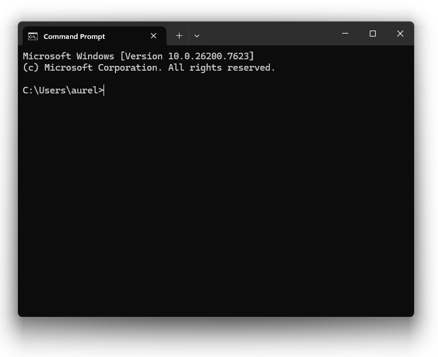
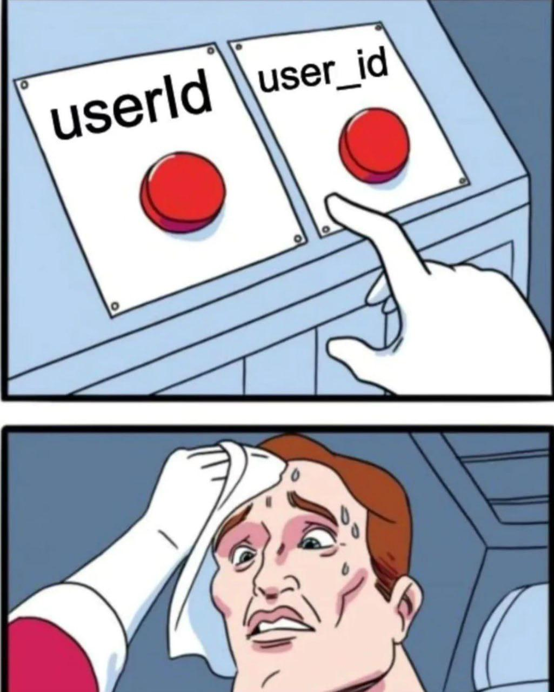
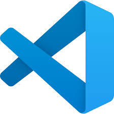
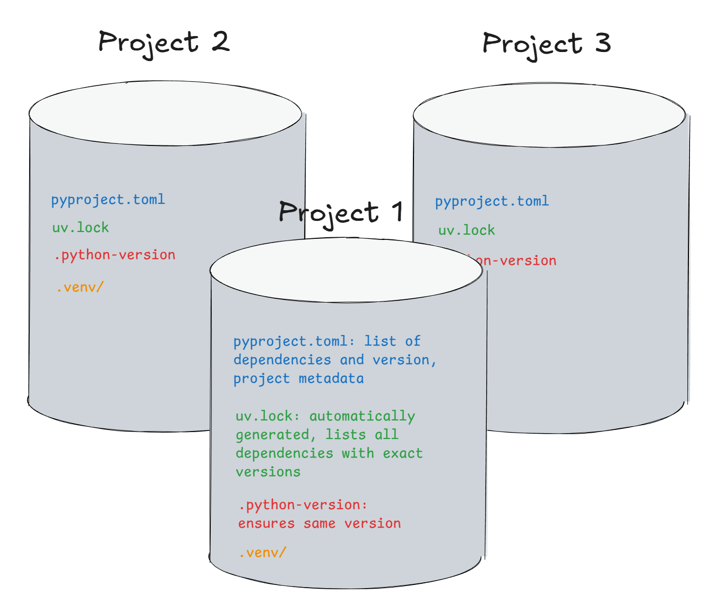

```{r set-options, echo=FALSE, cache=FALSE, warning=FALSE}
options(width = 100)
library(knitr)
library(purrr)
```

## Goals for today

In the next 45 minutes:

- learn what a **terminal** is and why we use it
- set up an efficient (and professional) programming **environment** with an IDE
- install **Python** and understand environments
- prepare everything needed for the next lectures

We will address main concepts in the lecture, and then get hands-on in the guided exercise session this afternoon.


# Using a terminal

## What is a terminal?

The terminal is a text-based interface that allows you to interact directly with your computer/operating system by typing commands.

#### Alternative names:

"terminal", "command line", "shell", "command prompt"

#### Some terminology:

  - **Terminal**: the window where you type commands and see output
  - **Shell**: the program that interprets your commands (e.g. bash, zsh, PowerShell)

<br>


## Why use a terminal

Almost everything you can do with a graphical interface can also be done from the terminal.

#### The terminal is often:

  - faster for repetitive tasks
  - more precise and reproducible
  - easier to automate
  - available on almost every system

Because of this, terminals are widely used in programming, data science, and research workflows.


## Opening a terminal

::: {.columns}

::: {.column width="50%"}

### macOS

**How to open:**

- Press Cmd + Space
- Type "Terminal"
- Press Enter

:::

::: {.column width="50%"}

### Windows

**How to open:**

- Open the Start menu
- Search for "Command Prompt" or <br> "Windows Terminal"
:::

:::

#### On Windows, you may see different terminals:

- **Command Prompt (CMD)**: lightweight, text-based, older (early days of Windows), very basic
- **PowerShell**: modern, powerful, widely used, CMD on steroids
- **Windows Terminal**: a modern app that can host both

For this course: Use Command Prompt in Windows Terminal.


## Opening your terminal

<div style="text-align: center;">
  
</div>

When you first open Terminal you typically are placed in your **home directory**. You can navigate to other directories (folders) using terminal commands.


## On files, paths, and shortcuts

With the terminal, you access and work with **files**. A file is a container of data (remember from Data Handling: `0`s and `1`s).

- Files have **extensions** (.txt, .csv, .pdf)
- Files live inside **directories** (folders)
- Every file has a unique location called a **path**


## On files, paths, and shortcuts

To access files, their location must be given with **paths**. Paths describe where a file is located.

##### Absolute path:

- starts from the root of the file system
- example: `C:/Users/Bilbo/Documents/TheRedBookofWestmarch.txt`

##### Relative path:

- starts from your current working directory
- example: `Documents/TheRedBookofWestmarch.txt`


## On files, paths, and shortcuts

From the terminal, you can use shortcuts instead of absolute paths.

##### Useful path shortcuts:

<div style="font-family: monospace;">
`.`&nbsp;&nbsp;&nbsp;&nbsp;current directory

`..`&nbsp;&nbsp;&nbsp;&nbsp;parent directory

`~`&nbsp;&nbsp;&nbsp;&nbsp;your home directory
</div>

#### Examples:
  - file in the parent directory: `../file.txt`
  - your Documents folder: `~/Documents`


## Main terminal commands

When you first open Terminal you typically are placed in your **home directory**.

##### Main commands:

<table style="width:100%; table-layout:fixed; font-size:0.75em;">
  <colgroup>
    <col style="width:45%;">
    <col style="width:27.5%;">
    <col style="width:27.5%;">
  </colgroup>
  <thead>
    <tr>
      <th>Description</th>
      <th>bash/macOS</th>
      <th>Command Prompt (Windows)</th>
    </tr>
  </thead>
  <tbody>
    <tr>
      <td>Check your current directory (<strong>p</strong>rint <strong>w</strong>orking <strong>d</strong>irectory)</td>
      <td><code>pwd</code></td>
      <td><code>cd</code></td>
    </tr>
    <tr>
      <td>List the files in the current directory</td>
      <td><code>ls</code></td>
      <td><code>dir</code></td>
    </tr>
    <tr>
      <td>Move into and out of the directory (<strong>c</strong>hange <strong>d</strong>irectory)</td>
      <td><code>cd &lt;directory&gt;</code></td>
      <td><code>cd &lt;directory&gt;</code></td>
    </tr>
    <tr>
      <td>Create a directory (<strong>m</strong>a<strong>k</strong>e <strong>dir</strong>ectory)</td>
      <td><code>mkdir data</code></td>
      <td><code>mkdir data</code></td>
    </tr>
  </tbody>
</table>

#####  Tips:

- Running `cd` without arguments takes you to `~`
- Use Tab for auto-completion
- Use arrow keys to browse command history
- All these commands work from wherever your shell is currently pointing
- Look at Brad Traversy's [Common Terminal Commands](https://gist.github.com/bradtraversy/cc180de0edee05075a6139e42d5f28ce)


## Working with files in a terminal
<table style="width:100%; table-layout:fixed; font-size:0.75em;">
  <colgroup>
    <col style="width:30%;">
    <col style="width:35%;">
    <col style="width:35%;">
  </colgroup>
  <thead>
    <tr>
      <th>Description</th>
      <th>bash/macOS</th>
      <th>Command Prompt (Windows)</th>
    </tr>
  </thead>
  <tbody>
    <tr>
      <td>Create an empty file</td>
      <td><code>touch hello.txt</code></td>
      <td><code>echo. &gt; hello.txt</code></td>
    </tr>
    <tr>
      <td>Delete a file</td>
      <td><code>rm hello.txt</code></td>
      <td><code>del hello.txt</code></td>
    </tr>
    <tr>
      <td>Print file contents</td>
      <td><code>cat hello.txt</code></td>
      <td><code>type hello.txt</code></td>
    </tr>
    <tr>
      <td>Edit a file</td>
      <td><code>nano hello.txt</code></td>
      <td><code>notepad hello.txt</code></td>
    </tr>
    <tr>
      <td>Copy a file</td>
      <td><code>cp hello.txt hello_copy.txt</code></td>
      <td><code>copy hello.txt hello_copy.txt</code></td>
    </tr>
    <tr>
      <td>Move/rename a file</td>
      <td><code>mv hello.txt goodbye.txt</code></td>
      <td><code>move hello.txt goodbye.txt</code></td>
    </tr>
  </tbody>
</table>

MacOS and Linux (`bash`, `zsh`) are unix systems. That's why Mac and Linux use the same terminal commands (ls, cat, etc.), while Windows uses different ones (dir, type, etc.).


## Naming Conventions

#### Use Case Styles:

- 🐍 **`snake_case`** (`my_file_name.py`)
- 🐫 **`camelCase`** (`myFileName.py`)
- 🍢 **`kebab-case`** (`my-file-name.py`)


#### Don'ts:

  - **Do not use spaces** in folder or file names! Never.
  - Avoid special characters (remember Data Handling and encoding nightmares).
  - Make sure to **not switch styles** within a project.


## Naming Conventions: 🐍, 🐫 or 🍢

<div style="text-align: center;">
  
</div>

Following an established convention will not make you look like a complete novice. 😎🆒


# On IDEs

## What is an IDE?

An **IDE** (**I**ntegrated **D**evelopment **E**nvironment) is a tool designed to help you write, run, and manage code efficiently.

Compared to a basic text editor, an IDE typically provides:

  - syntax highlighting
  - code completion and suggestions
  - error detection
  - integrated terminal
  - debugging tools
  - version control integration (e.g. Git)

These features reduce errors and make programming more structured and productive.

**Examples**: VSCode, Pycharm, RStudio, Posit


<!--
## IDE is more complete than a code editor (to remove)

A text editor edits plain text and has no understanding of programming languages

A code editor understands programming languages and provides syntax highlighting and basic assistance

An IDE combines a code editor with tools to run, debug, test, and manage projects (cf RStudio)
-->

## Visual Studio Code

Visual Studio Code (VS Code) is a lightweight but powerful code editor that behaves like a full IDE through **extensions**.

::: {.columns}
::: {.column width="55%"}

<div style="font-size: 0.85em;">

  - free and open source
  - available on Windows, macOS, and Linux
  - widely used in academia and industry
  - well suited for Python, R, and many other languages
  - very versatile and flexible!
  - integrated terminal
  - extensions for Git, notebooks, linters, and formatters
  - integrated Copilot!
  - syncs to all machines with a GitHub account

</div>

:::
::: {.column width="45%"}

<br>

<div style="text-align: center;">
  
</div>

:::
:::


## First setup (exercise session today)

<!--
@Aurelien - do students know what linting is? will you introduce pre-commit hooks later?
No, and no ;-)  I'll see with Franziska if she'll introduce it.
-->

- Install VS Code
- Install the “Data Science” profile
- Install extensions
- Run first Python script


# Python

## Why python?

Python is a good first (and second...) programming language.

- easy to read and write
- widely used in data science, economics, research, web development, automation, and AI
- flexible enough for small scripts and large projects


#### Python or R?

"**It simply does not matter**. If you stick around in data science long enough, you will eventually get in touch with both languages and, in turn, learn both. There is a huge overlap of what you can do with either of those languages. The point is, if you just start doing analytics using a programming language, both languages are guaranteed to carry you a long way. There is no way to tell for sure which one will be the more dominant language 10 years from now, or whether both will be around holding their ground the way they do now." -- Matthias Bannert, "Research Software Engineering"


## Python in the shell or in a .py file

You can use Python in different ways:

- interactively in the terminal
- by writing code in .py files
- by writing code in .ipynb Jupyter or .qmd Quarto notebooks

We will mainly work with .py files inside projects.

```{python}
#| eval: false
#| echo: true
print('Hello World')
print(2 + 3)             # addition(+)
print(3 - 1)             # subtraction(-)
```


## Coming from R

If you know R (which you do...), Python will feel familiar, but not identical.

#### Key differences to keep in mind:

- indentation is part of the language
- indexing starts at 0
- Python prefers **explicit, readable code**

<!-- here we're going more into details, but too much for students now. Python has less "weird" things than R, for instance in recycling vectors, or coercion, or compact writing loops with `apply` functions, etc. -->


## Indentation

In Python, indentation defines the structure of your code.

Blocks of code are created by indentation, not by curly braces {} like in many other languages.

- indentation is mandatory
- inconsistent indentation will break your code

```{python}
#| eval: false
#| echo: true
if x > 0:
    print("positive")
    print("still inside the block")

print("outside the block")
```

<!--
@Aurelien - Can enforce automatic indentation (at least in PyCharm) via Ctrl+alt+I
-->


## Counting starts at 0

In Python, many things start counting at 0 (**zero-based indexing**).

#### Example:
- the first element has index 0
- the second element has index 1

Common in programming, even if it feels unintuitive at first.


# Managing Python Projects

## The Problem: Dependency Conflicts

In R, you mostly use a single global library. In Python, **different projects need different python versions and package versions**.

\

#### What happens without isolation?

Imagine you're working on two projects:

- **Project A** (old research): needs `pandas` version 1.5
- **Project B** (new assignment): needs `pandas` version 2.0

If you install globally, updating for Project B **breaks Project A**!


## A note on Python Interpreters

A **Python interpreter** is the program that reads and executes your Python code.

\

Your computer may have zero, one, or even **multiple Python interpreters** installed:

- **System Python**: might come pre-installed with your operating system (Windows, macOS, some Linux)
- **User Python**: Python you install yourself (e.g. from python.org, Anaconda, or via `uv`)


##### Each project can use a different interpreter with a different Python version (3.11, 3.12, etc.).


## How R and Python differ

::: {.columns}
::: {.column width="50%"}
**R:**

  - Stronger standards for packages and package management (CRAN)
  - More backward compatibility
  - Global installation usually works
:::
::: {.column width="50%"}
**Python:**

  - Many packages, many python versions and interpreters
  - "Wild West" ecosystem
  - **Environments are essential**
:::
:::

<!--Yes, this is more complex than R! The tradeoff: Python gives you precision and reproducibility at the cost of more upfront setup. Once you learn it, you'll appreciate having full control.-->


## The Solution: Virtual Environments

Think of each project as having its own **kitchen**:

::: {.columns}
::: {.column width="50%"}
<div style="text-align: center;">
  
</div>
:::

::: {.column width="50%"}
<div style="text-align: center;">
  
</div>
:::
:::

- Each kitchen has its own tools, ingredients, and equipment
- If one recipe needs an old oven and another needs a new one, they don't conflict

**In Python:** A **virtual environment** is an isolated setup for each project with its own packages and Python version. This solves the conflict problem.


## The Tool: `uv`

##### `uv` is a modern Python package manager that makes environments **automatic and fast**

- manages virtual environments automatically
- installs packages very fast
- ensures reproducible setups
- works consistently across systems

(Replaces pip, pip-tools, virtualenv, `pip freeze` or `requirements.txt`)

\

**⚠️ Important:** Never install packages globally with system Python! **Always use environments**.


## Structure of a `uv` project

:::{.columns}
::: {.column width="50%"}

#### Each `uv` project has 3 key files
-  `.python-version`: python version to use
-  `pyproject.toml`: dependencies
-  `uv.lock`: exact versions of packages, automatically generated

`uv` generates a `.venv/` folder containing the actual environment (don't delete it!).


:::

::: {.column width="50%"}

<div style="text-align: center;">
  
</div>

:::
:::


## Getting started using `uv`

```{python}
#| eval: false
# Initialize a new project with its own environment
uv init my_project
cd my_project

# Add dependencies (creates/updates pyproject.toml)
uv add rich pandas

# When joining an existing project: install from lock file
uv sync

# Run code (automatically uses the project's venv)
uv run main.py
```

`uv` will store in each environment the version of the interpreter, the packages, and will "lock" each package version for the project in a `lock` file.


# Until next time


## For next time

- install git: we will start using version control from the next lecture.


## References:

- Matthias Bannert, [Research Software Engineering](https://rse-book.github.io/interaction.html)
- Lecture notes of Basics of Computing Environments for Scientists, [Physics department of ETH Zurich](https://compenv.phys.ethz.ch/python/ecosystem_1/00_overview/)