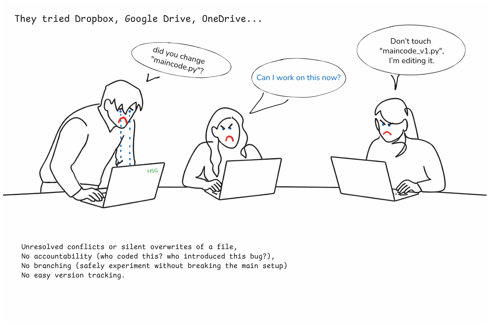
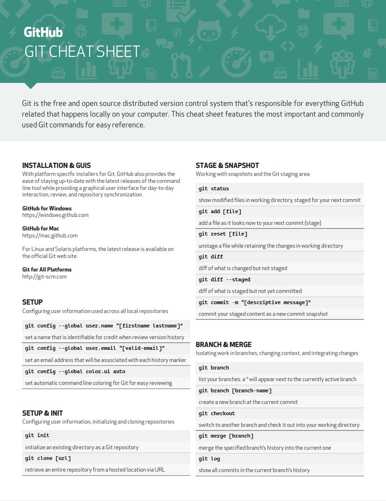
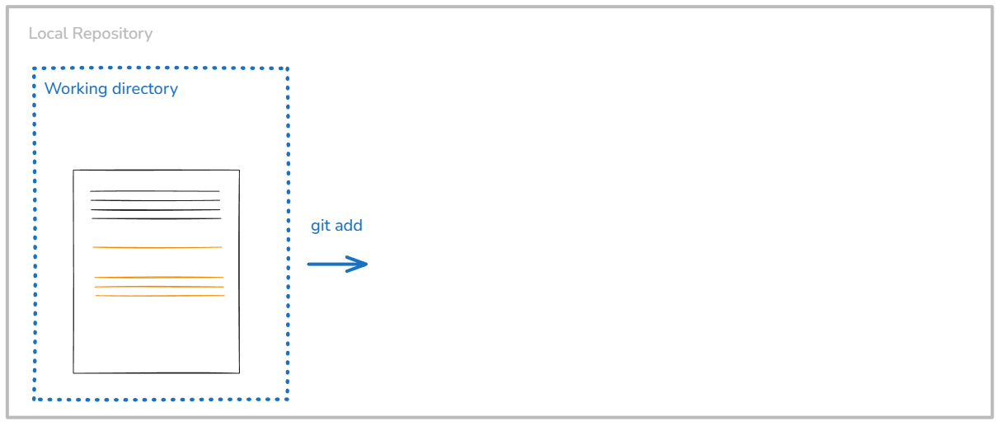
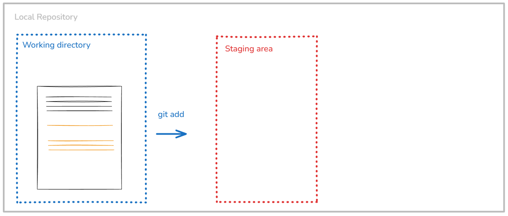
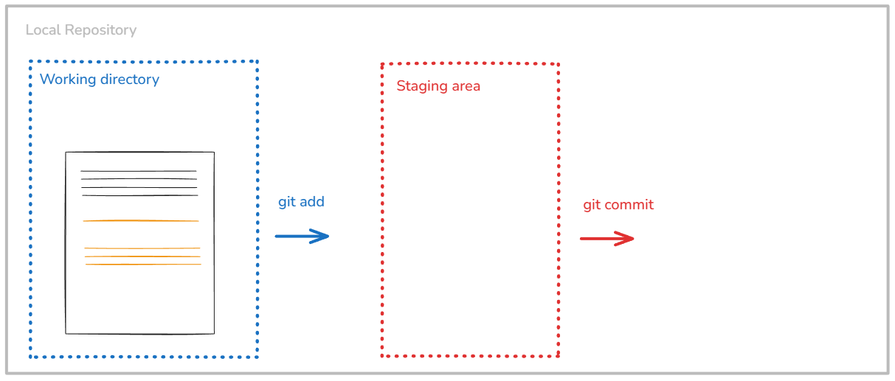

```{r set-options, echo=FALSE, cache=FALSE, warning=FALSE}
options(width = 100)
library(knitr)
library(purrr)
```

## Goals for today

In this lecture, we will:

- understand what is **version control** to collaborate
- know basic commands in `git`

\

In the next lecture, we will

- create a github account
- learn how to collaborate with a remote repository with `git` and GitHub


## Vision

Track your work. Collaborate on programming/data science projects.


## Prerequisites for today

- You have installed `git` on your computer
- You have installed VSCode and the `git` extension (part of the data science profile)

##### Git feels complicated at first!!!

I am trying to give you a good intuition for how it works and what it does. You will need to practice to get used to it. Don't worry if you don't understand everything at first, just try to get the general idea and we will practice in the exercises.


# What is git?

## A daily situation...

{fig-alt="Git story" width="100%" fig-align="center" }

## A daily situation...

{fig-alt="Git story" width="100%" fig-align="center"}

## A daily situation...

{fig-alt="Git story" width="100%" fig-align="center"}

## A daily situation...

{fig-alt="Git story" width="100%" fig-align="center"}


## What is git?

#### Version Control System (VCS)

  - Looks at the changes in your files
  - Records all changes over time to give you a full history
  - Similar to “track changes” in Microsoft Word


#### Git only looks at and tracks the changes in a file

{fig-alt="Git story" width="100%" fig-align="center"}


## Why should we learn git?

- Very hard to lose files with git
- Great for collaboration
- History allows you to go back and understand changes or revert when there are problems
- Reproducibility
- In demand for any data science job


## Git and the Command Line Interface (CLI)

#### Git is usually used from a CLI (like a terminal)

- Learn git commands and use them in a terminal.
- Very flexible, but a bit unintuitive


#### But also from Graphical User Interface (GUI)

- Most applications nowadays: GitHub Desktop, VSCode extension, RStudio
- Often easier to use and no commands needed.
- Easier to visualize the steps.


## In this course

:::: {.columns}

::: {.column width="60%"}

<br>

We will learn the basic commands of git in a CLI, and we will use the GUI in VSCode

All the commands we will learn are available in the official [Git Cheat Sheet](https://education.github.com/git-cheat-sheet-education.pdf). Please download the sheet.
:::

::: {.column width="40%"}
{fig-alt="Git cheatsheet" width="100%"}
:::
::::


## Setting up git

##### From the cli:

  - In VSCode, open a terminal and select `git bash` (Windows) or `bash` (Linux/MacOS).

OR:

  - On Windows, open Git Bash (start menu -> Git Bash). Make sure you've installed git beforehand.
  - On MacOS, open the Terminal app.
  - On Linux, open your distribution’s (or any other) terminal emulator.
  - Let’s do this together now!


## Setting up git

Run the following commands in your terminal to correctly configure git on your computer.

```{bash}
# Add your name
git config --global user.name "Your Name"

# Add your email address
git config --global user.email "your.email@unisg.ch"

# Use modern main branch name
git config --global init.defaultbranch main
```


#### A detail (you only need to do this once at config, not to remember for the course):
```{bash}
# For Linux/Mac:
git config --global core.autocrlf input

# For Windows:
git config --global core.autocrlf true
```

Why? Windows saves linebreaks (enter) differently then Linux/Mac does. Remember Data Handling (Linux / macOS: LF `\n`, Windows: CRLF `\r\n`). Git may interpret this as code changes. This setting prevents unnecessary diffs and conflicts.


# Git: intuition

## We start from a local directory

{width="640px"}

- A project in git is called a **repository** (or **repo** for short) and it always corresponds to a directory on your machine. This is usually where you save your project.
- Nothing here is shared with others yet.
- Git always works locally first.


## Working in your directory as usual (same *, different day)

{width="640px"}

- The working directory is where you write code, edit files, run scripts, etc.
- Files here may be untracked, modified or unfinished
- Saving a file only affects the working directory. `Git` does nothing yet.


## We select files to be tracked

{width="640px"}

- Use `git add` to select the files that you want to include in your project history, that you want to track, and that you want to share with others.


## We *add* files to the staging area

{width="640px"}

- The staging area is a **list of changes** you are about to record.
- It is not a folder and not a backup.
- You can stage edits that logically belong together.


## We *commit* the staged changes

{width="640px"}

- Use `git commit` to record the staged changes and creates a **snapshot in time**.
- It adds a message explaining why the change was made.
- ! Commits are: permanent, ordered, traceable, attributable to a person


## We now have a git repository with a history of our project

{width="640px"}

- Git repository is the history of your project.
- It contains all commits, who changed what, when and why.
- This is what enables undoing mistakes, collaboration, branching, merging


## We can then share our repository with others

{width="640px"}

- For next week.


## Summary

Three levels: changes can be either **unstaged**, **staged** or **commited**.

  - When we first make a change it is unstaged
  - Once we **add** the change to the staging area it is **staged**
  - We can then **commit** all staged changes

Files are added to the staging area with `git add <path to file or directory>`

All files in the staging area are commited with `git commit`


# Let's start

## Initialize a git repository

Remember our folder structure:

```
Introduction_to_programming/
├── github_course_materials/ # is empty for now, you will clone the git repo in week 3
├── exercises/               # Student's own work
│   ├── week_01/
│   ├── week_02/
│   ├── ...
│   ├── week_12/
├── group_project/
│   ├── ...
```

We will **initialize a repo** in the exercises folder. You will have to initialize another repo in your group_project folder.


## Initialize a repo

This is done via the `init` command.

In your terminal from VSCode, navigate to your `cd Introduction_to_programming/exercises`. Then:

```bash
git init
# Initialized empty Git repository in /Users/Introduction_to_programming/exercises
```

With git init we turn the directory into a repository.

At this point, 🗂️ **tracking has started!**


## Add a file to the staging area

Let's write a text file "example.txt" using our terminal.

```bash
#| eval = false
echo "first steps in git" > example.txt
# verify
cat example.txt
```

Add `example.txt` to the staging area. Changes are added to the staging area with git add <path to file or directory>.

```bash
git add example.txt
```

- You can use git add . to add all unstaged changes in the current directory to the staging area
- You can also use * to represent any sort of filename e.g. add all .txt files via *.txt


## Seeing Changes: git status 👀
You can see the high-level changes and what is about to happen with `git status`

```bash
git status
# On branch main
# No commits yet
# nothing to commit (create/copy files and use "git add" to track)
```

Let's change the content of example.txt. Save it. Then run:

```bash
git status
# On branch main
# Changes not staged for commit:
#   (use "git add <file>..." to update what will be committed)
#   (use "git restore <file>..." to discard changes in working directory)
#         modified:   example.txt

# no changes added to commit (use "git add" and/or "git commit -a")
```


## Tracking Changes: git commit
All changes in the staging area are commited with `git commit`. Every commit needs a message!

Let’s commit the new change

```bash
git commit -m "Creating example.txt"
# [main (root-commit) ed61bb5] Adding example.txt
#  1 file changed, 1 insertion(+)
#  create mode 100644 example.txt

git status
# On branch main
# nothing to commit, working tree clean
```

Once a change is commited it becomes significantly harder to remove it.
<!--
The classic way to undo a commited change in git would be to make another commit with the reverse change.
Modifying a commit is possible, but you should now what you are doing. Typically this is called “changing history” and is (esp. in collaborative settings) frowned upon.
-->

<!--
Stuck in an Editor 🛗
Forgot the -m "insightful commit message"?

Every commit needs a message
If you don’t provide one, git will open an editor for you to write the message in
This editor may also open itself for other git commands
Every line with a # at the beginning is a comment and will be ignored by git (usually some helpful extra info)
Save and close the editor for git to proceed
Stuck in an Editor: Breaking Free ⛓️‍💥
The default editor in git is (usually) vim
-->


## Additional `git` commands

- `git diff`: see the actual unstaged changes to files which have already been commited before line by line
- `git reset`: reset your staging area (use `git reset <filename/directory>` for specific files)
- `git restore`: undo any changes to files (go back to last commit stage). It allows you to just go ahead and change your files without wasting time having to create backups. 💪
- `git log`: see the history of your commits (who changed what, when and why). You can move up and down with the arrow keys and leave the log view by pressing q.


## The anatomy of a git command 🔍️
Git commands, like many other CLI tools follow a certain structure:

```bash
git status
git commit -m "Adding example.txt"
git config --global user.name "Your Name"
```

With -h you can get help on any git command 🚨

```bash
git status -h
git commit -h
```


## Ignoring the ignorable: `git ignore`

#### By default, git will track all the files in your repository.

- If you want it to ignore certain files or filetypes, you have to tell it so explicitly.
- For instance: outputs that can be re-generated by your code, like intermediary data sets (csv), pdf reports that are automatically computed, graphs, `.DS_Store` files on MacOS.
- You also want to ignore `.venv/`: this directory is machine-specific (*environment realization*). However, you must track `pyproject.toml`and `uv.lock` (*environment definition*).

#### You can do this by using a file called `.gitignore`

- Every file will be compared against the list in `.gitignore` and if it matches, git will ignore the file
- (The `.gitignore` file itself is tracked just like any other file)


#### Classic example of a `.gitignore` file

```bash
# Ignore every file called data_countries.csv
myfile.pdf

# Ignore the file called data_countries.csv in the folder data at the root of your repository
/data/data_countries.csv

# Ignore all data and generated outputs
*.csv
*.xlsx
```


<!--
## Further notes on `.gitignore`

There can be multiple different `.gitignore` files at different levels (one global, different local ones at the repo level). The `.gitignore` applies only within the directory.

Once a file is tracked by git, adding it to the `.gitignore` will not do anything. You'll have to remove it from git (delete, and commit again).

.gitignore: global vs. local 🫥

There can be multiple different `.gitignore` files at different levels
There’s one global `.gitignore`, that will work across your whole computer
There are local `.gitignore` files within your repositories
You can even have a `.gitignore` file in a directory within your repository and it will apply only within that directory
You can find a list of very useful templates for local `.gitignore` files at https://github.com/github/gitignore.
A classic example for files to ignore globally are `.DS_Store` files on macOS.
-->


# Branches and merging

## What are git branches? 🌳

- Branches are **alternate realities**: they allow you to have different versions of your code within the same repository next to each other
- You can switch back and forth between branches
- In the end you can merge your changes back into your main branch

## Create a new branch

- Use `git checkout -b my-branch`: creates a branch and checks it out (you are leaving `main` and working on your new branch)
- You can work on your new branch as usual.
- Use `git status` to be aware on which branch you are on.
- Use `git checkout my-branch` to switch branches.


## Merging

- You can combine two different branches by merging them with each other using `git merge my-branch`
- You will merge the branch that you name in the command into the one you are currently on
- In most cases you will want to be on the main branch when using git merge (but not always!)
- Merging will create a new “merge” commit


## Going back through time with `git checkout`

You can go back to any previous commit (and many other things!) with `git checkout`.

- each commit has a "hash" (a commit id). You can go back to the a particular commit by referencing the hash.
- checkout sends you out of a branch, i.e. detached head. You need to explicitly switch to main (or to any other branch)

```bash
git checkout 795780d
```

## Merge conflicts

#### Merge conflicts occur when there are edits to the same file (and at the same location) on two different branches

- when combining changes from two branches, there is not always a clear solution.
- If git doesn’t know how to merge the two branches, we get a merge conflict
- Merge conflicts have to be manually resolved (by us)

If you merge your branches / edits before making more changes, you can avoid conflicts


## Illustration for merge conflicts

print screen.


## Resolving merge conflicts

- To resolve a merge conflict, we will have to pick one of the two versions
- Once a solution is picked for every conflict you can commit the solution and the merge continues / finishes
- Picking a solution is easiest to do by using GUI tools


# Lessons, Do's and don'ts

- Can be a bit complicated to use (esp. at first)
- History takes up file space (but only little)
- Struggles with large files
- Do not store data!
- You do need to explicitly use it i.e. it doesn’t just work in the background


Now you need to know almost everything you need (except branching, which will come).


Downloading a repository: git clone
Alternatively, we can download a repository from the internet using the clone command. This will create a new repository on our machine and fill it with the remote repository’s contents.

git clone https://github.com/open-teaching/git-murder-mystery.git