```{r set-options, echo=FALSE, cache=FALSE, warning=FALSE}
options(width = 100)
library(knitr)
library(purrr)
```

## Goals for today

In this lecture, we will:

- understand what is **version control** to collaborate
- know basic commands in Git

\

In the next lecture, we will

- create a GitHub account
- learn how to collaborate with a remote repository with Git and GitHub


## Prerequisites for today

- You have installed Git on your computer
- You have installed VSCode and the Git extension (part of the data science profile)

##### Git feels complicated at first!!!

- I am trying to give you a good intuition for how it works and what it does.
- You will need to practice to get used to it.
- Don't worry if you don't understand everything at first, just try to get the general idea and we will practice in the exercises.


# What is Git?

## A daily situation...

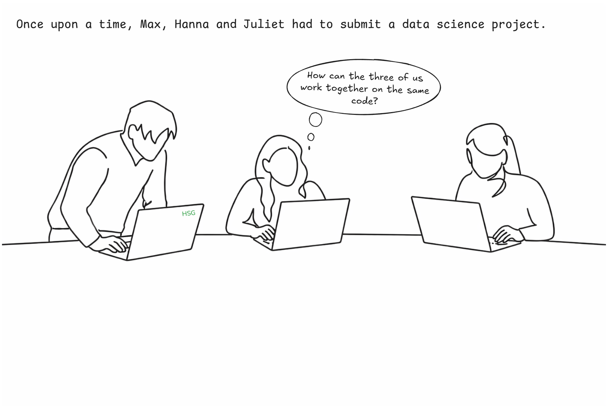{fig-alt="Git story" width="100%" fig-align="center" }

## A daily situation...

{fig-alt="Git story" width="100%" fig-align="center"}

## A daily situation...

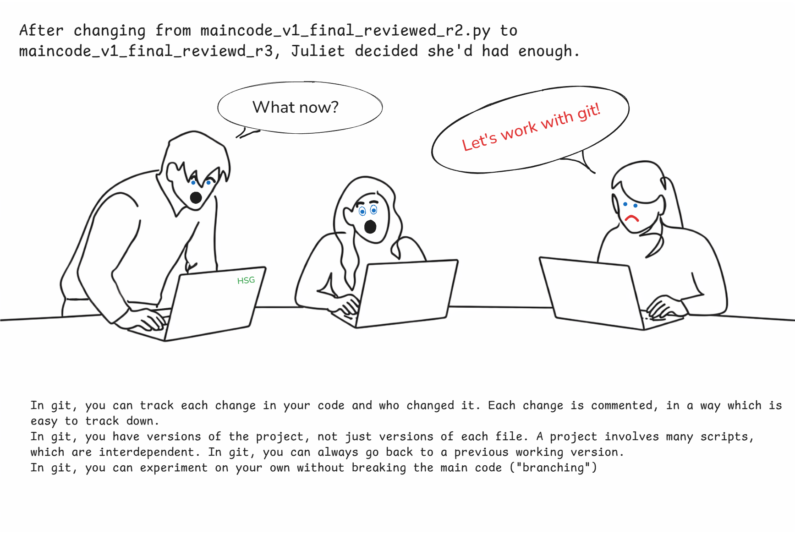{fig-alt="Git story" width="100%" fig-align="center"}

## A daily situation...

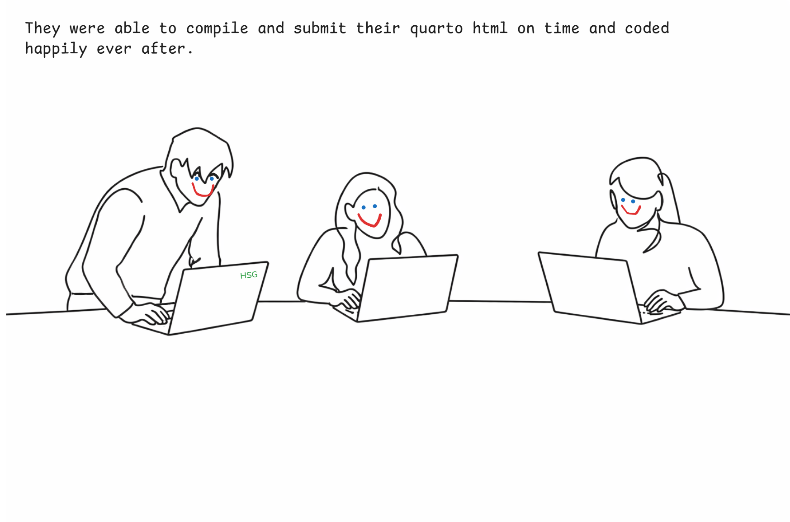{fig-alt="Git story" width="100%" fig-align="center"}


## What is Git?

#### Version Control System (VCS)

  - Looks at the changes in your files
  - Records all changes over time to give you a full history
  - Similar to “track changes” in Microsoft Word


#### Git only looks at and tracks the changes in a file

{fig-alt="Git story" width="100%" fig-align="center"}


## Why should we learn Git?

- Very hard to lose files with Git
- Great for collaboration
- History allows you to go back and understand changes or revert when there are problems
- Reproducibility
- In demand for any data science job


## Git and the Command Line Interface (CLI) {visibility="hidden"}

#### Git is usually used from a CLI (like a terminal)

- Learn Git commands and use them in a terminal.
- Very flexible, but a bit unintuitive


#### But also from Graphical User Interface (GUI)

- Most applications nowadays: GitHub Desktop, VSCode extension, RStudio
- Often easier to use and no commands needed.
- Easier to visualize the steps.


## In this course

:::: {.columns}

::: {.column width="60%"}

<br>

We will learn the basic commands of Git in a Command-Line Interface (CLI), and we will use the GUI in VSCode

All the commands we will learn are available in the official [Git Cheat Sheet](https://education.github.com/git-cheat-sheet-education.pdf). Please download the sheet.
:::

::: {.column width="40%"}
{fig-alt="Git cheatsheet" width="90%"}
:::
::::


## Setting up Git

##### From the CLI:

  - In VSCode, open a terminal and select Git Bash (Windows) or bash (Linux/MacOS).

OR:

  - On Windows, open Git Bash (start menu -> Git Bash). Make sure you've installed Git beforehand.
  - On MacOS, open the Terminal app.
  - Let’s do this together now!


## Setting up Git

Run the following commands in your terminal to correctly configure Git on your computer.

```bash
# Add your name
git config --global user.name "Your Name"

# Add your email address
git config --global user.email "your.email@unisg.ch"

# Use modern main branch name
git config --global init.defaultBranch main
```


#### A detail (you only need to do this once at config, not to remember for the course):
```bash
# For Linux/Mac:
git config --global core.autocrlf input

# For Windows:
git config --global core.autocrlf true
```

Why? Windows saves linebreaks (enter) differently then Linux/Mac does. Remember Data Handling (Linux / macOS: LF `\n`, Windows: CRLF `\r\n`). Git may interpret this as code changes. This setting prevents unnecessary diffs and conflicts.


# Git: intuition

## We start from a local directory

{width="640px"}

- A project in Git is called a **repository** (or **repo** for short) and it always corresponds to a directory on your machine. This is usually where you save your project.
- Git always works locally first (nothing shared).


## Working in your directory as usual

{width="640px"}

- The working directory is where you write code, edit files, run scripts, etc.
- Files here may be untracked, modified or unfinished
- Saving a file only affects the working directory. Git does nothing yet.


## We select files to be tracked

{width="640px"}

- Use `git add` to select the files that you want to include in your project history, that you want to track, and that you want to share with others.


## We *add* files to the staging area

{width="640px"}

- The staging area is a **list of changes** you are about to record.
- It is not a folder and not a backup.
- You can stage edits that logically belong together. Example: You edited 5 files but only 2 are ready.


## We *commit* the staged changes

{width="640px"}

- Use `git commit` to record the staged changes and creates a **snapshot in time**.
- It adds a message explaining why the change was made.
- ! Commits are: permanent, ordered, traceable, attributable to a person


## We now have a Git repository

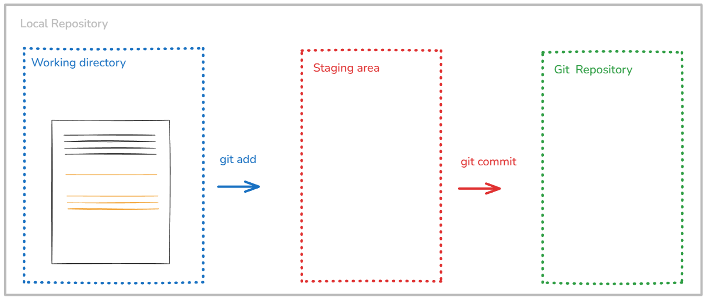{width="640px"}

- A Git repository is the history of your project.
- It contains all commits, who changed what, when and why.
- This is what enables undoing mistakes, collaboration, branching, merging


## We can then share our repository with others

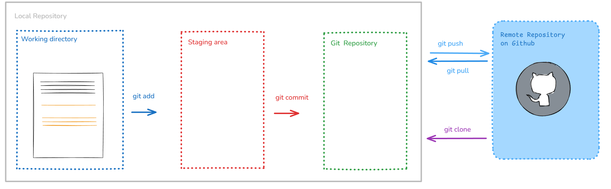{width="640px"}

- For next week!


## Summary

Three levels: changes can be either **unstaged**, **staged** or **committed**.

  - When we first make a change it is unstaged
  - Once we **add** the change to the staging area it is **staged**
  - We can then **commit** all staged changes

Files are added to the staging area with `git add <path to file or directory>`

All files in the staging area are committed with `git commit`


# Let's start

## Initialize a Git repository

Remember our folder structure:

```
Introduction_to_programming/
├── github_course_materials/ # is empty for now, you will clone the Git repo in week 3
├── exercises/               # Student's own work
│   ├── week_01/
│   ├── week_02/
│   ├── ...
│   ├── week_12/
├── group_project/
│   ├── ...
```

We will **initialize a repo** in the exercises folder. You will have to initialize another repo in your group_project folder.


## Initialize a repo

This is done via the `init` command.

In your terminal from VSCode, navigate to your `cd Introduction_to_programming/exercises`. Then:

```bash
git init
# Initialized empty Git repository in /Users/Introduction_to_programming/exercises
```

With `git init` we turn the directory into a repository.

At this point, 🗂️ **tracking has started!**


## Add a file to the staging area

Let's write a text file `example.txt` using our terminal.

```bash
echo first steps in git > example.txt # Windowns (cmd)
echo "first steps in git" > example.txt # Mac/Linux (bash)
```

Both create the same file content. Verify:

```bash
cat example.txt # Mac/Linux
type example.txt # Windows
```

Add `example.txt` to the staging area. Changes are added to the staging area with `git add <path to file or directory>`.

```bash
git add example.txt
```

- You can use `git add .` to add all unstaged changes in the current directory to the staging area (beware of sensitive files!)
- You can also use `*` to represent any sort of filename e.g. add all .txt files via `*.txt`


## Seeing Changes: git status 👀
You can see the high-level changes and what is about to happen with `git status`

```bash
git status
# On branch main
# No commits yet
# Changes to be committed:
#   (use "git rm --cached <file>..." to unstage)
#         new file:   example.txt
```

Let's change the content of "example.txt". Save it, then run:

```bash
git status
# No commits yet
#
# Changes to be committed:
#   (use "git rm --cached <file>..." to unstage)
#         new file:   example.txt
#
# Changes not staged for commit:
#   (use "git add <file>..." to update what will be committed)
#   (use "git restore <file>..." to discard changes in working directory)
#         modified:   example.txt
```


## Tracking Changes: `git commit`
All changes in the staging area are committed with `git commit`. Every commit needs a message!

Let’s add and then commit the new change

```bash
git add example.txt
git commit -m "Creating example.txt"
# [main (root-commit) fc0372c] Creating example.txt
#  1 file changed, 1 insertion(+)
#  create mode 100644 example.txt

git status
# On branch main
# nothing to commit, working tree clean
```

Once a change is committed it becomes significantly harder to remove it.
<!--
The classic way to undo a committed change in git would be to make another commit with the reverse change.
Modifying a commit is possible, but you should now what you are doing. Typically this is called “changing history” and is (esp. in collaborative settings) frowned upon.
-->


## Commit messages

:::{.columns style="align-items: flex-start;"}
::: {.column width="40%"}

<div style="margin-top: 2em;"></div>

  - "Add GDP data cleaning function" ✅
  - "Update code" ❌
  - "Fix missing values in `clean_gdp_data()`" 😋
  - "small changes" 🤯
  - "final final push to main" 😤

:::
::: {.column width="60%"}
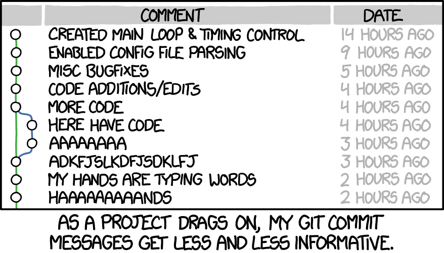
:::
:::

#### A good commit message: "What & Why"

- Keep it short and specific (< 50 characters)
- Use imperative mood: "Add", "Fix", "Update" (not "Added", "Fixed")


## Ignoring the ignorable: `.gitignore`

#### By default, Git will track all the files in your repository.

- If you want it to ignore certain files or filetypes, you have to tell it so explicitly.
- For instance: outputs that can be re-generated by your code, like intermediary data sets (csv), pdf reports that are automatically computed, graphs, `.DS_Store` files on MacOS.
- You also want to ignore `.venv/`: this directory is machine-specific (*environment realization*). However, you must track `pyproject.toml`and `uv.lock` (*environment definition*).

#### You can do this by using a file called `.gitignore`

- Every file will be compared against the list in `.gitignore` and if it matches, Git will ignore the file
- (The `.gitignore` file itself is tracked just like any other file)


## Ignoring the ignorable: `.gitignore`

#### Classic example of a `.gitignore` file

```bash
# Ignore every file called myfile.pdf
myfile.pdf

# Ignore the file called data_countries.csv in the folder data at the root of your repository
/data/data_countries.csv

# Ignore all data and generated outputs
*.csv
*.xlsx
```

**Do not store data on Git -> `.gitignore`**


<!--
## Further notes on `.gitignore`

There can be multiple different `.gitignore` files at different levels (one global, different local ones at the repo level). The `.gitignore` applies only within the directory.

Once a file is tracked by git, adding it to the `.gitignore` will not do anything. You'll have to remove it from git (delete, and commit again).

You can find a list of very useful templates for local `.gitignore` files at https://github.com/github/gitignore.
A classic example for files to ignore globally are `.DS_Store` files on macOS.
-->


# Branches and merging

## A project becomes a series of commits {.top}

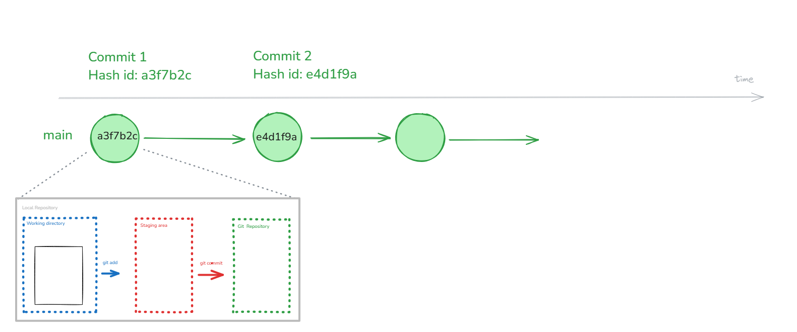{width=740px fig-align="center"}

- Git repository is the history of your project and contains all commits.
- Each commit is identified with a unique commit id (a hash), which is 40 hexadecimal characters long. The short form typically shown is 7 characters.


## Time-travel: `git checkout` for commits {.top}

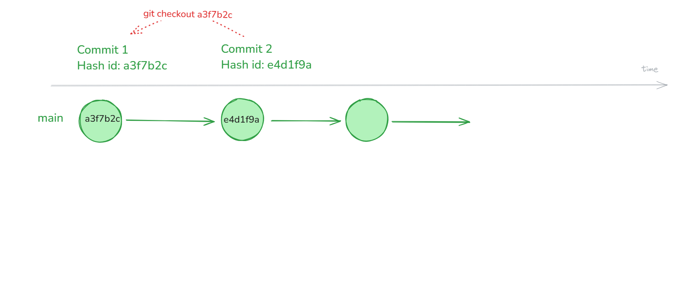{width=740px fig-align="center"}

- **Go to any old commit** with `git checkout` by referencing the hash: `git checkout a3f7b2c`
- This is for **viewing history**, not for switching branches (use `git switch` for branches!)
- `checkout` sends you **out of a branch**, i.e. **detached HEAD**. You need to explicitly switch to main (or to any other branch).

<!-- you can go to any commit, past or future -->


## A note on detached heads

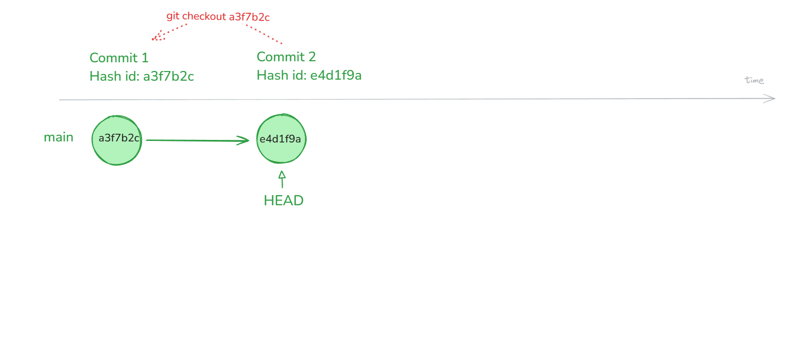{width=740px fig-align="center"}

- HEAD is Git's pointer to your current position in the project.
- It normally points to a branch that moves forward with commits.


## A note on detached heads

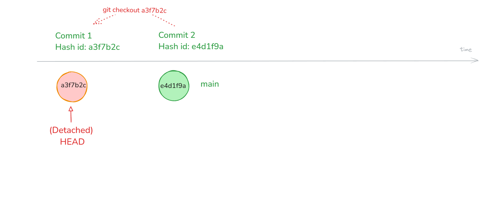{width=740px fig-align="center"}

- HEAD points to a specific commit, not the main branch! From the commit, you can look around and experiment
- Commits made here won't be on main. Use `git switch main` to get back to the main branch.


## What are Git branches? 🌳 {.top}

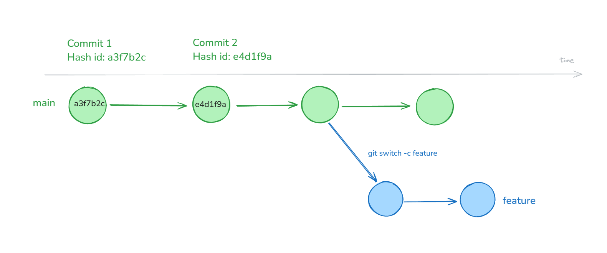{width=740px fig-align="center"}

- Branches are **alternate realities**: they allow you to have different versions of your code within the same repository next to each other
- You can switch back and forth between branches


## Create a new branch 🌳 {.top}

- Use `git switch -c my-branch`: creates a branch and checks it out (you are leaving `main` and working on your new branch)
- You can work on your new branch as usual.
- Use `git status` to be aware on which branch you are on.
- Use `git branch` to check the existing branches.
- Use `git branch -d <branch-name>` to safely delete (`-d`) a branch after it's merged.
- Use `git switch my-branch` to switch branches.

::: {.absolute bottom=10}
[Since Git 2.23, `git switch` is the recommended alternative to `git checkout` for switching branches.]{style="font-size: 0.7em; color: gray;"}
:::


## Why would you ever want to branch, and how often?

::: {.fragment}
#### Why branch?

- **To experiment:** try new ideas without risking the working version of your code
- **To work in parallel:** multiple people can work on different features at the same time
- **To isolate changes:** keep unfinished work separate from the main branch, e.g., when you are working on a piece of code that is not ready yet.

#### How often?

- In my experience: branch often
- Often it depends on the "merging policy" of your team.
:::


## Merging 🔀

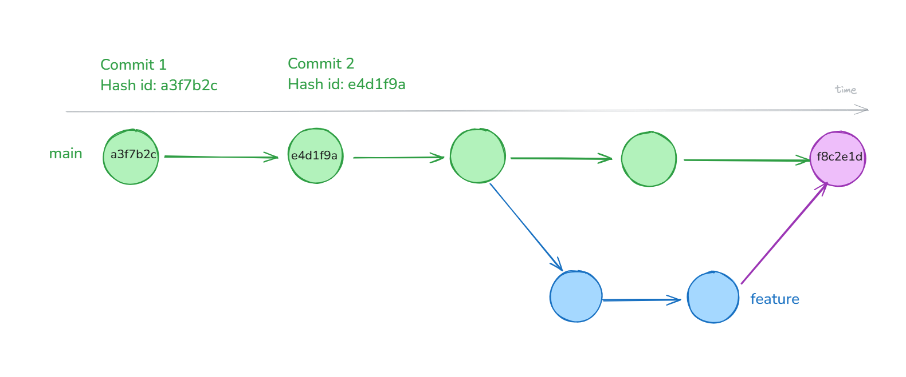{width=740px fig-align="center"}

- In the end you can merge your changes back into your main branch
- You can combine two different branches by merging them using `git merge my-branch`


## Merging 🔀

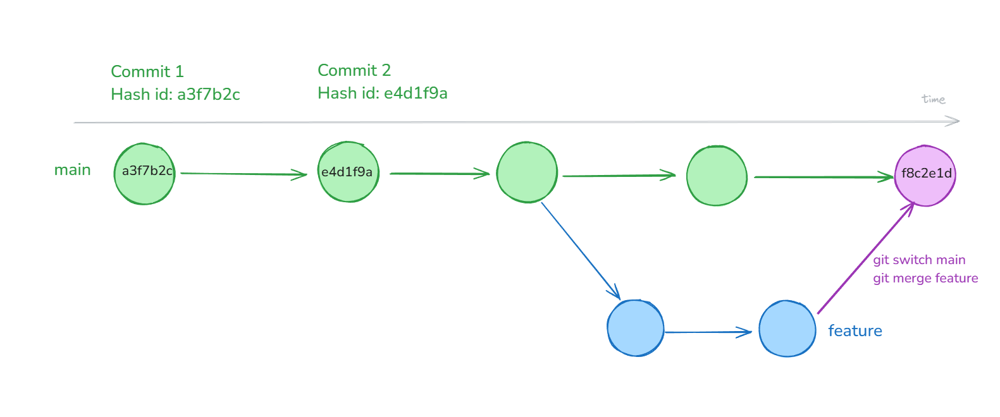{width=740px fig-align="center"}

- `git merge <branch>` merges the named branch into your current branch (usually `main`)
- Merging will create a new "merge" commit


## Merge conflicts ⚔️

{fig-align="center"}


## Merge conflicts ⚔️

<div style="margin-top: 1em;"></div>

#### Merge conflicts occur when there are edits to the same file (and at the same location) on two different branches

<div style="margin-top: 1em;"></div>

- When combining changes from two branches, there is not always a clear solution.
- If Git doesn’t know how to merge the two branches, we get a merge conflict
- Merge conflicts have to be **manually resolved**
- **DON'T PANIC**

<div style="margin-top: 1em;"></div>

If you merge your branches / edits before making more changes, you can avoid conflicts


## Illustration for merge conflicts

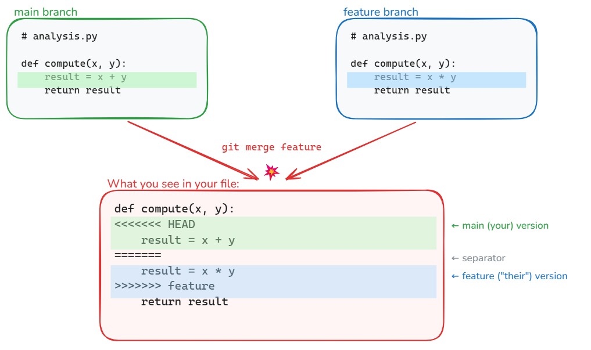{width=740px fig-align="center"}


## Resolving merge conflicts

- To resolve a merge conflict, you will have to go through changes one by one and pick one of the two versions
- Determine which files are in conflict with `git status`
- Once a solution is picked for every conflict you can add the file, commit the solution and the merge continues / finishes
- Picking a solution is easiest to do by using GUI tools


## Example of a merge conflict {.top}

::: {.columns}
::: {.column width="40%"}

<div style="margin-top: 1em;"></div>

```bash
<<<<<<< HEAD
<div id="footer">contact : email.support@github.com</div>
=======
<div id="footer">
 please contact us at support@github.com
</div>
>>>>>>> branch
```
:::
::: {.column width="60%"}
[In this conflict, the lines between `<<<<<< HEAD:index.html` and `======` are the content from the branch you are currently on.]{style="font-size: 0.9em;"}

[The lines between `=======` and `>>>>>>> issue-5:index.html` are from the feature branch we are merging.]{style="font-size: 0.9em;"}
:::
:::

<div style="margin-top: 1em;"></div>

::: {.columns}
::: {.column width="40%"}

<div style="margin-top: 1em;"></div>

```bash
<div id="footer">
please contact us at email.support@github.com
</div>
```
:::
::: {.column width="60%"}
[To resolve the conflict, edit the whole section until it reflects the state you want in the merged result. Remove the conflict markers `<<<<<<`, `======` and `>>>>>>>`.]{style="font-size: 0.9em;"}

[Then run `git add index.html` and `git commit` to finalize the merge. CONFLICTS RESOLVED.]{style="font-size: 0.9em;"}
:::
:::

::: {.absolute bottom=10}
[Example from [Happy Git with R](https://happygitwithr.com/git-branches)]{style="font-size: 0.7em;"}
:::


## Abort

If, during the merge, you get confused about the state of things or make a mistake:

- use `git merge --abort` to abort the merge and go back to the state prior to running `git merge`.
- Then try to complete the merge again.


# Last words

## Self-study

Once you've recovered from the lecture, please read the next three slides.

- Additional Git commands [link🔗](#additional-git-commands)
- The anatomy of a Git command 🔍️ [link🔗](#the-anatomy-of-a-git-command)
- Stuck in an editor? Breaking free ⛓️‍💥 [link🔗](#stuck-in-an-editor-breaking-free)


## Thanks for your attention

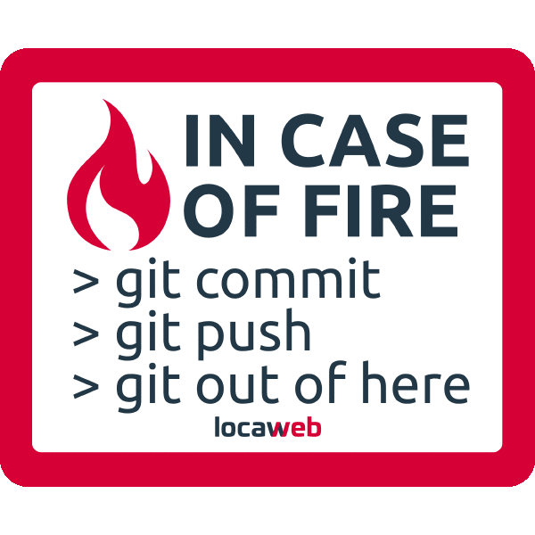{fig-align="center"}


## Sources

- Jan Simson, [Intro to Git](https://simson.io/intro-to-git/)
- Jennifer Bryan, [Happy Git and GitHub for the useR](https://happygitwithr.com/git-branches)


# Self-study

## Self-study

Once you've recovered from the lecture, please read the next three slides.


## Additional Git commands

- `git diff`: changes between your working directory and staging area (unstaged changes)
- `git diff --staged`: changes between your staging area and the last commit (what will be committed next)
- `git reset`: reset your staging area (use `git reset <filename/directory>` for specific files)
- `git restore --staged <file>`: used to undo the effects of `git add` (unstage a certain file and undo a previous git add)
- `git restore <file>`: discard local changes in a file, restoring its last committed state. Undo any changes to files (go back to last commit stage). Cannot be undone 💪
- `git log`: see the history of your commits (who changed what, when and why). You can move up and down with the arrow keys and leave the log view by pressing `q`. Use  `git log --oneline` to see the log in a compact way.


## The anatomy of a Git command 🔍️
Git commands, like many other CLI tools follow a certain structure:

```bash
git <command> [flags/options] [arguments]

git status
git commit -m "Adding example.txt" # -m for message
git config --global user.name "Your Name"  # --global for setting the configuration globally
```

With `-h` you can get help on any Git command 🚨

```bash
git status -h
git commit -h
```


## Stuck in an editor? Breaking free ⛓️‍💥

- Git sometimes opens a text editor (for merge commits, etc.), and you might be stuck in it (it happens to me all the time).
- Also, this happens if you run `git commit` without the `-m` option. Every commit needs a message. If you don’t provide one, Git will open a text editor in the current terminal so you can write the commit message manually.


## Stuck in an editor? Here's how to escape


#### If you're in **vim** (the default):

1. Press `Esc` (make sure you're in normal mode)
2. Type `:wq` then `Enter` → **save and quit**
3. Or type `:q!` then `Enter` → **quit without saving**

#### If you're in **nano**:

1. `Ctrl + O` then `Enter` → **save**
2. `Ctrl + X` → **exit**

#### Avoid this altogether:

```bash
git config --global core.editor "code --wait"
```

This tells Git to use VS Code instead of vim/nano.
