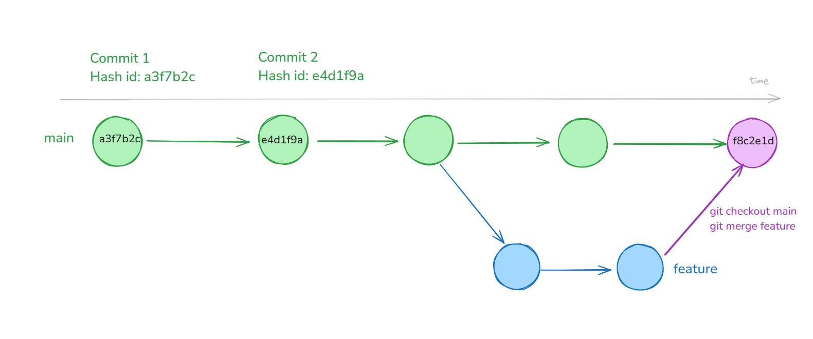
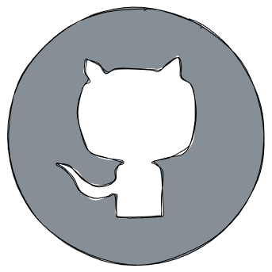
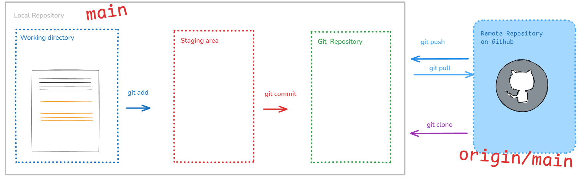
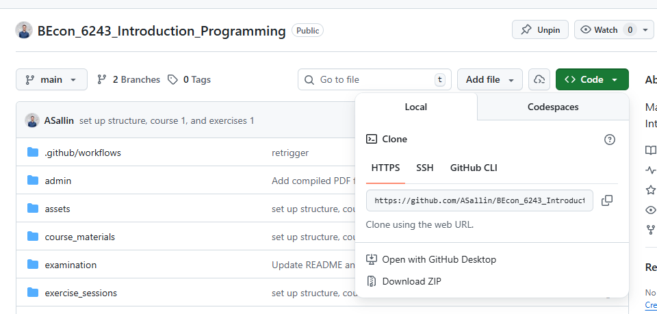

```{r set-options, echo=FALSE, cache=FALSE, warning=FALSE}
options(width = 100)
library(knitr)
library(purrr)
```

## Goals for today

In this lecture and exercise session, we will:

- go remote with our repository
- set up a collaborative project on git


# Short Recap

## Git is a Version Control System


**Basic workflow:**
`git init` → `git add` → `git commit`

**Key concepts:**
Working directory → Staging area → Repository

Use `.gitignore` to exclude files you don't want to track.

<!--
Three levels: changes can be either **unstaged**, **staged** or **commited**.

  - When we first make a change it is unstaged
  - Once we **add** the change to the staging area it is **staged**
  - We can then **commit** all staged changes
-->


## Recap: Branches and merging



**Branches** let you work on features without breaking main code.

`git branch feature` → `git checkout feature` → make changes → `git commit`

**Merging** brings changes from one branch into another.

`git checkout main` → `git merge feature`

**Merge conflicts** happen when changes overlap. Resolve manually, then commit.


# Remotes 🌐️

## Communicate and collaborate via remotes


- To collaborate with others we need a remote
- GitHub is the de facto standard with a big community


## Remotes 🌐️

- A **remote** is a version of your repository stored on a website like GitHub.

#### What is GitHub?

- GitHub is a website to host git repositories
- By having your git repository online, you can easily collaborate with others
- There are alternative hosts like Bitbucket or GitLab


## Why having your code on GitHub?

::: {.columns}
::: {.column width="30%"}
{width=80% fig-align="center"}
:::
::: {.column width="70%"}

<div style="margin-top: 1em;"></div>

- Backup of your project (you can work from different machines)
- Collaboration in groups and also with people you don't know
- Free and Open-Source Software (FOSS)
- Visibility as a Programmer (your porfolio - GitHub fulfills some function of a social network for programmers)
:::
:::


## Github.com: a demo

Check some interesting **GitHub repositories**: [PaddleOCR](https://github.com/PaddlePaddle/PaddleOCR), an open-source optical character recognition, or [Awesome Datascience](https://github.com/academic/awesome-datascience), a full collection of resources on data science

Or **GitHub pages**, like [the GitHub profile of the World Bank](https://github.com/worldbank) or [build your own](https://github.com/codecrafters-io/build-your-own-x) page with "build-your-own" projects.


# Working with remotes

## Four basic commands to work with remotes



- `git clone` / `git remote`
- `git pull` / `git push`
- The main remote is usually called `origin`.
- Remotes also have branches, just like your local repository.


## Adding a remote from an existing repository

When you want to add an **existing** repository to GitHub, you will have to add the remote yourself

```bash
git remote add <remote name> <remote URL>
```

<br>

It only works if you are not in a repo which has already been linked to a remote.

```bash
git remote add origin git@github.com:asallin/BECON_4222_Introduction_Programming.git
```

<br>

To learn about all possible commands for remotes use `-h`

```bash
git remote -h
```


## Cloning a repository

- You can download repositories from GitHub (and anywhere else), by **cloning** them
- For public repositories, `git clone` just works, for private ones you will need to be authenticated
- If you use `git clone`, the remote named `origin` is set up for you automatically.
- `git clone <remote URL>`


## Syncing Changes: overview


You first `pull` the latest changes from the remote and then `push` your own changes.


## Getting Changes: `git pull`

- To get the newest updates from GitHub, type `git pull` in your terminal.
- This command downloads any changes from the online repository and adds them to your current work.
- Usually, your branch is already set up to follow the matching branch on GitHub.
  - If it isn't, Git will show you a warning and tell you what to do.

```bash
# Pull from the tracked remote branch
git pull

# Pull from a specific branch
git pull <remote> <branch>
```

## Getting Changes: `git pull`

- `git pull` does does things under the hood: it *fetches* the latest changes and merges them into the current branch.
- (You can also run `git fetch` to fetch the latest changes and then `git merge <remote>/branch` to merge them)
- When you run `git pull` for the first time, you will need to choose a default *merge strategy*
- When you receive the message, just copy this line of code (or the one you prefer)

```bash
# Default to merge
git config pull.rebase false
```


## Pushing Your Changes: `git push`

- You can send *your* changes to github by running `git push`
- This only works if there are no new changes at the remote
  - If there have been changes since your last `pull` you need to `pull` again

```bash
# Push to the tracked remote branch
git push

# Push a branch to the remote for the first time
# -u is short for --set-upstream
git push -u <remote> <branch>
```


# Connecting git and github

## Authenticating with GitHub 🗝️

... some patience is required there...

## Authenticating with GitHub 🗝️

#### Authentication when pushing and pulling

- When you connect to a GitHub repository, GitHub needs to verify who you are using a username and password. Since August 2021 stronger authentication is required, and there are several secure methods available.
- We'll use **SSH keys**: you keep a private key on your computer and upload the matching public key to GitHub; when they match correctly, GitHub grants access.
- Using SSH keys is more secure than passwords, avoids repeated credential prompts, and is a common, portable method for authenticating to remote services.


#### How to?

- Setting up the authentication with GitHub could be somewhat cumbersome.
- Please go to this [website from LMU Munich](https://lmu-osc.github.io/Introduction-RStudio-Git-GitHub/SSH.html) and follow the steps to authenticate with GitHub.<br>*Credits*: Open Science Center at LMU Munich (Mike Croucher & Malika Ihle)


## Test your connection

Test your connection using the following code.

```bash
ssh -T git@github.com
> Hi ASallin! You've successfully authenticated, but GitHub does not provide shell access.
```


# Cloning a repository

## Cloning the course repository

#### 1. Navigate to your course directory [Introduction_to_programming]{.path} using the terminal.

Remember our course structure:

```
Introduction_to_programming/
├── github_course_materials/ # is empty for now, you will clone the git repo in week 3
├── exercises/               # Student's own work
│   ├── week_01/
│   ├── week_02/
│   ├── ...
│   ├── week_12/
├── group_project/
│   ├── ...
```

## Cloning the course repository

##### 2. Find the HTTPS or SSH on the GitHub course repo
Go on [https://github.com/ASallin/BECON_4222_Introduction_Programming](https://github.com/ASallin/BECON_4222_Introduction_Programming) and click on **<>Code**




## Cloning the course repository

##### 3. Clone the course repository.

The course is public, so cloning via HTTPS will work without a SSH key. However, cloning via the SSH URL requires a configured SSH key.


```bash
git clone https://github.com/ASallin/BECON_4222_Introduction_Programming.git
```

or

```bash
git clone git@github.com:ASallin/BECON_4222_Introduction_Programming.git
```

## Cloning the course repository

Now you've cloned the course repository in your directory. You'll have a new folder called [BECON_4222_Introduction_Programming]{.path}. You can remove the [materials]{.path} folder.

```
Introduction_to_programming/
├── github_course_materials/ # is empty for now, you will clone the git repo in week 3
├── exercises/               # Student's own work
│   ├── week_01/
│   ├── week_02/
│   ├── ...
│   ├── week_12/
├── group_project/
│   ├── ...
```

Every week, you can refresh the course content with `git pull`.


# Create a repo

## Creating a GitHub repository

#### On your GitHub account, click **New repository**

- Choose a **name** (e.g., `my-project`)
- Set **visibility**: Public (anyone can see) or Private (only you and collaborators)
- Check **Add a README file**


## The README.md

- First thing visitors see when they open your repo
- Written in Markdown (you know Markdown already from Data Handling, same as Quarto)
- Should describe: what the project is, how to install/run it, how to contribute
- A good README makes your project accessible and professional


## Clone it and start working

```bash
git clone git@github.com:yourusername/my-project.git
```


## Pull Requests

A **pull request** (PR) is a request to merge changes from one branch into another.

#### Why?

- You don't push directly to `main` — you work on a branch, then ask for your changes to be reviewed and merged
- PRs are the standard way to collaborate on GitHub

#### Workflow

1. Create a branch and make your changes
2. Push the branch to GitHub: `git push -u origin my-branch`
3. On GitHub, open a **Pull Request** from `my-branch` → `main`
4. Collaborators review, comment, request changes
5. Once approved, **merge** the PR

PRs keep the `main` branch clean and give the team a chance to review code before it's integrated.


## Collaborators


## Sources

https://smonsays.github.io/git-workshop/#/iv.-collaboration

Jan Simon

