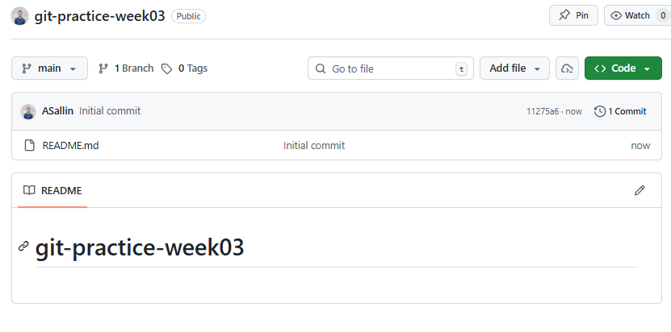
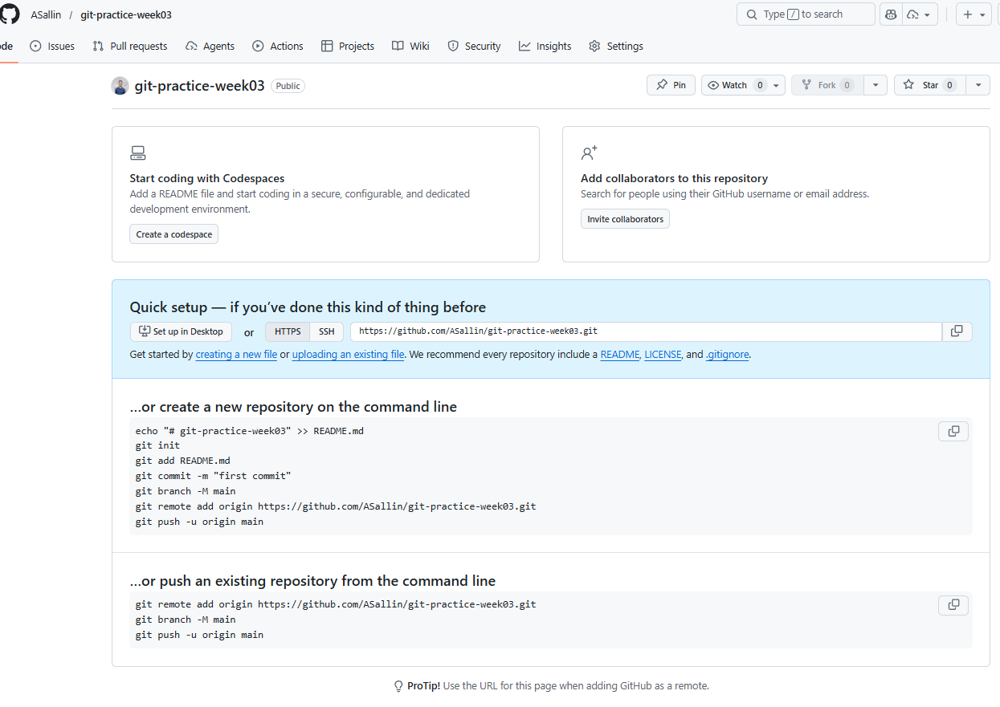

```{r set-options, echo=FALSE, cache=FALSE, warning=FALSE}
options(width = 100)
library(knitr)
library(purrr)
```

## Goals for today

#### At the end of this lecture and exercise session, you will:

- know how to go remote with our repository
- be able to collaborate using Git

##### Remember: practice, practice, practice!
- It feels overwhelming at first, but it gets easier with time and experience.
- Start working with Git and GitHub as soon as possible, for instance for your group projects in Data Analytics II 😉


# Recap: Git Basics

## Recap: Git workflow

{height="360px"}

Fill out the blanks.


## Git workflow

{height="360px"}

- A typical repository contains a mix of files: source code (R scripts, Python scripts, etc.), output files (like quarto documents or csv files), and configuration files (like .gitignore).
- **Basic workflow:** `git init` → `git add` → `git commit`
- **Key concepts:** Working directory → Staging area → Repository
- Use `.gitignore` to exclude files you don't want to track.

<!--
Three levels: changes can be either **unstaged**, **staged** or **commited**.

  - When we first make a change it is unstaged
  - Once we **add** the change to the staging area it is **staged**
  - We can then **commit** all staged changes
-->


## Recap: Git commit history

{height="360px"}

Fill out the blanks.


## Recap: Branches and merging

{height="360px"}

- **Branches** let you work on features without breaking main code.<br>`git switch -c feature` → make changes → `git commit`
- **Merging** brings changes from one branch into another.<br>`git switch main` → `git merge feature`
- **Merge conflicts** happen when changes overlap. Resolve manually, then commit.


# Remotes 🌐️

## Communicate and collaborate via remotes

::: {.columns}
::: {.column}
- The main reason to use Git is to **collaborate** with others and **back up your files** online.
- Think of:
  - Group project in Data Analytics II in R
  - Group project for Introduction to Programming in Python
  - Any project you want to share with others (e.g., your portfolio, open-source contributions, etc.)
:::
::: {.column}
{height="360px"}
:::
:::


## Communicate and collaborate via remotes


- So far you've tracked your own work locally.
- To collaborate with others, we need a **remote**
- GitHub is the de facto standard with a big community


## Remotes 🌐️

#### What is a remote?

- A **remote** is a version of your repository stored on a website like GitHub.

#### What is GitHub?

- GitHub is a website to host Git repositories
- By having your Git repository online, you can easily collaborate with others
- There are alternative hosts like Bitbucket or GitLab


## Why having your code on GitHub?

::: {.columns}
::: {.column width="30%"}
{width=80% fig-align="center"}
:::
::: {.column width="70%"}

<div style="margin-top: 1em;"></div>

- Backup of your projects (work from different machines, from work to private, or from one firm to another...)
- Collaboration in groups and also with people you don't know
- Free and Open-Source Software (FOSS)
- Visibility as a programmer (show your portfolio and your "productivity" as a programmer... GitHub fulfills some signaling function and works as a social network for programmers)
:::
:::


## Github.com: a demo

#### Check some interesting **GitHub repositories**:
- [PaddleOCR](https://github.com/PaddlePaddle/PaddleOCR), an open-source optical character recognition
- [Awesome Datascience](https://github.com/academic/awesome-datascience), a full collection of resources on data science
- ...

#### Or **GitHub pages**:
- [the GitHub profile of the World Bank](https://github.com/worldbank)
- [build your own](https://github.com/codecrafters-io/build-your-own-x) page with "build-your-own" projects,
- ...


# Working with remotes

## Four basic commands to work with remotes

{height="360px"}

- **Connect to a remote**: `git clone` / `git remote`
- **Sync with the remote**: `git pull` / `git push`
- The main remote is usually called `origin`.
- Remotes also have branches, just like your local repository.


## Connect to a remote by adding it from an existing repository

When you want to add an **existing** repository to GitHub, you will have to add the remote yourself

```bash
git remote add <remote name> <remote URL>
```

<br>

It only works if you are not in a repo which has already been linked to a remote.

```bash
git remote add origin git@github.com:asallin/BECON_4222_Introduction_Programming.git
```

<br>

To learn about all possible commands for remotes use `-h`

```bash
git remote -h
```


## Connect to a remote by cloning a repository

- You can download repositories from GitHub (and anywhere else), by **cloning** them
- For public repositories, `git clone` just works, for private ones you will need to be authenticated
- If you use `git clone`, the remote named `origin` is set up for you automatically.
- `git clone <remote URL>`


# Syncing Changes: Pull and Push

## Syncing Changes: overview

{height="370px"}

You first `pull` the latest changes from the remote...

... and then `push` your own changes.


## Getting Changes: `git pull`

- To get the newest updates from GitHub, type `git pull` in your terminal.
- This command downloads any changes from the online repository and adds them to your current work.


```bash
# Pull from the tracked remote branch
git pull

# Pull from a specific branch
git pull <remote> <branch>
```


## Getting Changes: `git pull`

- `git pull` does two things under the hood: it *fetches* the latest changes and merges them into the current branch.
- (You can also run `git fetch` to fetch the latest changes and then `git merge <remote>/branch` to merge them)


::: {.callout-note}
When you run `git pull` for the first time, Git might prompt you to choose a default *merge strategy*. When you receive the message, run:

```bash
# Default to merge
git config pull.rebase false
```
:::


## Pushing Your Changes: `git push`

- You can send *your* changes to GitHub by running `git push`
- This only works if there are no new changes at the remote
- If there have been changes since your last `pull` you need to `pull` again.
- **Why?**
<!--Because you need to have the latest version of the code before you can push your changes. This is to avoid conflicts and ensure that everyone is working with the most up-to-date code.-->

```bash
# Push to the tracked remote branch
git push
```

#### Push a branch for the first time
```bash
# Push a branch to the remote for the first time
# -u is short for --set-upstream
git push -u <remote> <branch>
```


## `git pull`, `git push` and upstream branches

- It might be that a locally created branch has no **upstream branch**, i.e. it is not tracking any remote branch.
- In that case, Git will warn you and tell you exactly what to do:

::: {.panel-tabset}

#### `git push` if no upstream branch

You are on branch `test2`, created locally but never pushed. Running `git push`:

```bash
fatal: The current branch test2 has no upstream branch.
To push the current branch and set the remote as upstream, use

    git push --set-upstream origin test2
```

#### `git pull` if no tracking info

You are on branch `test3`, which is not yet tracking any remote branch. Running `git pull` from `test3`:

```bash
There is no tracking information for the current branch.
Please specify which branch you want to merge with.

    git pull <remote> <branch>

If you wish to set tracking information for this branch you can do so with:

    git branch --set-upstream-to=origin/test3 test3
```
:::

> **Note:** The easiest way to avoid both situations: always use `git push -u origin <branch>` the first time you push a new branch.


## Push and pull

{height="470px" fig-align="center"}


# Connecting Git and GitHub

## Authenticating with GitHub 🗝️

... set it up once,

...can be nerve-wracking,

...done forever as long as you don't change computer,

... takes about 10 minutes ...


## Authenticating with GitHub 🗝️

#### Authentication when pushing and pulling

- When you connect to a GitHub repository, GitHub needs to verify who you are using a username and password. Since August 2021 stronger authentication is required, and there are several secure methods available.
- We'll use **SSH keys**: you keep a private key on your computer and upload the matching public key to GitHub; when they match correctly, GitHub grants access.
- Using SSH keys is more secure than passwords, avoids repeated credential prompts, and is a common, portable method for authenticating to remote services.


#### How to?

- Setting up the authentication with GitHub could be somewhat cumbersome.
- Please go to this [website from LMU Munich](https://lmu-osc.github.io/Introduction-RStudio-Git-GitHub/SSH.html) and follow the steps to authenticate with GitHub.<br>*Credits*: Open Science Center at LMU Munich (Mike Croucher & Malika Ihle)


## Test your connection

Test your connection using the following code.

```bash
ssh -T git@github.com
> Hi ASallin! You've successfully authenticated, but GitHub does not provide shell access.
```


# Cloning a repository

## Cloning the course repository

How to clone the course repository will be covered in the exercise session, but here is a quick overview of the steps.


## Cloning the course repository

#### 1. Navigate to your course directory [Introduction_to_programming]{.path} using the terminal.

Remember our course structure:

```
Introduction_to_programming/
├── github_course_materials/ # is empty for now, you will clone the git repo in week 3
├── exercises/               # Student's own work
│   ├── week_01/
│   ├── week_02/
│   ├── ...
│   ├── week_12/
├── group_project/
│   ├── ...
```

## Cloning the course repository

#### 2. Find the HTTPS or SSH on the GitHub course repo
Go on [https://github.com/ASallin/BECON_4222_Introduction_Programming](https://github.com/ASallin/BECON_4222_Introduction_Programming) and click on **<>Code**


## Clone the course repository

#### 3. Clone the course repository.

The course is public, so cloning via HTTPS will work without a SSH key. However, cloning via the SSH URL requires a configured SSH key.


```bash
git clone https://github.com/ASallin/BECON_4222_Introduction_Programming.git
```

or

```bash
git clone git@github.com:ASallin/BECON_4222_Introduction_Programming.git
```


## Cloning the course repository

Now you've cloned the course repository in your directory. You'll have a new folder called [BECON_4222_Introduction_Programming]{.path}. You can remove the [github_course_materials]{.path} folder.

```
Introduction_to_programming/
├── BECON_4222_Introduction_Programming/
├── exercises/               # Student's own work
│   ├── week_01/
│   ├── week_02/
│   ├── ...
│   ├── week_12/
├── group_project/
│   ├── ...
```

Every week, you can refresh the course content with `git pull`.

> **Note**: this is experimental. **The course materials uploaded on Canvas every week are the official version.** If you want to use the GitHub repository, make sure to pull the latest changes before starting to work on the exercises. You can also check the commit history to see what has changed since the last upload on Canvas.


# Create a repository

## Creating a GitHub repository

::: {.columns}
::: {.column}

1. On your GitHub account, click **New repository**
{width=100%}

2. Choose the paramaters:
  - **Name** (e.g., `git-practice-week03`)
  - **Visibility**: Public (anyone can see) or Private (only you and collaborators)
  - **Add a README file**
:::
::: {.column}
{width=100%}
:::
:::


## The README.md

::: {.columns}
::: {.column}
- First thing visitors see when they open your repo
- Written in Markdown (same syntax as Quarto)
- Should describe: what the project is, how to install/run it, how to contribute
- A good README makes your project accessible and professional
:::
::: {.column}
{width=100%}
:::
:::


## Create a local repository and link it to GitHub

::: {.panel-tabset}

### Create a local repo first, then link it to GitHub

::: {.columns}
::: {.column}

I want to link my GitHub repository `git-practice-week03` to my local repository.

```bash
git init
git remote add origin https://github.com/ASallin/git-practice-week03.git
git fetch origin
git switch -c main --track origin/main
# then work on your local repository and push changes to GitHub
```

> **Note**: `git pull origin main` does not work here, because the local repository is not yet linked to the remote. You need to run `git fetch origin` first to get the remote branches, then you can switch to the main branch and pull changes.
:::
::: {.column}
{width=100%}
:::
:::

### Clone the repo from GitHub locally

```bash
git clone git@github.com:yourusername/git-practice-week03.git
```

##### My recommendation: use this option!
When you clone a repository, the remote is set up for you automatically, and you can start working right away.

:::


# GitHub from basics to more advanced features

## Pull Requests (PRs)

A **pull request** (PR) is a request to merge changes from one branch into another.

#### Why?

- When collaborating with other people, it's often good to review each other's changes
- This is easiest done by using pull requests
- You don't push directly to `main`: you work on a branch, then *request* for your changes to be reviewed, *pulled* and merged
- PRs are the standard way to collaborate on GitHub


## Pull requests: Overview


## Pull requests: Detailed View


## Workflow

1. Create a branch and make your changes
2. Push the branch to GitHub: `git push -u origin my-branch`
3. On GitHub, open a **Pull Request** from `my-branch` → `main`
4. Collaborators review, comment, request changes
5. Once approved, **merge** the PR

PRs keep the `main` branch clean and give the team a chance to review code before it's integrated.


## When Should you Start using PRs?

- Maybe your project doesn't need these features yet
- Often it makes sense to use pull requests even when collaborating with just a few people
  - To avoid merge conflicts
  - Also for reviewing each others changes
- Many companies require code reviews and using PRs


# Advanced Git and GitHub

## Advanced Git and GitHub

There are many more features of Git and GitHub that we won't cover in this course. Explore them on your own if you're interested.

You can start incorporating these features as you become more comfortable with Git and GitHub. Not every project needs them.

#### In Git:
- **Hooks**: trigger scripts on certain Git events (e.g., pre-commit, post-merge)
- **Rebasing**: an alternative to merging that creates a cleaner commit history

#### In GitHub:
- **GitHub Issues**: track bugs, tasks, and feature requests
- **GitHub Pages**: host static websites directly from a GitHub repository
- **GitHub Actions**: automate workflows (e.g., run tests, deploy code)
- **Forking**: create your own copy of someone else's repository to experiment with changes without affecting the original


## Issues

- System to track tasks that still need to be done
- Allows for discussion
- When an issue is done, it is "closed"

::: Example

Go on [the github page of the `BFS` package  (API wrapper from the Swiss Federal Statistical Office)](https://github.com/lgnbhl/BFS/issues) and look at the different issues.

:::

## Forking

- You can easily copy public repositories into your own GitHub account, by `forking` them
- This way, you get your own remote version of the respository
  - You can still contribute your changes back to the original repository
  - The two repositories stay linked on GitHub
- This happens in GitHub not Git


## GitHub Pages

- Host your own website there **for free** on GitHub Pages
- You can create websites for specific projects (i.e. repositories)
  - \<your_gh_username\>.github.io/\<your_repo_name\>
- Special repository name: \<your_gh_username\>.github.io to create a personal page (portfolio, blog, etc.)

::: {.columns}
::: {.column}{width=70%}

#### Create a page in 10mn from a template:
- Go to [https://github.com/arifszn/gitprofile](https://github.com/arifszn/gitprofile) and fork the repository
- Enable GitHub Pages (→ Settings) and GitHub Actions (→ Actions)
- Look at the website at https://\<your-username\>.github.io/gitprofile/
- Configure `gitprofile.config.ts` to customize your profile page.
:::
::: {.column}{width=30%}
{width=100%}
:::
:::
<!-- end columns -->

## GitHub Pages

::: {.columns}
::: {.column}{width=70%}
#### Quarto website:
- You can also create a Quarto website and host it on GitHub Pages. Check out the [Quarto documentation](https://quarto.org/docs/websites/publishing-to-github/) for more details.
- Basic and static

#### Examples (you can fork them and start from there)
- Data scientist profiles: [Silvia Canelòn](https://silviacanelon.com/), [Samantha Csik](https://samanthacsik.github.io/) (great tips on blogs), [full tutorial by Marvin Schmitt](https://marvin-schmitt.com/blog/website-tutorial-quarto/)
- My personal website: [https://asallin.github.io/](https://asallin.github.io/)
:::
::: {.column}{width=30%}
](../../assets/img/lecture_03_github/quarto_page.png){width=100%}
:::
:::
<!-- end columns -->


# Going Beyond

::: {.absolute bottom=20 style="font-size: 0.7em; color: #6b7280;"}
Thanks Jan Simson for the inspiration!
:::

## Visualizing Git repositories

Several tools exist to visualize `git` repositories. These can be useful to get a quick overview of a git repository.

- 🚚 [git-truck](https://github.com/git-truck/git-truck)
- 🐙 [GitHub Repo Visualizer](https://mango-dune-07a8b7110.1.azurestaticapps.net/?repo=jansim%2Fadvanced-git) ([Article](https://githubnext.com/projects/repo-visualization))
- 🌸 [gource](https://gource.io/)

## Additional resources

- <https://learngitbranching.js.org/>
- <https://github.com/git-guides>
- [Introduction to RStudio Git & GitHub](https://lmu-osc.github.io/Introduction-RStudio-Git-GitHub/)
- [The Carpentries: Version Control with Git](https://swcarpentry.github.io/git-novice/)
- <https://gitimmersion.com>


# Let's get our hands dirty!

## Practical: A Summary exercise {background-color="black"}

#### This is a guided demo exercise to practice the full collaborative workflow using GitHub and pull requests.

- Create teams of 2 people.
- For this exercise to work, you need to have installed Git and set up your GitHub account with SSH keys.
- If you haven't done that yet, participate actively with the demo.


## I need a volunteer! {background-color="black"}


## Sources

- The course materials is inspired by Jan Simson, [Introduction to Git](https://simson.io/intro-to-git/) and [Advanced Git](https://simson.io/advanced-git/index.html). Thanks for the inspiration and the great resources!


