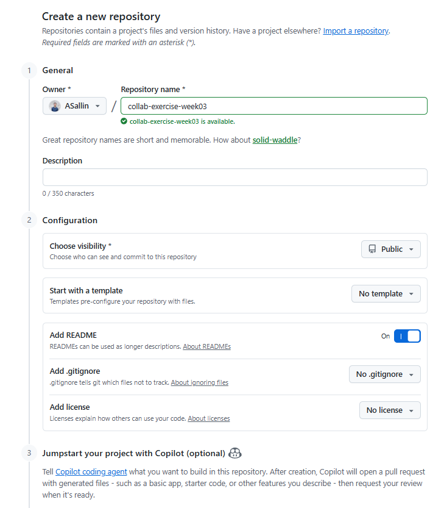
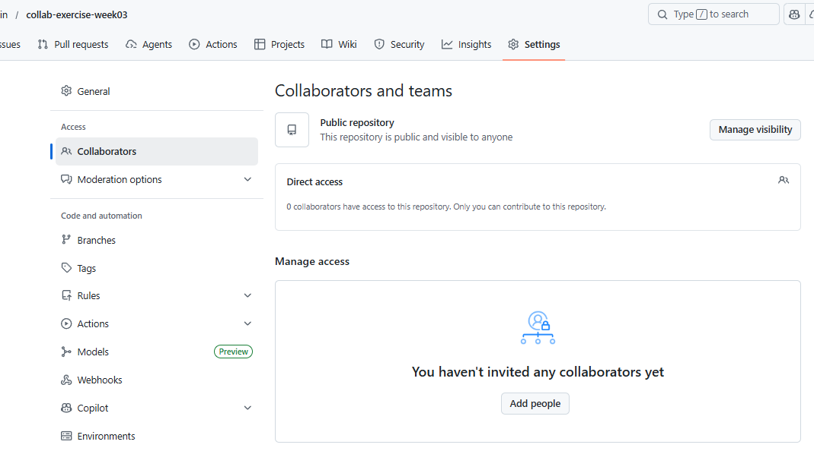
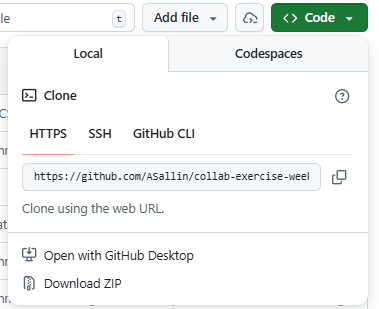
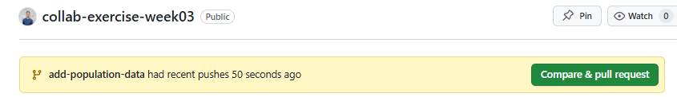
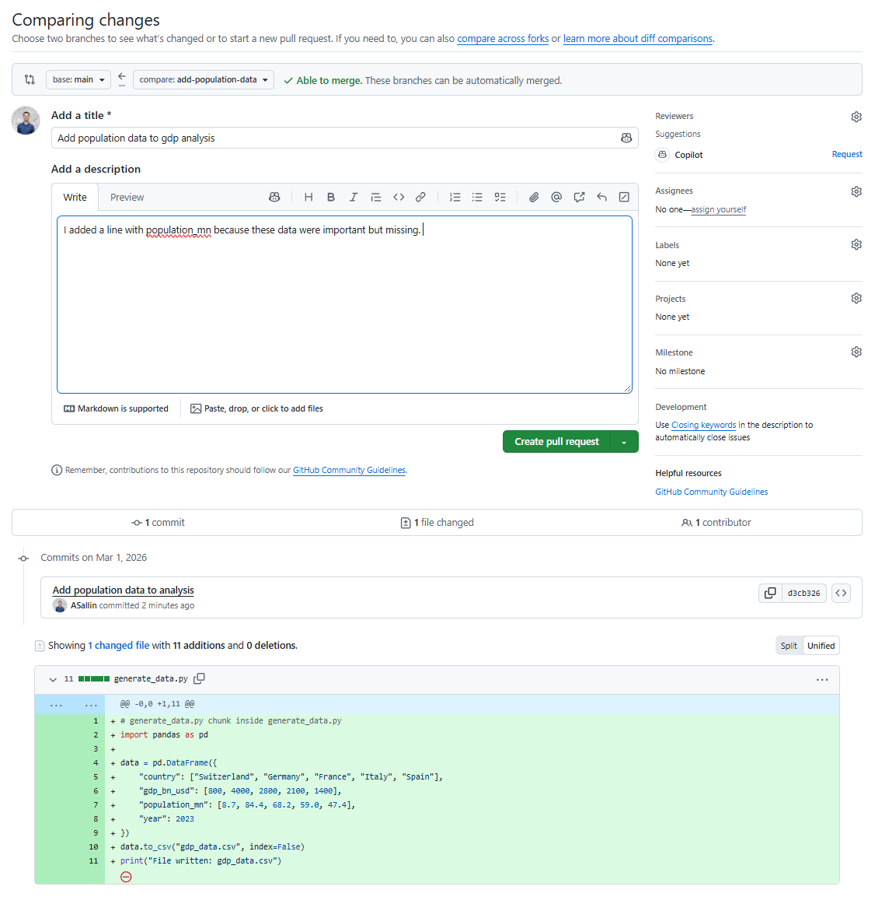
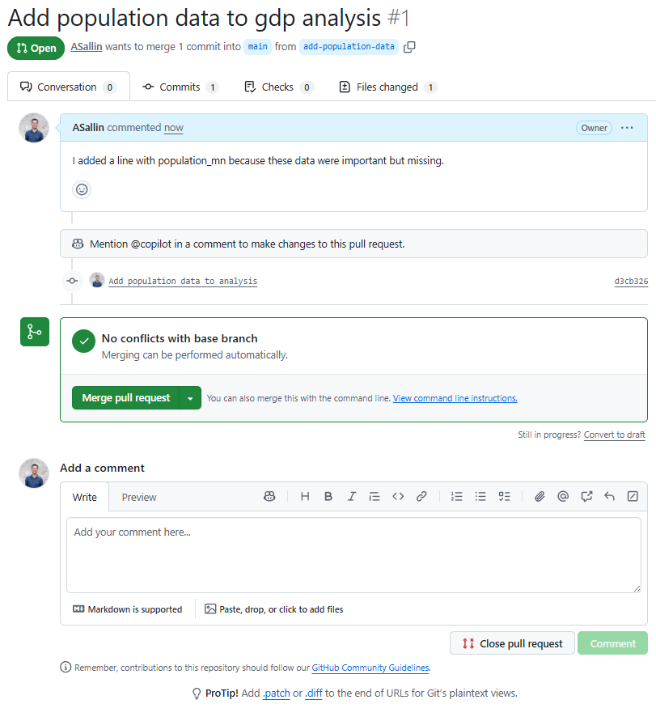

<style>
/* Student A: purple */
div.callout-important {
  border-left-color: #7c3aed !important;
}
div.callout-important > .callout-header {
  background-color: rgba(124, 58, 237, 0.08) !important;
}
/* Student B: orange */
div.callout-tip {
  border-left-color: #ea580c !important;
}
div.callout-tip > .callout-header {
  background-color: rgba(234, 88, 12, 0.08) !important;
}
</style>

# Overview

**Goal:** By the end of this exercise, you and your partner will share a GitHub repository, each working on your own branch, with a merged pull request (PR) in the history. **This is a typical workflow we would like you to use for your group project in this course, and you can also use it for your other group projects in R or Python or any programming language.**

Work in pairs. Decide who is **Student A** (the repository owner) and who is **Student B** (the collaborator).

---

# Phase 1: Create and Link a Repository

::: {style="display:flex; align-items:center; gap:10px; margin-bottom:-12px;"}
::: {style="width:40px; height:40px; border-radius:50%; background-color:#7c3aed; flex-shrink:0; display:flex; align-items:center; justify-content:center; color:white; font-weight:bold; font-size:1.1em;"}
A
:::
**Student A**
:::

:::: {.callout-important}
## **Student A**: Create a repository and invite your collaborator

1. Go to [github.com](https://github.com) and click **New repository**
2. Name it `collab-exercise-week03`, set visibility to **Public**
3. Add a README, but **do not** add a [.gitignore]{.path} file
4. Click **Create repository** and copy the URL

::: {.callout-note collapse="true"}
#### 📸 See the GitHub interface


:::

5. Invite Student B as a collaborator: **Settings → Collaborators → Add people**

::: {.callout-note collapse="true"}
#### 📸 See the GitHub interface


:::

6. Clone the repository into [exercises/week_03]{.path}:

```bash
cd exercises/week_03
git clone <your repo URL>
cd collab-exercise-week03
```

::: {.callout-note collapse="true"}
#### 📸 See the GitHub interface


:::

::::

> **Note:** Using the SSH URL requires a configured SSH key. If SSH is not set up yet, use the HTTPS URL, which works for public repositories without a key.

::: {style="display:flex; align-items:center; gap:10px; margin-bottom:-12px;"}
::: {style="width:40px; height:40px; border-radius:50%; background-color:#ea580c; flex-shrink:0; display:flex; align-items:center; justify-content:center; color:white; font-weight:bold; font-size:1.1em;"}
B
:::
**Student B**
:::

:::: {.callout-tip}
## **Student B**: Accept the invitation and clone

1. Accept the collaborator invitation (check GitHub notifications, email, and spam)
2. Clone the repository into [exercises/week_03]{.path}:

```bash
cd exercises/week_03
git clone <Student A's repo URL>
cd collab-exercise-week03
```
::::


---

# Phase 2: Set Up the Environment

In this part, we will set up the environment and generate a dataset using a simple Python script. The script `generate_data.py` creates a CSV file with GDP data for a few countries:

```python
import pandas as pd

data = pd.DataFrame({
    "country": ["Switzerland", "Germany", "France", "Italy", "Spain"],
    "gdp_bn_usd": [800, 4000, 2800, 2100, 1400],
    "year": 2023
})

data.to_csv("gdp_data.csv", index=False)
print("File written: gdp_data.csv")
```


::: {style="display:flex; align-items:center; gap:10px; margin-bottom:-12px;"}
::: {style="width:40px; height:40px; border-radius:50%; background-color:#7c3aed; flex-shrink:0; display:flex; align-items:center; justify-content:center; color:white; font-weight:bold; font-size:1.1em;"}
A
:::
**Student A**
:::

:::: {.callout-important}
## **Student A**: Create a virtual environment and add the data script

1. In the repository, create a virtual environment and install `pandas`:

```bash
uv init --python 3.13
uv add pandas
```

2. Download [generate_data.py]{.path} (available on Canvas) and copy it into [collab-exercise-week03]{.path}

3. Using the terminal or a text editor, create a [.gitignore]{.path} that excludes the virtual environment. In the terminal, you can use `echo` like this:

```bash
echo ".venv/
__pycache__/
*.pyc" > .gitignore
```

The .gitignore file should now look like this:

```bash
.venv/
__pycache__/
*.pyc
```

> **Note:** `>` creates the file (or overwrites it if it already exists). `>>` (used later) appends to an existing file.

4. Commit and push:

```bash
git add .
git commit -m "Add virtual environment and data generation script"
git push
```

::::

::: {style="display:flex; align-items:center; gap:10px; margin-bottom:-12px;"}
::: {style="width:40px; height:40px; border-radius:50%; background-color:#ea580c; flex-shrink:0; display:flex; align-items:center; justify-content:center; color:white; font-weight:bold; font-size:1.1em;"}
B
:::
**Student B**
:::

:::: {.callout-tip}
## **Student B**: Sync the environment and generate the data

1. Pull Student A's changes and sync the virtual environment:

```bash
git pull
uv sync
```

> **Note:** `uv sync` recreates the virtual environment from [uv.lock]{.path}, reproducing the exact same environment that was started by Student A. You don't need to run `uv init` yourself.

2. Run the data generation script, either directly with `uv run` or from VS Code by selecting the right Python interpreter (like in the first exercise session):

```bash
uv run python generate_data.py
```


3. [gdp_data.csv]{.path} is now generated locally. Remember from the lecture: generated files should not be tracked. Add it to [.gitignore]{.path} and push:

```bash
echo "gdp_data.csv" >> .gitignore
git add .gitignore
git commit -m "Ignore generated CSV file"
git push
```

::::

::: {style="display:flex; align-items:center; gap:10px; margin-bottom:-12px;"}
::: {style="width:40px; height:40px; border-radius:50%; background-color:#7c3aed; flex-shrink:0; display:flex; align-items:center; justify-content:center; color:white; font-weight:bold; font-size:1.1em;"}
A
:::
**Student A**
:::

:::: {.callout-important}
## **Student A**: Pull the changes

```bash
git pull
```

::::

**Checkpoint:** At this point, both students have [generate_data.py]{.path} and [.gitignore]{.path}. The CSV is generated locally but not tracked by Git. The .gitignore file is in sync.

---

# Phase 3: Branch and Pull Request

::: {style="display:flex; align-items:center; gap:10px; margin-bottom:-12px;"}
::: {style="width:40px; height:40px; border-radius:50%; background-color:#ea580c; flex-shrink:0; display:flex; align-items:center; justify-content:center; color:white; font-weight:bold; font-size:1.1em;"}
B
:::
**Student B**
:::

:::: {.callout-tip}
## **Student B**: Create a branch and extend the dataset

1. Create a new branch:

```bash
git switch -c add-population-data
```

2. Open [generate_data.py]{.path} and add a `population_mn` column:

```python
data = pd.DataFrame({
    "country": ["Switzerland", "Germany", "France", "Italy", "Spain"],
    "gdp_bn_usd": [800, 4000, 2800, 2100, 1400],
    "population_mn": [8.7, 84.4, 68.2, 59.0, 47.4],
    "year": 2023
})
data.to_csv("gdp_data.csv", index=False)
```

3. Commit and push the branch:

```bash
git add generate_data.py
git commit -m "Add population data to analysis"
git push -u origin add-population-data
```

4. Open a Pull Request on GitHub:
   - GitHub will show a banner: *"add-population-data had recent pushes"*, click **Compare & pull request**

::: {.callout-note collapse="true"}
#### 📸 See the GitHub interface


:::

   - Title: `Add population data to GDP analysis`
   - Write a short description of what you changed and why
   - Click **Create pull request**

::: {.callout-note collapse="true"}
#### 📸 See the GitHub interface


:::

::::

::: {style="display:flex; align-items:center; gap:10px; margin-bottom:-12px;"}
::: {style="width:40px; height:40px; border-radius:50%; background-color:#7c3aed; flex-shrink:0; display:flex; align-items:center; justify-content:center; color:white; font-weight:bold; font-size:1.1em;"}
A
:::
**Student A**
:::

:::: {.callout-important}
## **Student A**: Review the pull request

1. Open the Pull Request on GitHub and go to the **Files changed** tab. It gives you an overview of all the changes made on the branch that wants to be pulled. Check that only [generate_data.py]{.path} was modified.

::: {.callout-note collapse="true"}
#### 📸 See the GitHub interface


:::

2. Leave a review comment requesting one more change:

> *"Great work! Before we merge, can you add a `gdp_per_capita_usd` column? It should be GDP in billions of USD divided by population in millions, scaled to USD per person."*

::::

::: {style="display:flex; align-items:center; gap:10px; margin-bottom:-12px;"}
::: {style="width:40px; height:40px; border-radius:50%; background-color:#ea580c; flex-shrink:0; display:flex; align-items:center; justify-content:center; color:white; font-weight:bold; font-size:1.1em;"}
B
:::
**Student B**
:::

:::: {.callout-tip}
## **Student B**: Address the review

Add the column to [generate_data.py]{.path}:

::: {.callout-note collapse="true"}
#### 💡 Solution

```python
data["gdp_per_capita_usd"] = data["gdp_bn_usd"] / data["population_mn"] * 1000
```

:::

Commit and push. The PR updates automatically:

```bash
git add generate_data.py
git commit -m "Add GDP per capita column"
git push
```

::::

::: {style="display:flex; align-items:center; gap:10px; margin-bottom:-12px;"}
::: {style="width:40px; height:40px; border-radius:50%; background-color:#7c3aed; flex-shrink:0; display:flex; align-items:center; justify-content:center; color:white; font-weight:bold; font-size:1.1em;"}
A
:::
**Student A**
:::

:::: {.callout-important}
## **Student A**: Approve and merge

1. Check the updated **Files changed** tab and verify the formula is correct
2. Approve and click **Merge pull request**

::::

Both students sync `main`:

```bash
git switch main
git pull
```

**Checkpoint:** Student B's changes are in `main`. Both students are in sync. The full collaborative workflow is complete.


---

# Ensuring that your feature/working branch is up-to-date with the `main` branch (self-study)

When working in a team, the `main` branch changes frequently. Before continuing your work (or opening a pull request), you should update **your** feature branch to align with `main`.

There are two safe and common ways to do this.

::: {.callout-note}
This part is more advanced and not required for the course. It is however an important workflow to understand and master for any collaborative project.
:::


## Option 1: Merge `main` into your feature branch

Make sure you are on your feature / working branch

```bash
git switch <feature-branch>

# Download newest changes from GitHub. This updates your local copy of main but does not change your branch yet.
git fetch origin

# Merge main into your branch. Now your branch contains all changes from main
git merge origin/main

# If there are conflicts, Git will tell you. Fix them, then run:
git add .
git commit
```


## Option 2: Rebase your branch onto `main`

This keeps the commit history linear and clean, but is slightly more advanced.

```bash
git switch <feature-branch>

# Download newest changes from GitHub. This updates your local copy of main but does not change your branch yet.
git fetch origin

# rebase onto main
git rebase origin/main

# If there are conflicts, Git will tell you. Fix them, then run:
git add .
git rebase --continue

# repeat (Fix -> git add -> git rebase --continue) until Git says something like "Successfully rebased and updated <feature-branch>."
```


---

# Summary

You have practised the core collaborative Git workflow:

| Step | Command(s) |
|---|---|
| Clone an existing repo | `git clone` |
| Ignore generated files | [.gitignore]{.path} |
| Sync a virtual environment | `uv sync` |
| Get a collaborator's changes | `git pull` |
| Work on a branch | `git switch -c`, `git push -u origin <branch>` |
| Contribute via PR | GitHub web interface |

::: {.callout-note}
From now on, this is the workflow you will use for your group project: each team member works on their own branch and contributes changes via pull requests.
:::
