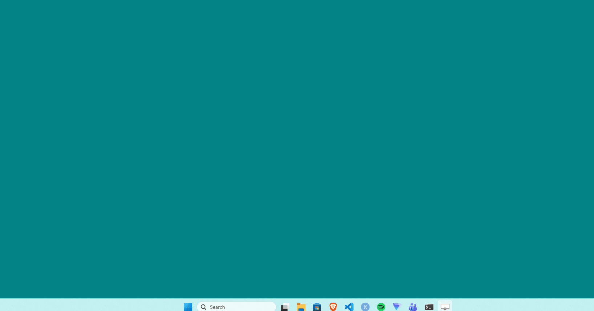
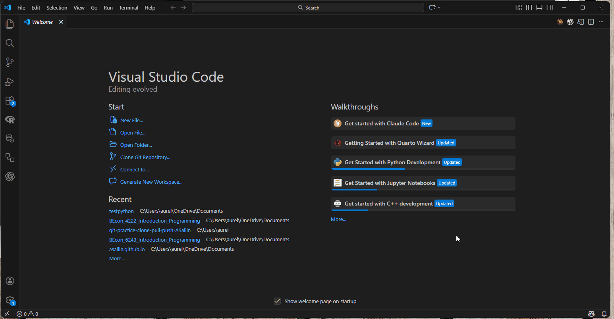
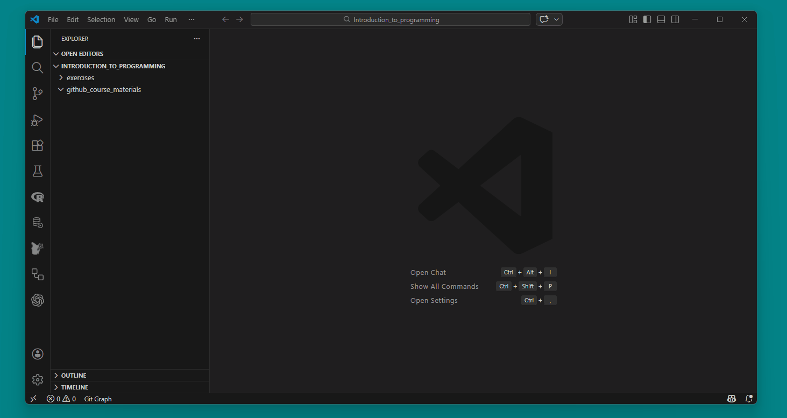
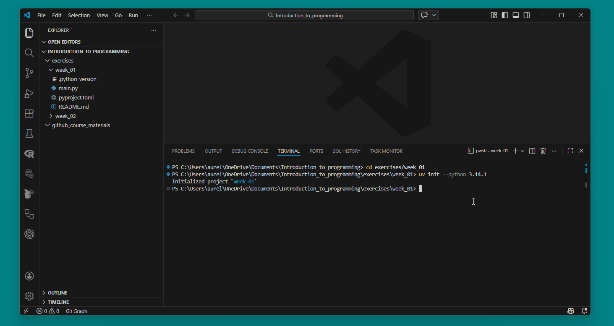
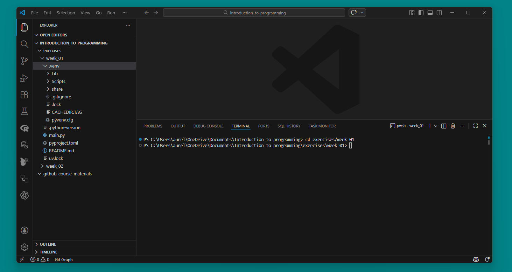
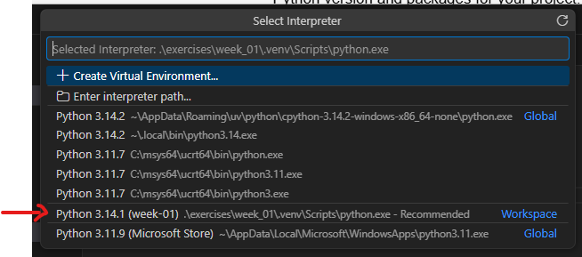
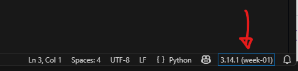

# Exercise 1: Set up your course directory

Create a directory for the course on your computer: `Introduction_to_programming` using the terminal. This directory will be your local directory containing your exercises, course materials, and group project. We suggest that we all work with the same directory names to make collaboration and debugging easier.

To create the directory, use bash, command prompt or powershell to first navigate to the path you want to create the directory using `cd`,  then create the directory using `mkdir`.

We will have the following folder structure throughout the course. Notice our personal preference for snake case.

```bash
Introduction_to_programming/
├── github_course_materials/ # is empty for now, you will clone the git repo in week 3
├── exercises/               # Student's own work
│   ├── week_01/
│   ├── week_02/
│   ├── ...
│   ├── week_12/
├── group_project/
│   ├── ...

```

where `Introduction_to_programming` is the main folder, `github_course_materials` will be created next week with git, and `group_project` will contain students' own work.


:::: {.callout-tip collapse="true"}
#### Solution

::: {.panel-tabset}

##### Windows

In command prompt, starting from your home directory `~` (e.g., `C:/Users/aurel`):

```bash
C:\Users\aurel>cd OneDrive/Documents

C:\Users\aurel\OneDrive\Documents>mkdir Introduction_to_programming

C:\Users\aurel\OneDrive\Documents>cd Introduction_to_programming

C:\Users\aurel\OneDrive\Documents\Introduction_to_programming>mkdir github_course_materials

C:\Users\aurel\OneDrive\Documents\Introduction_to_programming>mkdir exercises

C:\Users\aurel\OneDrive\Documents\Introduction_to_programming>cd exercises

C:\Users\aurel\OneDrive\Documents\Introduction_to_programming\exercises>mkdir week_01

C:\Users\aurel\OneDrive\Documents\Introduction_to_programming\exercises>mkdir week_02

C:\Users\aurel\OneDrive\Documents\Introduction_to_programming\exercises>cd ..

C:\Users\aurel\OneDrive\Documents\Introduction_to_programming>dir
```

##### Mac

In Terminal, starting from your home directory `~` (e.g., `/Users/yourname`):

```bash
~ $ cd Documents

~/Documents $ mkdir Introduction_to_programming

~/Documents $ cd Introduction_to_programming

~/Documents/Introduction_to_programming $ mkdir github_course_materials

~/Documents/Introduction_to_programming $ mkdir exercises

~/Documents/Introduction_to_programming $ cd exercises

~/Documents/Introduction_to_programming/exercises $ mkdir week_01

~/Documents/Introduction_to_programming/exercises $ mkdir week_02

~/Documents/Introduction_to_programming/exercises $ cd ..

~/Documents/Introduction_to_programming $ ls
exercises               github_course_materials
```

:::

::::

<br>

# Exercise 2: Install VS Code

Now install VSCode on your computer. Follow instructions online. Then create the "data science profile" in VSCode. See here for an introduction: [https://code.visualstudio.com/docs/configure/profiles](https://code.visualstudio.com/docs/configure/profiles)


## 2.1. Open VSCode in your course directory

You should always make VS Code start from the directory your are working in. You can do this in the following ways:

  1. Either use your terminal and navigate to `Introduction_to_programming` using `cd`. Then use `code .` to open VS code in your directory.
  2. You can also open VS Code, and then use File/Open Folder.

::: {.callout-tip collapse="true"}
#### Solution

The solution to this exercise will be shown during the exercise session. Here is a preview of how to open VS Code from the terminal:

{width="700px"}
:::


## 2.2. Open a terminal in VSCode

An advantage of using VS Code is that you can use the terminal directly in VS Code. This allows you to have your code and your terminal in the same window, which is very convenient.

In VS Code, open a terminal. Notice that you can choose between powershell or command prompt in Windowns, or bash in MacOs. In the terminal, understand where you are located. Find your current path directory using `pwd` or `cd`.

::: {.callout-tip collapse="true"}
#### Solution

The solution to this exercise will be shown during the exercise session. Here is a preview of how to open a terminal in VS Code:

{width="600px"}
:::


## 2.3. Get familiar with VS Code

Take time to explore VS Code. Notice the left bar. In this bar, the first tab is to access all your files and folders within your directory (the directory in which VSCode is rooted). There is also a tab for extensions, etc.

Install the following extensions (these help Python work better in VS Code):

  - **Python** (Microsoft)
  - **Pylance** (Microsoft)
  - **Ruff**
  - **Jupyter**

::: {.callout-tip collapse="true"}
#### Solution

The solution to this exercise will be shown during the exercise session.
:::

## 2.4. Create and remove a file

Using your terminal, create a file "hello.txt" in the `exercises/week_01` folder. Remove the file "hello.txt". After this, move your working directory back to `Introduction_to_programming`.

:::: {.callout-tip collapse="true"}
#### Solution

::: {.panel-tabset}

##### Windows (command prompt)
```bash
# Navigate to week_01 (you should be in Introduction_to_programming)
> cd exercises/week_01

# Solution 2 for Command Prompt users in Windows: create the file hello.txt
> echo. > hello.txt
> del hello.txt

# Move back to Introduction_to_programming
> cd ../..
```

##### Mac (bash)
```bash
# Navigate to week_01
cd ~/Documents/Introduction_to_programming/exercises/week_01

# Solution for Mac users: create the file hello.txt
touch hello.txt
rm hello.txt

# Move back to Introduction_to_programming
cd ../..
```
:::

::::

<br>


# Exercise 3: Install python via `uv`

You can use the following commands in your terminal to set everything up. Remember, left click works like copy-paste in many terminals. Go on the `uv` website for more information on how to install.

## 3.1. Install `uv`

::: {.panel-tabset}

### Windows

In Windows, we use powershell to install `uv`.

**Note:**Pay attention to the fact that we are using powershell to install `uv` because it is the way the company that wrote `uv` recommends, but that we are using command prompt for the rest of the course. You can also use powershell for the rest of the course if you prefer, but we will use command prompt in the exercise sessions to make sure everyone is on the same page.

```powershell
# Install uv using standalone installer
powershell -ExecutionPolicy ByPass -c "irm https://astral.sh/uv/install.ps1 | iex"

# Add uv to PATH (follow instructions in the terminal)
$env:PATH = $env:PATH + ";$env:USERPROFILE\.local\bin"

# Make the PATH change permanent
[Environment]::SetEnvironmentVariable("PATH", $env:PATH + ";$env:USERPROFILE\.local\bin", "User")

# Verify installation
uv
```

### Mac

```bash
# Install uv standalone installer
curl -LsSf https://astral.sh/uv/install.sh | sh

# Or using pip
pip install uv

# Verify installation
uv --version
```
:::

Then check if it works in your terminal:

```bash
uv
```

You should see something like this:

```bash
PS C:/.../Introduction_to_programming> uv
An extremely fast Python package manager.

Usage: uv.exe [OPTIONS] <COMMAND>

Commands:
  auth     Manage authentication
  run      Run a command or script
  init     Create a new project
  add      Add dependencies to the project
  ...
```

<br>

## 3.2. [Optional] Install python using `uv`

Now, we can install python. If Python is already installed on your system (on Windows mostly the case), `uv` will detect and use it without configuration.

`uv init` will automatically download Python to uv's managed directory if needed. If you need to install python, you can also do it manually with the following command:

```bash
uv python install
```

We will use Python 3.

<br>

## 3.3. Create a project for the exercise

Remember, in the lecture we mentioned the importance of "closed environments" for Python. This is different than in R. We will create a new environment for each exercise session. To create a closed environment, we use a project with `uv`, which will manage our python version and our packages.

In the terminal, make sure you are in your working directory `Introduction_to_programming/exercises/week_01`. Use `uv init` to initialize your project. Then specify the version of python we will use in this environment. We will use python 3.14.1 (for this course, it does not matter much).

::: {.panel-tabset}

#### Windows

```bash
# Navigate to week_01 (you should be in Introduction_to_programming)
cd exercises/week_01
uv init --python 3.14.1
```

#### Mac

```bash
cd ~/Documents/Introduction_to_programming/exercises/week_01
uv init --python 3.14.1
```

:::

You should observe the creation of different files:

```bash
Introduction_to_programming/exercises/week_01/
├── .python-version          # Specifies Python version (3.14.1) for this project
├── pyproject.toml           # Project configuration file. Defines project dependencies and settings
├── .gitignore               # Instructions for git. We will see this next week.
├── README.md                # README text file that contains your basic project documentation. Feel free to add some information. The syntax is `markdown` (`md`) syntax.
└── main.py                  # Example Python script, can be erased
```

Now, we will install the following python packages in our environment: `ipykernel`, `pandas`, `numpy`. Install them using `uv add `

```bash
uv add ipykernel pandas numpy
```

You should observe different things happening:

  - the creation of a `.venv` folder, which contains your isolated Python environment
  - the creation of a `uv.lock` file, which "locks" the exact versions of all dependencies
  - your file `pyproject.toml` being updated under "dependencies"`[^1]

::: {.callout-note}
#### The `.venv` folder structure differs between Windows and Mac

The `.venv` folder contains your Python interpreter, but the internal layout is different depending on your operating system:

- **Windows:** `.venv/Scripts/python.exe`
- **Mac:** `.venv/bin/python`

This matters when you need to manually select the Python interpreter in VS Code (see Exercise 3.5).
:::


::: {.callout-tip collapse="true"}
#### Solution

The solution to this exercise will be shown during the exercise session. Here is a preview of how to init uv and add dependencies:

{width="800px"}
{width="800px"}
:::

<br>

## 3.4 Open python using `uv`

Open python with your terminal using `uv run python`.

::: {.callout-tip collapse="true"}
#### Solution

The solution to this exercise will be shown during the exercise session. Here is a preview of how to run python in your `uv` environment:

{width="800px"}
:::


<br>

## 3.5 Using a python script in VS code

Once in `Introduction_to_programming/exercises/week_01`, open the `main.py`. The trick now is to **choose the right python interpreter**. Python interpreters are programs that read and execute your Python code. Each environment can have its own interpreter, which ensures you use the correct Python version and packages for your project. Since we defined our Python installation, we need to select the interpreter we chose from our `uv` environment.

- In VS Code, use CTRL/CMD + SHIFT + P to open the palette. Then write "Select Python Interpreter". There will be a list of available Python interpreters. Chose the one corresponding to Python 3.14.1 in your `venv` (tagged "Workspace" by VS Code).

*Note*: it could be that VSCode does not detect your interpreter right away. In this case, first try to refresh VSCode using CTRL/CMD + SHIFT + P and then "Developer: Reload Window". Otherwise, select "Enter interpreter path" and navigate to the `.venv` folder in your project, then select the Python executable:

  - **Windows:** `.venv/Scripts/python.exe`
  - **Mac:** `.venv/bin/python`

::: {.callout-tip collapse="true"}
#### Solution

The solution to this exercise will be shown during the exercise session. Here is a preview of how to select the right python interpreter in VS Code:

{width="640px"}

:::


- In VS Code, if you have a `.py` file open, check the Python interpreter at the bottom right and make sure you have the right one selected.

::: {.callout-tip collapse="true"}
#### Solution

The solution to this exercise will be shown during the exercise session. Here is a preview of how to select the right python interpreter in VS Code:

{width="640px"}

:::


<br>

# Exercise 4: Create a Python script

Create a first python script called `hello.py`, which contains the command `print('hello world')`. Run it from the script and run it with uv using the following command:

```bash
uv run hello.py
```

In the python file, right click and select "Run in Interactive Window". You've run your first Python script of the course. 🎊


<br>

## Using the terminal be like

{width="440px"}


[^1]: Note that `uv.lock` + `pyproject.toml` replace the traditional `requirements.txt` in `pip`. You can generate a requirements.txt file from uv using `uv pip freeze > requirements.txt`.
