::: {=html}
```{=html}
<style>
.path {
  background-color: #f2f2f2;
  padding: 2px 6px;
  border-radius: 4px;
  font-family: monospace;
}
</style>
```
:::

<br>

## Exercise 0: Install `git` and the VSCode extension `Git Graph`

**This step has to be done before the exercise session.**

Please follow the instructions on the git website: [https://git-scm.com/book/en/v2/Getting-Started-Installing-Git](https://git-scm.com/book/en/v2/Getting-Started-Installing-Git)


::: {.panel-tabset}

#### Windows

For Windows users, we recommend installing git via the Git for Windows installer: [https://git-scm.com/download/win](https://git-scm.com/download/win).


#### Mac
On Mavericks (10.9) or above you can do this simply by trying to run git from the Terminal resp. the Bash the very first time, e.g. using `git --version`. If you don’t have it installed already, it will prompt you to install it. If you want a more up to date version, you can also install it via a binary installer.[^1]  A macOS Git installer is maintained and available for download at the Git website [here](https://git-scm.com/download/mac).

[^1]: A binary installer is a ready-to-run version of a program that has already been compiled into machine code for your operating system. See e.g. [this](https://www.reddit.com/r/learnprogramming/comments/lyw9gf/can_someone_explain_what_people_mean_by_binaries/) Reddit comment on the topic.
:::

Install the VSCode extension `Git Graph` from the VSCode marketplace. This extension allows you to visualize your git repository and perform git operations using a graphical interface. You can also use the built-in `git` support in VSCode, but we recommend `Git Graph` for better visualization of branches and commits.

If you need a refresher on the different command-line-interfaces (terminals), check the appendix below 👇.

::: {.callout-note}
#### Using `git bash` on Windows

For Windows users: you have now installed `git`, which installs a terminal called `Git Bash`. This terminal supports all `git` commands and `bash` UNIX commands like in `bash` for Mac. With Git Bash, you can access files and directories in the same way as with `command prompt`. You can open `Git Bash` in your VSCode terminal.

This adds a bit more complexity for Windows users: you now have three options. You can use the `cmd prompt` terminal, the `Git Bash` terminal, or powershell. We recommend using `Git Bash` for all git commands in your vscode terminal, but you can also use `cmd prompt` with `git` commands. The important thing is that you are aware of these different shells/terminals.
:::


<!------------------------------------------------
--------------------------------------------------
--------------------------------------------------
------------------------------------------------->


<div style="margin-top: 8em;"></div>


## Exercise 1: Configure `git` on your machine

At this point, you should have `git` installed on your machine. It does not matter if you are on Windows or Mac, the configuration is the same. Moreover, **`git` commands are the same** in both Mac and Windows, and you can use all git commands from any terminal (`cmd prompt`, `git bash`).

Open a terminal and follow the steps below to configure your `git` installation.

```bash
# Add your name
git config --global user.name "Your Name"

# Add your email address
git config --global user.email "your.email@unisg.ch"

# Use modern main branch name
git config --global init.defaultBranch main
```

- `user.name`: Set the name that will be attached to your commits. This is *visible* to collaborators when working on shared repositories.
- `user.email`: Set the email address that will be attached to your commits. IMPORTANT: Use the *same* email address as for your GitHub account, since GitHub uses it to link commits to your profile (contribution graph, avatar, etc.).
- `init.defaultBranch`: Configure the default name of the initial branch when creating a new repository. Historically this was called "master", but most platforms now use "main" as the standard default branch name.


**For Linux/Mac**

``` bash
git config --global core.autocrlf input
```

**For Windows**

``` bash
git config --global core.autocrlf true
```

The following commands configure how Git handles line endings across different operating systems (remember Data Handling?). Windows uses a different end-of-line character(CRLF) than macOS/Linux (LF). This can lead to unnecessary changes showing up in version control and cause avoidable merge conflicts.

::: {.callout-tip collapse="true" title="Solution"}
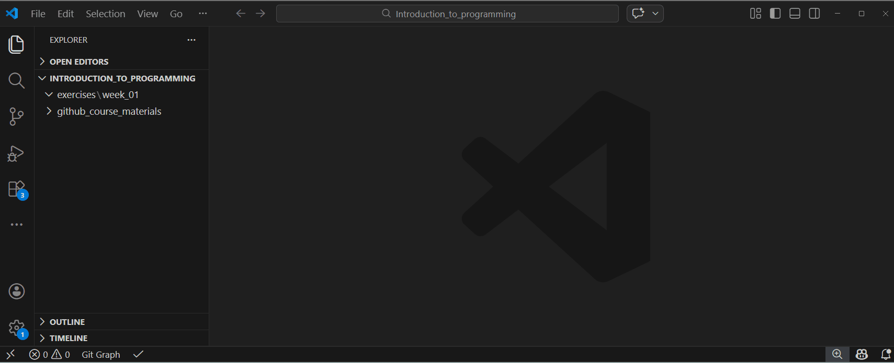
:::

<!------------------------------------------------
--------------------------------------------------
--------------------------------------------------
------------------------------------------------->


<div style="margin-top: 8em;"></div>


## Exercise 2: Initialize a `git` repository

We will work with the folder structure established in the first exercise session. Remember, the structure of your `Introduction_to_programming` directory should look like this:

```
Introduction_to_programming/
├── github_course_materials/ # is empty for now, you will clone the git repo in week 3
├── exercises/               # Student's own work
│   ├── week_01/
│   ├── week_02/
│   ├── ...
│   ├── week_12/
├── group_project/
│   ├── ...
```

1.  Identify the filepath of the directory [Introduction_to_programming/exercises/week_02]{.path}.
2.  In the terminal, navigate to that directory. This is important. The folder you are currently in is the one Git will track.
3.  Initialize a git repository using `git init`. Check your git repo using `git status`.


::: {.callout-tip collapse="true" title="Solution"}

::: {.panel-tabset}
1.  Identify the filepath of the directory [Introduction_to_programming/exercises/week_02]{.path}.

##### Windows (cmd prompt)
In your terminal from VSCode, navigate to [.../Introduction_to_programming/exercises/week_02]{.path}.

```bash
cd
cd exercises
dir
mkdir week_02
cd week_02
dir
```


##### Bash (Mac users or Windows users with Git Bash)

```bash
pwd
cd exercises
ls
mkdir week_02
cd week_02
ls
```


:::

Then, initialize a git repository using `git init`. We recommend now that you use `Git Bash` if you are on Windows.

```bash
git init
# Initialized empty Git repository in /Users/Introduction_to_programming/exercises/week_02
```

Initializing a Git repository means turning a normal folder into a Git-*tracked* project. When you run `git init`, Git creates a hidden [/.git]{.path} directory that stores the version history and configuration for that folder. From that moment on, Git can track changes, create commits, and manage versions of your files in that folder and its subfolders.

*Note*: you don't see the `.git` folder in your file explorer in the left bar of VS code because it is hidden. To see it, right click on the file explorer in VSCode and click on "Reveal in File Explorer". This will open the folder in your system file explorer, where you can see the hidden `.git` folder. You can also use the terminal command `ls -a` to list all files, including hidden ones, to see the `.git` folder:

```sh
$ ls -a
./  ../  .git/
```
:::


<!------------------------------------------------
--------------------------------------------------
--------------------------------------------------
------------------------------------------------->


<div style="margin-top: 8em;"></div>


## Exercise 3: First tracking and commit

1. Check the current status of your git project in [/week_02]{.path} using `git status`.

::: {.callout-tip collapse="true" title="Solution"}
To check the current status of your git project in [/week_02]{.path}, use:

```bash
git status
```

Output:
```sh
On branch main

No commits yet

nothing to commit (create/copy files and use "git add" to track)
```
:::

2. In [/week_02]{.path}, create a text file named `humorforprogrammers.txt` containing the sentence "Code is like humor. When you have to explain it, it is bad." using your terminal or simply using VSCode (new file -> save). Output the file content in the terminal.

::: {.callout-tip collapse="true" title="Solution"}
To create the text file `humorforprogrammers.txt` with the following content:

::: {.panel-tabset}

##### Windows (cmd prompt)
```bash
echo Code is like humor. When you have to explain it, it is bad. > humorforprogrammers.txt

# Output the content using type
type humorforprogrammers.txt
# Code is like humor. When you have to explain it, it is bad.
```


##### Bash (Mac users or with Git Bash)
```bash
echo "Code is like humor. When you have to explain it, it is bad." > humorforprogrammers.txt

# Output the content using cat
cat humorforprogrammers.txt
# Code is like humor. When you have to explain it, it is bad.
```

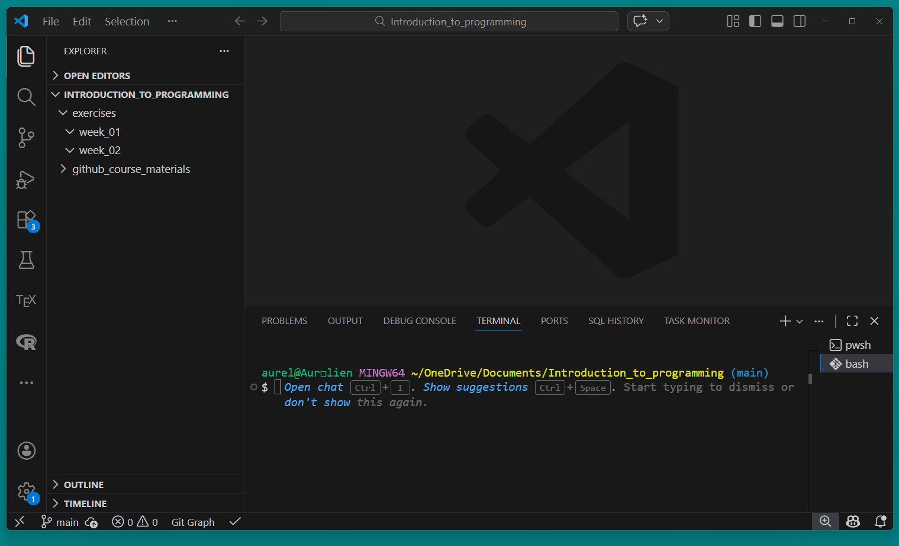

:::
:::

3. Observe what happens with `git status`. Comment.

::: {.callout-tip collapse="true" title="Solution"}
```bash
git status
```

Output:
```sh
On branch main

No commits yet

Untracked files:
  (use "git add <file>..." to include in what will be committed)
        humorforprogrammers.txt

nothing added to commit but untracked files present (use "git add" to track)
```
:::

4. Add the file to the staging area. Check with `git status`. Comment.

::: {.callout-tip collapse="true" title="Solution"}

```bash
git add humorforprogrammers.txt
git status
```

Output:
```sh
On branch main

No commits yet

Changes to be committed:
  (use "git rm --cached <file>..." to unstage)
        new file:   humorforprogrammers.txt
```

*Remember*: The staging area is an intermediate step between your working files and a commit. When you run `git add`, you are selecting exactly which changes should be included in the next commit. You do not need to commit *all* your changes, you can select what should be committed. This allows you to group related changes together and avoid committing unfinished or unrelated edits.
:::

5. Create your first commit. Commit the new file with the commit message "text file created". Check with `git status`.

::: {.callout-tip collapse="true" title="Solution"}
```bash
git commit -m "text file created"
git status
```

Output:
```sh
[main (root-commit) 3326090] text file created
 1 file changed, 1 insertion(+)
 create mode 100644 humorforprogrammers.txt
On branch main
nothing to commit, working tree clean
```

*Remember*: A commit is a saved snapshot of your project at a specific point in time. When you run `git commit`, `git` records the staged changes together with a message describing what was changed. Each commit becomes part of the project’s history, allowing you to track progress, review changes, and revert to earlier versions if necessary.

*Hint*: try to be explicit in your commit messages, so that you can easily understand the history of your project when looking back at the commits.

What happens if you forget the `-m` flag and its argument, and just write `git commit`? Find out in the appendix below. 👇
:::

6. Change the text in `humorforprogrammers.txt` to "Code is absolutely not like humor." and save.

:::{.callout-tip collapse="true" title="Solution"}
In `bash`:

```bash
echo "Code is absolutely not like humor." > humorforprogrammers.txt
# Output the content to check
cat humorforprogrammers.txt
```
:::

7. Use `git diff` to see the actual unstaged changes.

::: {.callout-tip collapse="true" title="Solution"}
```bash
git diff
```
You should observe something like this:

```sh
diff --git a/humorforprogrammers.txt b/humorforprogrammers.txt
index 47e1a11..8e8d1ff 100644
--- a/humorforprogrammers.txt
+++ b/humorforprogrammers.txt
@@ -1 +1 @@
-Code is like humor. When you have to explain it, it is bad.
+Code is absolutely not like humor.
```
Notice the error "LF will be replaced by CRLF the next time Git touches it". We will ignore this error in this course.  If you want to understand it, check the appendix below 👇.
:::

8. Add the file to the staging area and commit the new file with the commit message "text file modified because disagreement". Check again with `git status`.

::: {.callout-tip collapse="true" title="Solution"}
Command:
```bash
git add humorforprogrammers.txt
git status
git commit -m "text file modified because disagreement"
```

Output:
```sh
On branch main
Changes to be committed:
  (use "git restore --staged <file>..." to unstage)
        modified:   humorforprogrammers.txt

[main 5c0e848] text file modified because disagreement
 1 file changed, 1 insertion(+), 1 deletion(-)
```
And the last `git status` should show:

```sh
On branch main
nothing to commit, working tree clean
```
:::

9. (**self-study 🔍**) Look at your sidebar in VSCode. You'll notice the `git` GUI {width="20px"}. Now create a new file `hello.txt` containing "hello world!". Observe the sidebar. Using the GUI, add `hello.txt` and commit, using a nice commit message.

::: {.callout-tip collapse="true" title="Solution"}
Create `hello.txt` file (bash):

``` bash
# 10:
echo "hello world!" > hello.txt
```

In the sidebar, open Git extension. Click on the plus symbol next to `hello.txt` to add it to the staging area.

In the message window, enter your commit message. No need to put it in quotes. Then hit commit. You'll see a new commit in the graph window:

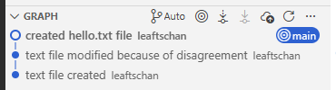

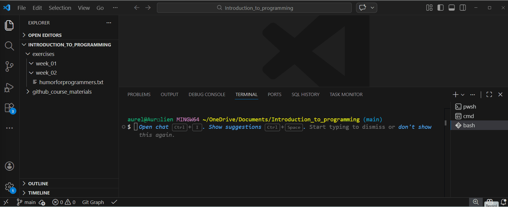
:::


<!------------------------------------------------
--------------------------------------------------
--------------------------------------------------
------------------------------------------------->


<div style="margin-top: 8em;"></div>


## Exercise 4: Prevent files from tracking using [.gitignore]{.path}

1. Make sure you are in the [/week_02]{.path} repo.
2. If you haven't done it from the course, download the [Git Cheat Sheet](https://education.github.com/git-cheat-sheet-education.pdf) and save it in your [/week_02]{.path} folder.
3. Create a new [.gitignore]{.path} file to ignore only this cheatsheet.

::: {.callout-tip collapse="true" title="Solution"}
We create a new file called [.gitignore]{.path} in the [/week_02]{.path} directory, asking specifically to exclude the Git Cheat Sheet.

*Remember*: the [.gitignore]{.path} file is used to specify which files and directories should be ignored by git. This means that any files or directories listed in the [.gitignore]{.path} file will not be tracked by git, and any changes to those files will not be included in commits.

The [.gitignore]{.path} file looks like this:

```bash
# Ignore the Git Cheat Sheet
git-cheat-sheet-education.pdf
```

There are different options to create the gitignore;

**Create [.gitignore]{.path} via the Git GUI**

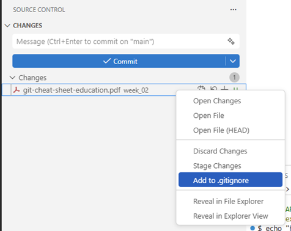

That automatically creates the [.gitignore]{.path} file for you.

**Via the terminal in bash:**

```bash
echo "git-cheat-sheet-education.pdf" > .gitignore
```

**Simply via VSCode (new file -> save as -> .gitignore)**


Note that you need to install the VS Code pdf viewer extension to see the PDF file in VSCode.
:::

4. Add all the files to your repo and commit. Notice what's happening.

::: {.callout-tip collapse="true" title="Solution"}
After adding this line to the [.gitignore]{.path} file, we add all files (`.`) to the staging area and commit:

```bash
git add .
git commit -m "Add .gitignore to ignore the Git Cheat Sheet"
```

In the GUI, you'll see the new commit in the graph window:

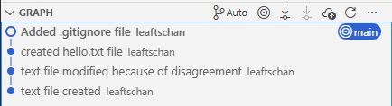

:::
5. Change the [.gitignore]{.path} file to the file below. Explain what the new [.gitignore]{.path} file does.  Finally, add and commit it using the message *"Updated .gitignore file"*. (**self-study 🔍**)

```bash
# Data and generated outputs
*.csv
*.tsv
*.xlsx
*.pdf
*.png
*.jpg
*.html

# Python temporary files
__pycache__/
*.pyc

# Virtual environment (uv)
.venv/

# Editor / OS files
.DS_Store # typical for macOS!
.vscode/
```

::: {.callout-tip collapse="true" title="Solution"}

Copy-paste the new contents into the [.gitignore]{.path} file.

``` bash
git status
git add .
git status
git commit -m "Updated .gitignore file"
```

In the GUI, you'll see the new commit in the graph window:

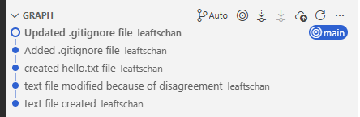

This `.gitignore` file tells Git which files and folders should not be tracked or committed to the repository.

It ignores:

  - **Data and generated outputs** (`*.csv`, `*.pdf`, `*.png`, etc.)\
    → These are typically results, exports, or large files that can be recreated and do not belong in version control.
  - **Python temporary files** (`__pycache__/`, `*.pyc`)\
    → These are automatically created by Python and do not need to be stored.
  - **Virtual environments** (`.venv/`)\
    → This folder contains installed packages and can be recreated from a requirements file.
  - **Editor and operating system files** (`.DS_Store`, `.vscode/`)\
    → These are system- or editor-specific configuration files that should not be shared.

In short, this `.gitignore` keeps the repository clean by excluding generated, temporary, and machine-specific files.

In general, a `.gitignore` file is useful for excluding temporary files, system files, build outputs, or sensitive information (e.g., passwords or API keys) that should not be part of the repository.

Git ignores files based on pattern matching rules defined in `.gitignore`.
These patterns work similarly to simple regular expressions (technically they use *glob patterns*), allowing you to ignore groups of files at once.

For example: - `*.log` ignores all log files\

  - `build/` ignores the entire build folder\
  - `.DS_Store` ignores macOS system files

Ignored files will not appear in `git status` and cannot be accidentally committed.
:::


<!------------------------------------------------
--------------------------------------------------
--------------------------------------------------
------------------------------------------------->


<div style="margin-top: 8em;"></div>


## Exercise 5: Time-Travel ⏱️

- Navigate to your directory [/exercises/week_02]{.path}.
- Open the git log of your respository or call it with `git log`. From the log, identify the commit hash of your first commit. Comment on what a `log` is and what a `commit hash` is.

::: {.callout-tip collapse="true" title="Solution"}
To identify the commit hash of the first commit, you can use the command:

```bash
git log
```

which renders the following log (the actual commit hashes will be different on your machine, of course):

```sh
commit 555d10497291572a63e0d5d783a62669d5c9cc8e (HEAD -> main)
Author: Aurélien Sallin <aurelien.sallin@protonmail.com>
Date:   Mon Feb 23 08:58:03 2026 +0100

    Updated .gitignore file

commit 2cfdd0cdf05f68dc16bc13da592c4b95b51448cd
Author: Aurélien Sallin <aurelien.sallin@protonmail.com>
Date:   Mon Feb 23 08:51:32 2026 +0100

    created hello.txt file

commit 66ba7715b63ef6553c9ba2e0fd0731fa099583c7
Author: Aurélien Sallin <aurelien.sallin@protonmail.com>
Date:   Mon Feb 23 08:43:00 2026 +0100

    text file modified because disagreement

commit 7777967acd9432caef10372466a501b4646137ed
Author: Aurélien Sallin <aurelien.sallin@protonmail.com>
Date:   Mon Feb 23 08:41:31 2026 +0100

    text file created
```

**Press `q` to exit the log.** As a practical note, you can also use `git log --oneline` to get a more concise log, which only shows the first 7 characters of the commit hash and the commit message.

Output of `git log --oneline`:
```sh
555d104 (HEAD -> main) Updated .gitignore file
2cfdd0c created hello.txt file
66ba771 text file modified because disagreement
7777967 text file created
```

You can observe the different commit hashes. A commit hash is a unique identifier automatically generated by Git for each commit. It is a long string of letters and numbers (e.g., `a3f5c9d...`) that uniquely represents a specific snapshot of the project.

We observe that the commit hash of our first commit is `7777967acd9432caef10372466a501b4646137ed`, in short version `7777967`. Another way is to use the VSCode GUI to look at the commit history and identify the commit hash of the first commit:

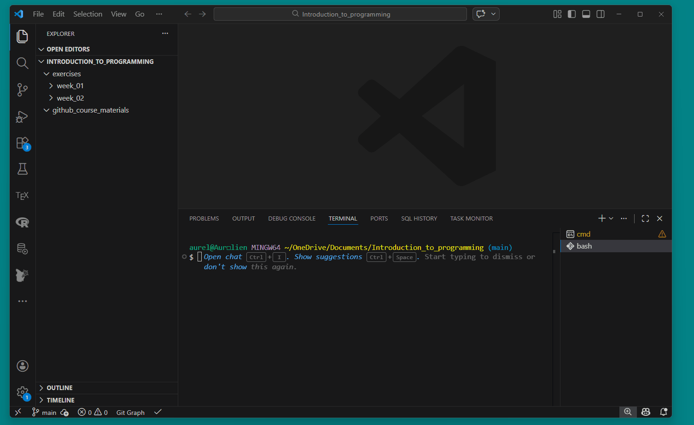
:::

- Checkout the first commit using the `git checkout` function. As seen in the course, you can checkout to a `git commit` using the commit identifier.

::: {.callout-tip collapse="true" title="Solution"}
We can checkout to this commit using:

```bash
git checkout 7777967
```

which gives you this:

```sh
Note: switching to '7777967'.

You are in 'detached HEAD' state. You can look around, make experimental
changes and commit them, and you can discard any commits you make in this
state without impacting any branches by switching back to a branch.

If you want to create a new branch to retain commits you create, you may
do so (now or later) by using -c with the switch command. Example:

  git switch -c <new-branch-name>

Or undo this operation with:

  git switch -

Turn off this advice by setting config variable advice.detachedHead to false

HEAD is now at 7777967 text file created
```

You should observe that the content of the file `humorforprogrammers.txt` has changed to the original version. This is because we are now in a "detached HEAD" state, meaning that we are not on any branch, but rather on a specific commit in the project’s history. Normally, `HEAD` points to a branch (e.g., `main`), and that branch moves forward when you create new commits. In a detached HEAD state, however, `HEAD` points to a single commit instead of a branch name. In this state, we can look around and make experimental changes, but any commits we make will not be associated with any branch (that means they can become "lost" once you switch back to a branch). If you decide you want to keep work done in a detached HEAD state, you should create a new branch (e.g., `git switch -c new-branch-name`) so your commits are properly anchored.

*Remember*: `HEAD` is a special pointer in Git that refers to your current position in the project’s history. In most cases, `HEAD` points to the latest commit on the branch you are currently working on.
When you create a new commit, `HEAD` moves forward to that new commit.

:::

- Switch back to your main branch using `git switch main`.

::: {.callout-tip collapse="true" title="Solution"}
To switch back to the main branch, we can use:
```bash
git switch main
```

```sh
Previous HEAD position was 7777967 text file created
Switched to branch 'main'
```
:::

- Reflect on what we've done. In what circumstances would you want to checkout to a previous commit? What are the risks of doing so?


<!------------------------------------------------
--------------------------------------------------
--------------------------------------------------
------------------------------------------------->


<div style="margin-top: 8em;"></div>


## Exercise 6: On Branches 🪵

Ensure your directory is still in [/week_02]{.path} in the terminal.

- Create a new branch called `fixCode`. Switch to the new branch. Make sure you're on the right branch using `git status`. Check the different branches of your repo with `git branch`.

::: {.callout-tip collapse="true" title="Solution"}
Create a new branch called `fixCode` and checkout the new branch:

```bash
git switch -c fixCode
# Switched to a new branch 'fixCode'

git status
# On branch fixCode
# nothing to commit, working tree clean

git branch
#* fixCode
#  main
```

In Git Bash, you can see the current branch you are on:

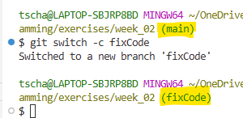

or simply call `git status` or `git branch` to see the current branch.
:::

- Add a new file `fix.txt` containing "I fixed the code!" and save. Add and commit the change on the new branch.

::: {.callout-tip collapse="true" title="Solution"}
Add a new file `fix.txt` containing "I fixed the code!" and save. Add and commit the change on the new branch.

```bash
echo "I fixed the code!" > fix.txt
git status
git add fix.txt
git status
git commit -m "Added fix.txt file"
```
:::

- Pause and reflect on the following questions: in what branch are you now? What is the content of the main branch?
- Go back to the main branch. Check the content of the directory. Do you see the new file? Why not?

::: {.callout-tip collapse="true" title="Solution"}
Go back to the main branch and check the content of the directory:

```bash
git switch main

git status
# On branch main
# nothing to commit, working tree clean
```

The file is not visible on `main` because we created and committed it on the `fixCode` branch. To see the file on `main`, we need to merge the `fixCode` branch into `main`.
:::

- Merge the `fixCode` branch into main

::: {.callout-tip collapse="true" title="Solution"}
Merge the `fixCode` branch into main:

```bash
git merge fixCode
```
Output:
```sh
Updating 555d104..3070032
Fast-forward
 fix.txt | 1 +
 1 file changed, 1 insertion(+)
 create mode 100644 fix.txt
```

The file `fix.txt` is now part of the `main` branch after the merge. We were able to merge without conflicts because we only added a new file on the `fixCode` branch, which did not interfere with any existing files on the `main` branch.

At the end, you can delete the `fixCode` branch since it has been merged:
```bash
git branch -d fixCode
```
:::

- Repeat all the above steps (with a different branch name & commit) using the GUI on VSCode (**self-study 🔍**)


<!------------------------------------------------
--------------------------------------------------
--------------------------------------------------
------------------------------------------------->


<div style="margin-top: 8em;"></div>


## Exercise 7: On merge conflicts

1.  Create a new branch called `conflictBranch`. Checkout the new branch.

::: {.callout-tip collapse="true" title="Solution"}
``` bash
git switch -c conflictBranch
```
:::

2.  Go back to the `main` branch. Change the contents in `humorforprogrammers.txt` to *"There are only 10 kinds of people in the world: those who understand binary and those who don’t."*. Verify successful change by displaying the file contents. You should see only the joke above. Add and commit your changes.

::: {.callout-tip collapse="true" title="Solution"}
``` bash
git switch main
echo "There are only 10 kinds of people in the world: those who understand binary and those who don’t." > humorforprogrammers.txt
cat humorforprogrammers.txt
git add humorforprogrammers.txt
git commit -m "Changed first line in humor text file on main branch"
```
:::

3.  Switch to the `conflictBranch`. Change the text in `humorforprogrammers.txt` to *"Code is like humor. When you have to explain it, it is not fun at all."* and save. Add and commit the change.

::: {.callout-tip collapse="true" title="Solution"}
``` bash
git switch conflictBranch
echo "Code is like humor. When you have to explain it, it is not fun at all." > humorforprogrammers.txt
cat humorforprogrammers.txt
git add humorforprogrammers.txt
git commit -m "updated humor text file on conflict branch"
```
:::

4.  Go back to `main` and merge `conflictBranch` into main. Why do we get a merge conflict? Resolve the merge conflict via "Resolve in Merge Editor". Keep the changes from the main branch. Commit the merge. Delete the `conflictBranch`.

::: {.callout-tip collapse="true" title="Solution"}
``` bash
git switch main
git merge conflictBranch
```

You should see the following two things happening:

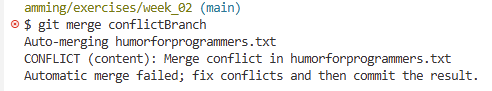

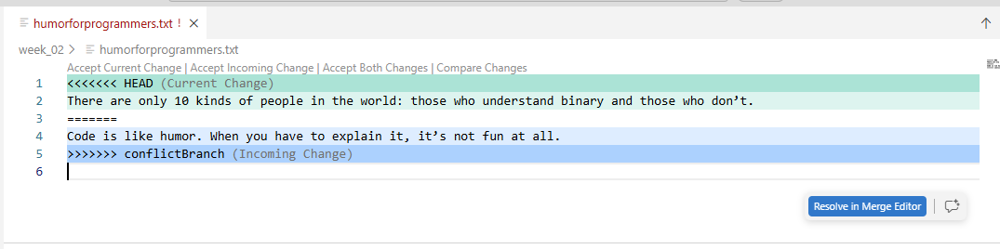

Click on the blue button: "Resolve in Merge Editor". The following window opens:

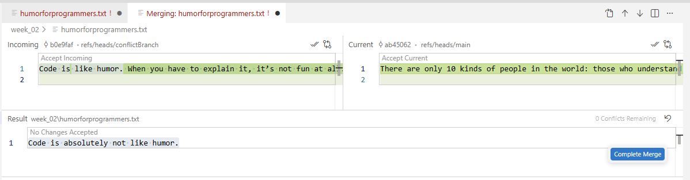

Note the following tools you now have:

-   "Accept Incoming" and the branch name `conflictBranch`
-   "Accept Current" and the branch name `main`
-   Reset via back-arrow

Choose "Accept Current" and complete the merge via a commit:

``` bash
git commit -m "choose version from main"
git branch -d conflictBranch
```
:::


<!------------------------------------------------
--------------------------------------------------
--------------------------------------------------
------------------------------------------------->


<div style="margin-top: 8em;"></div>


## Exercise 8: An additional exercise on merge conflicts (**self-study 🔍**)

Ex 7 taught the mechanics. Ex 8 shows how conflicts arise in real collaboration. Let's simulate the situation of a merge conflict using a simple Python script. Imagine Peter and Clara are working on a project together. They start with a shared file, then each modifies the same line on a different branch. We will stay in the same repository and directory ([/week_02]{.path}) for this exercise for simplicity.

#### Setup: create a shared file on `main`

1. Make sure you are on the `main` branch.
2. Create a Python file called `compute.py` with the following content. You can create it using VSCode (new file -> save):

```python
result = 2 + 2
print(result)
```

3. Add and commit: `"Add compute.py with simple addition"`

::: {.callout-tip collapse="true" title="Solution"}

Make sure you are on `main` and create `compute.py`:

```bash
git switch main
```

Create the file `compute.py` in VSCode with the content `result = 2 + 2` and `print(result)`, then:

```bash
git add compute.py
git commit -m "Add compute.py with simple addition"
```
:::


#### Clara's part:
- Create a new branch called `clara-fix`. Checkout the new branch.
- Clara thinks the calculation should be a multiplication. Change the first line of `compute.py` to `result = 2 * 3`. Save, add, and commit: `"Change operation to multiplication"`

::: {.callout-tip collapse="true" title="Solution"}
```bash
git switch -c clara-fix
```

Open `compute.py` in VSCode and change the first line to `result = 2 * 3`. Save, then:

```bash
git add compute.py
git commit -m "Change operation to multiplication"
```

Output:
```sh
[clara-fix 11a7574] Change operation to multiplication
 1 file changed, 1 insertion(+), 1 deletion(-)
```
:::

#### Peter's part:
- Go back to the `main` branch. Peter thinks we need subtraction instead. Change the first line of `compute.py` to `result = 10 - 4`. Save, add, and commit: `"Change operation to subtraction"`

::: {.callout-tip collapse="true" title="Solution"}
```bash
git switch main
```

Notice that we are back on the `main` branch, where the original version of `compute.py` is still present. If you open the python file, you should observe the original `2+2`. Open `compute.py` in VSCode and change the first line to `result = 10 - 4`. Save, then:

```bash
git add compute.py
git commit -m "Change operation to subtraction"
```
:::

#### Reflection:
- What is the situation right now? Both Peter and Clara changed the **same line** of the **same file**, but on different branches. Use the `Git Graph` or the GUI to visualize the branches. What do you think will happen when we try to merge?

::: {.callout-tip collapse="true" title="Solution"}
We are now in a situation where `main` and `clara-fix` have diverged: both modified the same line of `compute.py`.

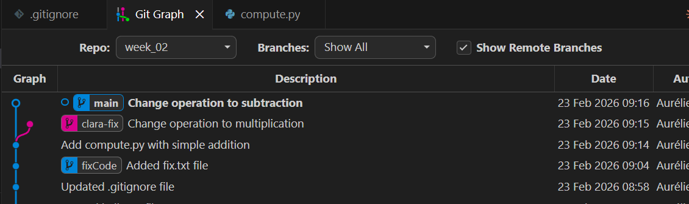

On the graph, you observe that the main branch is a commit ahead of main, and `clara-fix` is a commit ahead of `main`, but they are different commits. This means that the branches have diverged and have different versions of the same file. When we try to merge, `git` will not know which version to keep and will report a merge conflict.
:::

#### Merge conflict:
- Make sure you are on main. Merge `clara-fix` into `main`. Resolve the merge conflict by choosing which version you prefer (or write your own!). Commit the merge.

::: {.callout-tip collapse="true"}
Merge using
```bash
git merge clara-fix
```

Output:
```sh
Auto-merging compute.py
CONFLICT (content): Merge conflict in compute.py
Automatic merge failed; fix conflicts and then commit the result.
```

Git cannot auto-merge and reports a conflict. Open `compute.py` in VSCode, and you will see something like this:

```
<<<<<<< HEAD
result = 10 - 4
=======
result = 2 * 3
>>>>>>> clara-fix
print(result)
```

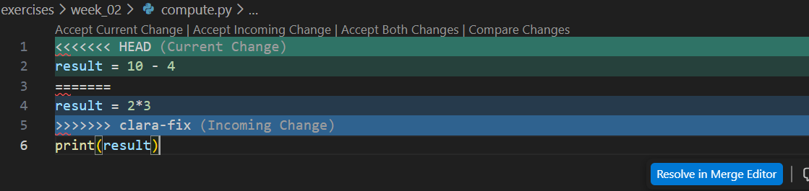

- Everything between `<<<<<<< HEAD` and `=======` is **Peter's version** (what is currently on `main`).
- Everything between `=======` and `>>>>>>> clara-fix` is **Clara's version**.

To resolve the conflict, delete the conflict markers and keep the version you prefer (or write something new). For example, let's keep Clara's multiplication:

```python
result = 2 * 3
print(result)
```

Save the file, then:

```bash
git add compute.py
git commit -m "Merge clara-fix: keep multiplication"
```

You can also resolve the merge conflict using the VSCode GUI. When VSCode detects conflict markers, it shows clickable buttons above the conflict: **"Accept Current Change"** (Peter's), **"Accept Incoming Change"** (Clara's), or **"Accept Both Changes"**. This is often easier than editing the markers manually.

Finally, clean up by deleting the merged branch (`-d` stands for delete):

```bash
git branch -d clara-fix
```

At the end, your git graph looks like this (there might be small differences in the commit messages and hashes):

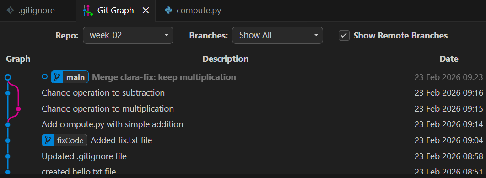
:::


<!------------------------------------------------
--------------------------------------------------
--------------------------------------------------
------------------------------------------------->


<div style="margin-top: 8em;"></div>


---

## Additional exercises (**self-study 🔍**, not exam-relevant)
You can learn `git` interactively with the website [learngitbranching.js.org](https://learngitbranching.js.org/). Have a look!


<div style="margin-top: 4em;"></div>


## Appendix: Terminals:  Bash vs. Git Bash vs. PowerShell vs. Command Prompt

All four tools are command-line interfaces (CLIs), but they use slightly different command syntax.

-   macOS and Linux use **Bash** by default.
-   Windows uses **PowerShell** by default.
-   **Git Bash** provides a Unix-like environment on Windows and is often easiest for beginners when working with Git.
-   **Command Prompt (cmd)** is the older Windows terminal and is less commonly used today.

Important: Git commands (`git status`, `git add`, etc.) work in all of them as long as Git is properly installed.

| Feature | Bash | Git Bash | PowerShell | Command Prompt (cmd) |
|---------------|---------------|---------------|---------------|---------------|
| **Operating System** | macOS, Linux | Windows | Windows (default), also macOS/Linux | Windows |
| **What It Is** | Standard Unix shell | Windows program that emulates Bash | Modern Windows shell | Older Windows shell |
| **Default on System?** | Yes (macOS/Linux) | No (install with Git) | Yes (Windows) | Yes (Windows, legacy) |
| **Typical Commands** | `ls`, `cd`, `mkdir`, `rm`, `echo` | `ls`, `cd`, `mkdir`, `rm`, `echo` | `dir`, `cd`, `mkdir`, `Remove-Item`, `echo` | `dir`, `cd`, `mkdir`, `del`, `echo` |
| **Git Commands Available?** | Yes (if Git installed) | Yes (comes with Git for Windows) | Yes (if Git installed) | Yes (if Git installed and in PATH) |
| **Recommended for This Course** | Yes (macOS/Linux users) | Yes (Windows users) | No because syntax differs | Yes |


<br>

## Appendix 2: Line Endings (LF vs. CRLF)

***Windows*** **users** may see a warning such as:

> warning: in the working copy of 'humorforprogrammers.txt', LF will be replaced by CRLF the next time Git touches it

This warning refers to differences in line endings between operating systems.\
macOS and Linux use **LF** (Line Feed) to mark the end of a line, while Windows uses **CRLF** (Carriage Return + Line Feed).

Because we configured `core.autocrlf=true` on Windows, Git stores files in the repository using LF (to keep things consistent across systems), but automatically converts them to CRLF in your local working directory.
If a file currently contains LF line endings, Git informs you that it will convert them to CRLF the next time it modifies the file.

This is not an error and does not affect the actual content of your file.
It simply ensures consistent handling of line endings and smooth collaboration across different operating systems.

macOS and Linux users (who set `core.autocrlf=input`) typically do not see this warning, since their systems already use LF line endings.

<br>

## Appendix 3: What happens if you forget the `-m` flag in `git commit`?

See slides lecture 2.