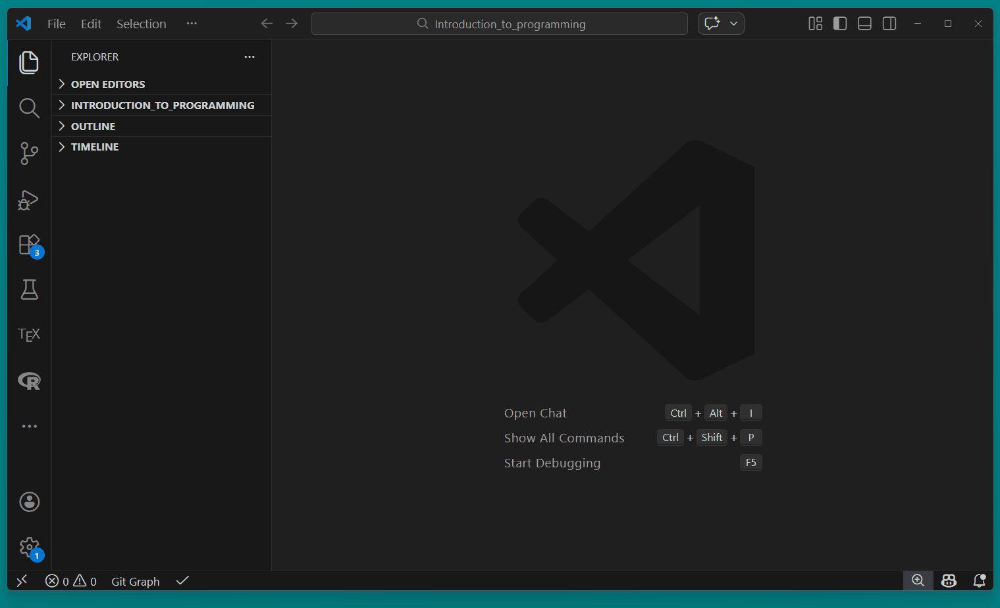
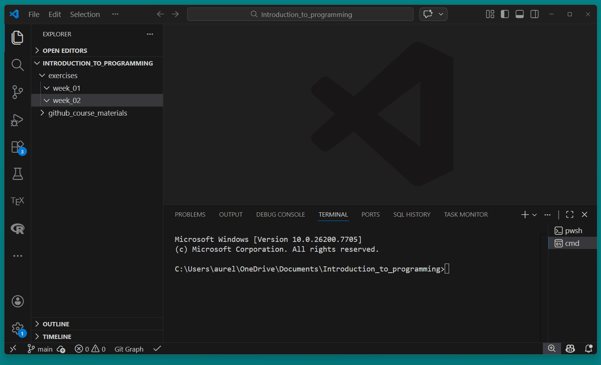
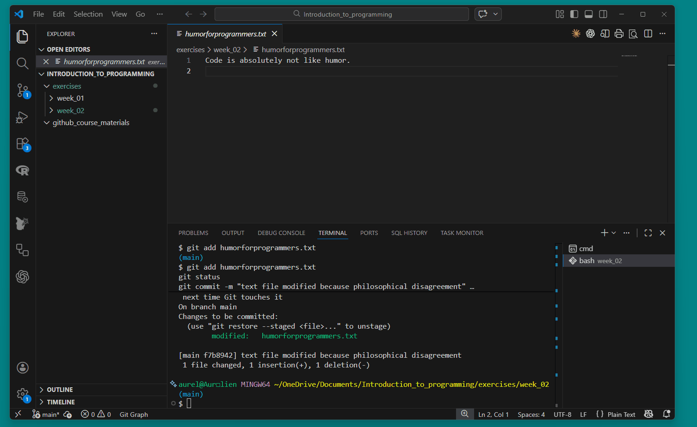
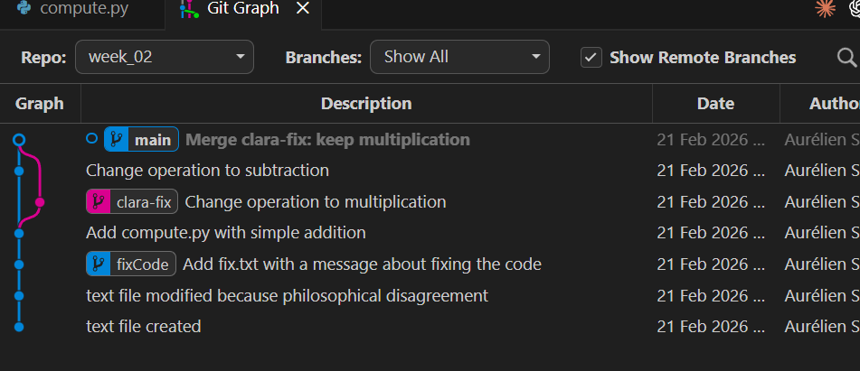

## Install `git` and the VSCode extension `Git Graph`

**This step has to be done before the exercise session.** Please follow the instructions on the git website: [https://git-scm.com/book/en/v2/Getting-Started-Installing-Git](https://git-scm.com/book/en/v2/Getting-Started-Installing-Git)


::: {.panel-tabset}

#### Windows

For Windows users, we recommend installing git via the Git for Windows installer: [https://git-scm.com/download/win](https://git-scm.com/download/win).


#### Mac
For Mac users, git is often already installed. On Mavericks (10.9) or above you can do this simply by trying to run git from the Terminal the very first time.

```bash
$ git --version
```

If you don’t have it installed already, it will prompt you to install it. If you want a more up to date version, you can also install it via a binary installer. A macOS Git installer is maintained and available for download at the Git website, at [https://git-scm.com/download/mac](https://git-scm.com/download/mac).
:::

Install the VSCode extension `Git Graph` from the VSCode marketplace. This extension allows you to visualize your git repository and perform git operations using a graphical interface. You can also use the built-in `git` support in VSCode, but we recommend `Git Graph` for better visualization of branches and commits.


<br>

## Configure `git` on your machine

At this point, you should have `git` installed on your machine. It does not matter if you are on Windows or Mac, the configuration and the `git` commands are the same.

Follow the step below to configure your `git` installation.

```bash
# Add your name
git config --global user.name "Your Name"

# Add your email address
git config --global user.email "your.email@unisg.ch"

# Use modern main branch name
git config --global init.defaultBranch main
```

```bash
# For Linux/Mac:
git config --global core.autocrlf input

# For Windows:
git config --global core.autocrlf true
```


<br>

## Initialize a `git` repository

We will work with the folder structure established in the first exercise session. Remember, the structure of your `Introduction_to_programming` directory should look like this:

```
Introduction_to_programming/
├── github_course_materials/ # is empty for now, you will clone the git repo in week 3
├── exercises/               # Student's own work
│   ├── week_01/
│   ├── week_02/
│   ├── ...
│   ├── week_12/
├── group_project/
│   ├── ...
```

1. Navigate to the exercises folder in the course directory `Introduction_to_programming/exercises/`. Check if `week_02` exists (using `ls` or `dir`). If `week_02` does not exist, create it using `mkdir week_02` in the terminal.
2. In the terminal, navigate to the `week_02` directory.
3. There, initialize a git repository using `git init`. Check your git repo using `git status`.

::: {.callout-note}
#### Using `git bash` on Windows

For Windows users: you have now installed `git`, which installs a terminal called `Git Bash`. This terminal supports all `git` commands and `bash` commands like in Mac. With Git Bash, you can access files and directories in the same way as with `command prompt`. You can open `Git Bash` in your VSCode terminal.

This adds a bit more complexity for Windows users: you now have three options. You can use the `cmd prompt` terminal, the `Git Bash` terminal, or powershell. We recommend using `Git Bash` for all git commands in your vscode terminal, but you can also use `cmd prompt` with `git` commands. The important thing is that you are aware of these different shells/terminals.
:::


::: {.callout-tip collapse="true"}
#### Solution

::: {.panel-tabset}

##### Windows (cmd prompt)
In your terminal from VSCode, navigate to your `Introduction_to_programming/exercises/week_02`.

```bash
cd
cd exercises
dir
mkdir week_02
cd week_02
dir
```



##### Bash (Mac users or with Git Bash)

```bash
pwd
cd exercises
ls
mkdir week_02
cd week_02
ls
```


:::

Then:

```bash
git init
# Initialized empty Git repository in /Users/Introduction_to_programming/exercises/week_02

git status
# On branch main
# No commits yet
# nothing to commit (create/copy files and use "git add" to track)
```

The `git init` command initializes a new git repository in the current directory. It creates a hidden `.git` folder that contains all the necessary files and metadata for version control. After running this command, you can start tracking changes to your files and making commits.

*Note*: you don't see the `.git` folder in your file explorer on the left bar of VS code because it is hidden. To see it, right click on the file explorer in VSCode and click on "Reveal in File Explorer". This will open the folder in your system file explorer, where you can see the hidden `.git` folder. You can also use the terminal command `ls -a` to list all files, including hidden ones, to see the `.git` folder.
:::

<br>

## First tracking and commit

1. In `week_02`, create a text file named `humorforprogrammers.txt` containing the sentence "Code is like humor. When you have to explain it, it is bad." using your terminal or simply using VSCode (new file -> save)
2. Observe what happens with `git status`.
3. Add the file to the staging area. Check with `git status`.
4. Create your first commit. Commit the new file with the commit message "text file created". Check with `git status`.
5. Change the text in `humorforprogrammers.txt` to "Code is absolutely not like humor." and save. Use `git diff` to see the actual unstaged changes.
6. Add the file to the staging area and commit the new file with the commit message "text file modified because philosophical disagreement".  Check with `git status`.


::: {.callout-tip collapse="true"}
#### Solution

First, create the text file `humorforprogrammers.txt` with the following content:

::: {.panel-tabset}

##### Windows (cmd prompt)
```bash
echo Code is like humor. When you have to explain it, it is bad. > humorforprogrammers.txt

# Verify the content using type
type humorforprogrammers.txt
# Code is like humor. When you have to explain it, it is bad.
```




##### Bash (Mac users or with Git Bash)
```bash
echo Code is like humor. When you have to explain it, it is bad. > humorforprogrammers.txt

# Verify the content using cat
cat humorforprogrammers.txt
# Code is like humor. When you have to explain it, it is bad.
```


:::

```bash
git status
```

```sh
$ git status
On branch main

No commits yet

Untracked files:
  (use "git add <file>..." to include in what will be committed)
        humorforprogrammers.txt

nothing added to commit but untracked files present (use "git add" to track)
```

Then, add the file to the staging area and check the status of your git repository.

```bash
git add humorforprogrammers.txt
git status
```

```sh
git status
On branch main

No commits yet

Changes to be committed:
  (use "git rm --cached <file>..." to unstage)
        new file:   humorforprogrammers.txt
```

Finally, commit the change with a nice commit message.

```bash
git commit -m "text file created"
git status
```

```sh
git status
[main (root-commit) 3326090] text file created
 1 file changed, 1 insertion(+)
 create mode 100644 humorforprogrammers.txt
On branch main
nothing to commit, working tree clean
```

Change the text in `humorforprogrammers.txt` to "Code is absolutely not like humor." and save. Use `git diff` to see the actual unstaged changes.

```bash
echo Code is absolutely not like humor. > humorforprogrammers.txt
git diff
```

You should observe something like this:

```sh
warning: in the working copy of 'humorforprogrammers.txt', LF will be replaced by CRLF the next time Git touches it
diff --git a/humorforprogrammers.txt b/humorforprogrammers.txt
index 47e1a11..8e8d1ff 100644
--- a/humorforprogrammers.txt
+++ b/humorforprogrammers.txt
@@ -1 +1 @@
-Code is like humor. When you have to explain it, it is bad.
+Code is absolutely not like humor.
```

```bash
git add humorforprogrammers.txt
git status
git commit -m "text file modified because philosophical disagreement"
```

```sh
git commit -m "text file modified because philosophical disagreement"
On branch main
Changes to be committed:
  (use "git restore --staged <file>..." to unstage)
        modified:   humorforprogrammers.txt

[main 5c0e848] text file modified because philosophical disagreement
 1 file changed, 1 insertion(+), 1 deletion(-)
```

:::


<br>

## Ignore some files

1. If you are not there yet, navigate to your repo `/week_02` in exercises.
2. If you haven't done it from the course, download the [Git Cheat Sheet](https://education.github.com/git-cheat-sheet-education.pdf) and save it in `/week_02`
3. Create a new `.gitignore` file to ignore only this cheatsheet.
4. Add all the files to your repo and commit. Notice what's happening.
5. Change the `.gitignore` file to the file below. Explain what the new `.gitignore` file does. Commit. (Self-study)

```bash
# Data and generated outputs
*.csv
*.tsv
*.xlsx
*.pdf
*.png
*.jpg
*.html

# Python
__pycache__/
*.pyc

# Virtual environment (uv)
.venv/

# Editor / OS files
.DS_Store # typical for macOS!
.vscode/
```


::: {.callout-tip collapse="true"}
#### Solution

We create a new file called `.gitignore` in the `week_02` directory, asking specifically to exclude the Git Cheat Sheet. The `.gitignore` file is used to specify which files and directories should be ignored by git. This means that any files or directories listed in the `.gitignore` file will not be tracked by git, and any changes to those files will not be included in commits.

```bash
# Ignore the Git Cheat Sheet
git-cheat-sheet-education.pdf
```




After adding this line to the `.gitignore` file, we add all files (`.`) to the staging area and commit:

```bash
git add .
git commit -m "Add .gitignore to ignore the Git Cheat Sheet"
```

:::

<br>

## Time-Travel ⏱️

- Go back to your directory `/week_02` in exercises.
- Open the git log of your respository or call it with `git log`. From the log, identify the commit hash (identifier) of your first commit. Note that `HEAD` is used to reference commits relatively, with `HEAD` being the current commit, `HEAD~1` the previous commit, `HEAD~2` the commit two commits ago, and so on.
- Checkout the previous commit using the `git checkout` function. As seen in the course, you can checkout to a `git commit` using the commit identifier. Or, you can use the following syntax: `git checkout HEAD~1`.
- Go back to your main branch using `git checkout main`.
- Reflect on what we've done. In what circumstances would you want to checkout to a previous commit? What are the risks of doing so?

::: {.callout-tip collapse="true"}
#### Solution

To identify the commit hash of the first commit, you can use the command:

```bash
git log
```

which renders the following log (the actual commit hashes will be different on your machine, of course):

```sh
commit 9f7fa3a26f61b477033129b4db29954988f3716d (HEAD -> main)
Author: Aurélien Sallin <aurelien.sallin@protonmail.com>
Date:   Sat Feb 21 11:58:32 2026 +0100

    Add .gitignore to ignore the Git Cheat Sheet

commit f7b8942c1217bb87c0dd6dc54378dbe57727de88
Author: Aurélien Sallin <aurelien.sallin@protonmail.com>
Date:   Sat Feb 21 11:50:19 2026 +0100

    text file modified because philosophical disagreement

commit a4fcde82470f03c8d101b10207e1f69c51812dad
Author: Aurélien Sallin <aurelien.sallin@protonmail.com>
Date:   Sat Feb 21 11:34:55 2026 +0100

    text file created
```

Press `q` to exit the log. As a practical note, you can also use `git log --oneline` to get a more concise log, which only shows the first 7 characters of the commit hash and the commit message.

We observe that the commit hash of our first commit is `a4fcde82470f03c8d101b10207e1f69c51812dad`. Another way is to use the VSCode GUI to look at the commit history and identify the commit hash of the first commit:


We can checkout to this commit using:

```bash
git checkout a4fcde82470f03c8d101b10207e1f69c51812dad
```

which gives you this:

```sh
git checkout a4fcde82470f03c8d101b10207e1f69c51812dad
Note: switching to 'a4fcde82470f03c8d101b10207e1f69c51812dad'.

You are in 'detached HEAD' state. You can look around, make experimental
changes and commit them, and you can discard any commits you make in this
state without impacting any branches by switching back to a branch.

If you want to create a new branch to retain commits you create, you may
do so (now or later) by using -c with the switch command. Example:

  git switch -c <new-branch-name>

Or undo this operation with:

  git switch -

Turn off this advice by setting config variable advice.detachedHead to false

HEAD is now at a4fcde8 text file created
```

You should observe that the content of the file `humorforprogrammers.txt` has changed to the original version. This is because we are now in a "detached HEAD" state, meaning that we are not on any branch, but rather on a specific commit. In this state, we can look around and make experimental changes, but any commits we make will not be associated with any branch. To get back to the main branch, we can use:

```bash
git checkout main
```
and our text file will be back to the most recent version.

:::


<br>

## On Branches 🪵

- Navigate to your repo in `/week_02` in exercises.
- Create a new branch called `fixCode`. Checkout the new branch. Make sure you're on the right branch using `git status`. Check the different branches of your repo with `git branch`.
- Add a new file `fix.txt` containing "I fixed the code!" and save. Add and commit the change on the new branch.
- Pause and reflect on the following questions: in what branch are you now? What is the content of the main branch?
- Go back to the main branch. Check the content of the directory. Do you see the new file? Why not?
- Merge the `fixCode` branch into main
- Repeat all the above steps (with a different branch name & commit) using the GUI on VSCode (*self-study*)

::: {.callout-tip collapse="true"}
#### Solution

Create a new branch called `fixCode` and checkout the new branch:

```bash
git checkout -b fixCode
# Switched to a new branch 'fixCode'

git status
# On branch fixCode
# nothing to commit, working tree clean

git branch
#* fixCode
#  main
```

Add a new file `fix.txt` containing "I fixed the code!" and save. Add and commit the change on the new branch.

```bash
echo I fixed the code! > fix.txt
git add fix.txt
git commit -m "Add fix.txt with a message about fixing the code"
```

Go back to the main branch and check the content of the directory:

```bash
git checkout main
# Switched to branch 'main'

git status
# On branch main
# nothing to commit, working tree clean
```

The file is not visible on `main` because we created and committed it on the `fixCode` branch. To see the file on `main`, we need to merge the `fixCode` branch into `main`.

Merge the `fixCode` branch into main:

```bash
git merge fixCode

# Updating 9f7fa3a..8926410
# Fast-forward
#  fix.txt | 1 +
#  1 file changed, 1 insertion(+)
#  create mode 100644 fix.txt
```

The file `fix.txt` is now part of the `main` branch after the merge. We were able to merge without conflicts because we only added a new file on the `fixCode` branch, which did not interfere with any existing files on the `main` branch.
:::

<br>


## On merge conflicts (if no time, live demo in class)

Let's simulate the situation of a merge conflict using a simple Python script. Imagine Peter and Clara are working on a project together. They start with a shared file, then each modifies the same line on a different branch. We will stay in the same repository and directory (`week_02`) for this exercise for simplicity.

#### Setup: create a shared file on `main`

1. Make sure you are on the `main` branch.
2. Create a Python file called `compute.py` with the following content. You can create it using VSCode (new file -> save):

```python
result = 2 + 2
print(result)
```

3. Add and commit: `"Add compute.py with simple addition"`

#### Clara's part:
- Create a new branch called `clara-fix`. Checkout the new branch.
- Clara thinks the calculation should be a multiplication. Change the first line of `compute.py` to `result = 2 * 3`. Save, add, and commit: `"Change operation to multiplication"`

#### Peter's part:
- Go back to the `main` branch. Peter thinks we need subtraction instead. Change the first line of `compute.py` to `result = 10 - 4`. Save, add, and commit: `"Change operation to subtraction"`

#### Reflection:
- What is the situation right now? Both Peter and Clara changed the **same line** of the **same file**, but on different branches. What do you think will happen when we try to merge?

#### Merge conflict:
- Make sure you are on main. Merge `clara-fix` into `main`. Resolve the merge conflict by choosing which version you prefer (or write your own!). Commit the merge.


::: {.callout-tip collapse="true"}
#### Solution

##### Setup:
Make sure you are on `main` and create `compute.py`:

```bash
git checkout main
```

Create the file `compute.py` in VSCode with the content `result = 2 + 2` and `print(result)`, then:

```bash
git add compute.py
git commit -m "Add compute.py with simple addition"
```

##### Clara's part:
```bash
git checkout -b clara-fix
```

Open `compute.py` in VSCode and change the first line to `result = 2 * 3`. Save, then:

```bash
git add compute.py
git commit -m "Change operation to multiplication"
```

##### Peter's part:
```bash
git checkout main
```

Notice that we are back on the `main` branch, where the original version of `compute.py` is still present. Open `compute.py` in VSCode and change the first line to `result = 10 - 4`. Save, then:

```bash
git add compute.py
git commit -m "Change operation to subtraction"
```

We are now in a situation where `main` and `clara-fix` have diverged: both modified the same line of `compute.py`.

##### Merge:
```bash
git merge clara-fix
```

```sh
$ git merge clara-fix
Auto-merging compute.py
CONFLICT (content): Merge conflict in compute.py
Automatic merge failed; fix conflicts and then commit the result.
```

Git cannot auto-merge and reports a conflict. Open `compute.py` in VSCode, and you will see something like this:

```sh
<<<<<<< HEAD
result = 10 - 4
=======
result = 2 * 3
>>>>>>> clara-fix
print(result)
```

- Everything between `<<<<<<< HEAD` and `=======` is **Peter's version** (what is currently on `main`).
- Everything between `=======` and `>>>>>>> clara-fix` is **Clara's version**.

To resolve the conflict, delete the conflict markers and keep the version you prefer (or write something new). For example, let's keep Clara's multiplication:

```python
result = 2 * 3
print(result)
```

Save the file, then:

```bash
git add compute.py
git commit -m "Merge clara-fix: keep multiplication"
```

You can also resolve the merge conflict using the VSCode GUI. When VSCode detects conflict markers, it shows clickable buttons above the conflict: **"Accept Current Change"** (Peter's), **"Accept Incoming Change"** (Clara's), or **"Accept Both Changes"**. This is often easier than editing the markers manually.

Finally, clean up by deleting the merged branch (`-d` stands for delete):

```bash
git branch -d clara-fix
```

At the end, your git graph looks like this:


:::


<br>

## Additional exercises (self-study)
You can learn `git` interactively with the website [learngitbranching.js.org](https://learngitbranching.js.org/). This website allows you to practice `git` commands in an interactive way, with visualizations of the git tree and branches. Note that it goes a step further than what we have seen in the course (and only what we've seen in the course and exercises is required for the exam).