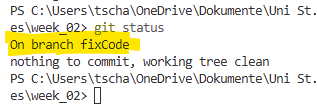
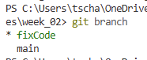
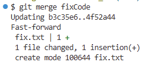

::: {=html}
```{=html}
<style>
.path {
  background-color: #f2f2f2;
  padding: 2px 6px;
  border-radius: 4px;
  font-family: monospace;
}
</style>
```
:::

**in construction!!**

Official Cheat-Sheet of Git: [link](https://git-scm.com/cheat-sheet)

Want to understand Git better?
[go here](https://git-scm.com/book/en/v2)

::: {.callout-important title="We will work with our common folder structure"}
Make sure to be consistent with the folder structure below (it is the same from last week and will stay the same *throught* the course):

```
Introduction_to_programming/
├── github_course_materials/ # is empty for now, you will clone the git repo in week 3
├── exercises/               # Student's own work
│   ├── week_01/
│   ├── week_02/
│   ├── ...
│   ├── week_12/
├── group_project/
│   ├── ...
```
:::

## Install `git` and the VSCode extension `Git Graph`

**This step has to be done before the exercise session.**

Please follow the instructions on the git website: [Git Installation Guide](https://git-scm.com/book/en/v2/Getting-Started-Installing-Git)

1.  For *Windows users*, we recommend installing git via the [Git for Windows installer](https://git-scm.com/download/win).

2.  For *Mac users*, git is often already installed.
    On Mavericks (10.9) or above you can do this simply by trying to run git from the Terminal resp.
    the Bash the very first time, e.g. using `git --version`.
    If you don’t have it installed already, it will prompt you to install it.
    If you want a more up to date version, you can also install it via a binary installer.[^1]
    A macOS Git installer is maintained and available for download at the Git website [here](https://git-scm.com/download/mac).


<br>

## Bash vs. Git Bash vs. PowerShell vs. Command Prompt

All four tools are command-line interfaces (CLIs), but they use slightly different command syntax.

-   macOS and Linux use **Bash** by default.
-   Windows uses **PowerShell** by default.
-   **Git Bash** provides a Unix-like environment on Windows and is often easiest for beginners when working with Git.
-   **Command Prompt (cmd)** is the older Windows terminal and is less commonly used today.

Important: Git commands (`git status`, `git add`, etc.) work in all of them as long as Git is properly installed.

| Feature | Bash | Git Bash | PowerShell | Command Prompt (cmd) |
|---------------|---------------|---------------|---------------|---------------|
| **Operating System** | macOS, Linux | Windows | Windows (default), also macOS/Linux | Windows |
| **What It Is** | Standard Unix shell | Windows program that emulates Bash | Modern Windows shell | Older Windows shell |
| **Default on System?** | Yes (macOS/Linux) | No (install with Git) | Yes (Windows) | Yes (Windows, legacy) |
| **Typical Commands** | `ls`, `cd`, `mkdir`, `rm`, `echo` | `ls`, `cd`, `mkdir`, `rm`, `echo` | `dir`, `cd`, `mkdir`, `Remove-Item`, `echo` | `dir`, `cd`, `mkdir`, `del`, `echo` |
| **Git Commands Available?** | Yes (if Git installed) | Yes (comes with Git for Windows) | Yes (if Git installed) | Yes (if Git installed and in PATH) |
| **Create a File** | `touch file.txt` | `touch file.txt` | `New-Item file.txt` | `echo. > file.txt` |
| **Delete a File** | `rm file.txt` | `rm file.txt` | `Remove-Item file.txt` | `del file.txt` |
| **Recommended for This Course** | Yes (macOS/Linux users) | Yes (Windows users) | Possible, but syntax differs | Not recommended |

<br>


## 1. Configurate git on your machine

Follow the step here to configurate your git installation.

-   `user.name`: Set the name that will be attached to your commits.
    This is *visible* to collaborators when working on shared repositories.
    IMPORTANT: Use the *same* email address as for your GitLab account, if you have any, since it is used for identification and linking commits to your GitLab/GitHub account

-   `user.email`: Set the email address that will be attached to your commits.
    IMPORTANT: Use the *same* email address as for your GitLab account, if you have any, since it is used for identification and linking commits to your GitLab/GitHub account.

-   `init.defaultBranch`: Configure the default name of the initial branch when creating a new repository.
    Historically this was called "master", but most platforms now use "main" as the standard default branch name.

``` bash
# Add your name
git config --global user.name "Your Name"

# Add your email address
git config --global user.email "your.email@unisg.ch"

# Use modern main branch name
git config --global init.defaultBranch main
```

The following commands configure how Git handles line endings across different operating systems.
Windows uses a different line ending format (CRLF) than macOS/Linux (LF), which can otherwise lead to unnecessary changes showing up in version control and cause avoidable merge conflicts.
Setting this option ensures a consistent file format across platforms and enables smooth collaboration.

**For Linux/Mac: Bash**

``` bash
git config --global core.autocrlf input
```

**For Windows: PowerShell**

``` bash
git config --global core.autocrlf true
```

<br>

## 2. Initialize a Git repository

1.  Identify the filepath of the directory [Introduction_to_programming/exercises/week_02]{.path}.
2.  In the terminal, navigate to that directory. This is important. The folder you are currently in is the one Git will track.
3.  Initialize a git repository using `git init`. Check your git repo using `git status`.

::: {.callout-tip collapse="true" title = "Solution"}
In your terminal from VSCode, navigate to [.../Introduction_to_programming/exercises/week_02]{.path}.

``` bash
cd "path-to-your-week_02-directory"
git init
```

:::

::: {.callout-note title="Initializing"}
Initializing a Git repository means turning a normal folder into a Git-*tracked* project.
When you run `git init`, Git creates a hidden [/.git]{.path} directory that stores the version history and configuration for that folder.
From that moment on, Git can track changes, create commits, and manage versions of your files in that folder and its subfolders.
:::

<br>

## 3. First tracking and commit

1.  Check the current status of your git project in [/week_02]{.path} using `git status`.

2.  In [week_02]{.path}, create a text file named `humorforprogrammers.txt` containing the sentence "*Code is like humor. When you have to explain it, it’s bad.*" using your terminal.

3.  Observe what happens with `git status`.
    Check `git log`.

4.  Output the file contents of `humorforprogrammers.txt`.

::: {.callout-tip collapse="true" title="Solution"}
Use the Git Bash, Powershell (Windows) or Bash (macOS) terminal in VSC for this task.
You can also use Git Bash directly.

``` bash
# 1-4:
git status
echo "Code is like humor. When you have to explain it, it’s bad." > humorforprogrammers.txt
git status
git log
cat humorforprogrammers.txt
```
:::

5.  Add the file to the staging area.
    Check again `git status`.
    Remember: you can use autocomplete with the Tab key to avoid having to write the full name manually.

6.  Create your first commit.
    Commit the new file with the commit message "text file created".
    Check with `git status`.

7.  Change the text in `humorforprogrammers.txt` to "*Code is absolutely not like humor.*".
    Verify the successful change by checking the file's content in your terminal.

8.  Use `git diff` to see the actual unstaged changes.

9.  Add the file to the staging area, check the status, and commit the new file with the commit message "text file modified because disagreement".
    Check again with `git status` and with `git log`.

::: {.callout-tip collapse="true" title="Solution"}
``` bash
# 5:
git add humorforprogrammers.txt
git status

# 6:
git commit -m "text file created"
git status

# 7:
echo "*Code is absolutely not like humor.*" > humorforprogrammers.txt
cat humorforprogrammers.txt

# 8:
git diff

# 9:
git add humorforprogrammers.txt
git status
git commit -m "text file modified because disagreement"
git status
git log
```
:::

10. Look at your sidebar in VSCode. You'll notice the `git` GUI {width="20px"}. Now create a new file `hello.txt` containing "hello world!". Observe the sidebar. Using the GUI, add `hello.txt` and commit, using a nice commit message.

::: {.callout-tip collapse="true" title="Solution"}
Create hello.txt file:

``` bash
# 10:
echo "hello world!" > hello.txt
```

In the sidebar, open Git extension.
Click on the plus symbol next to hello.txt to add it to the staging area.

In the message window, enter your commit message.
No need to put it in quotes.
Then hit commit.

You'll see a new commit in the graph window:


:::

::: {.callout-note title = "LF will be replaced by CRLF the next time Git touches it"}
***Windows*** **users** may see a warning such as:

> warning: in the working copy of 'humorforprogrammers.txt', LF will be replaced by CRLF the next time Git touches it

This warning refers to differences in line endings between operating systems.\
macOS and Linux use **LF** (Line Feed) to mark the end of a line, while Windows uses **CRLF** (Carriage Return + Line Feed).

Because we configured `core.autocrlf=true` on Windows, Git stores files in the repository using LF (to keep things consistent across systems), but automatically converts them to CRLF in your local working directory.
If a file currently contains LF line endings, Git informs you that it will convert them to CRLF the next time it modifies the file.

This is not an error and does not affect the actual content of your file.
It simply ensures consistent handling of line endings and smooth collaboration across different operating systems.

macOS and Linux users (who set `core.autocrlf=input`) typically do not see this warning, since their systems already use LF line endings.
:::

::: {.callout-note title = "commit"}
A commit is a saved snapshot of your project at a specific point in time.
When you run `git commit`, Git records the staged changes together with a message describing what was changed.
Each commit becomes part of the project’s history, allowing you to track progress, review changes, and revert to earlier versions if necessary.
:::

::: {.callout-note title = "staging area"}
The staging area is an intermediate step between your working files and a commit.
When you run `git add`, you are selecting exactly which changes should be included in the next commit - you do not need to commit *all* your changes, you can select what should be commited.
This allows you to group related changes together and avoid committing unfinished or unrelated edits.
In short, the staging area gives you precise control over what becomes part of the project history.
:::

::: {.callout-important title="VIM and Nano – when you forgot the `-m`"}
If you run `git commit` without the `-m` option, Git will open a text editor in the current terminal so you can write the commit message manually.

Git uses a terminal-based editor by default.
On many systems this is Vim, on others it may be Nano.
Both are command-line text editors.

**If Vim opens**

Vim starts in *normal mode*, where you cannot type immediately.

1.  Press `i` to enter *insert mode*.
2.  Type your commit message.
3.  Press `Esc` to leave insert mode.
4.  Type `:wq` and press `Enter` to save and quit.

If you want to exit without saving, type `:q!` instead.

**If Nano opens**

Nano is simpler: - Just start typing your message.
- Press `Ctrl + O` to save.
- Press `Enter` to confirm.
- Press `Ctrl + X` to exit.

**Recommendation:** If you prefer not to use an editor, you can always write your commit message directly with\
`git commit -m "Your message"`.
:::

<br>

## 4. Prevent files from tracking

1.  Make sure to still be in the [/week_02]{.path} repo.

2.  If you haven't done it from the course, download the [Git Cheat Sheet](https://education.github.com/git-cheat-sheet-education.pdf) and save it in your [/week_02]{.path} folder.

3.  If you want to see the pdf inside VSCode, we recommend you install the "PDF Viewer" extension.

4.  Create a new [.gitignore]{.path} file to ignore only the cheatsheet.
    Note that there are two options:

    -   Via the Git GUI in VSCode
    -   Via the terminal by creating a new .gitignore file

::: {.callout-tip collapse="true" title="Solution"}
There are two options to create the gitignore: once via Git GUI and once via the terminal.
We'll explain both.

-   Via the Git GUI:

    

    That automatically creates the [.gitignore]{.path} file for you.

-   Via the terminal:

    ```
    echo "git-cheat-sheet-education.pdf" > .gitignore
    ```
:::

5.  Add all the files to your repo and commit.
    Notice what's happening.

6.  Change the [.gitignore]{.path} contents to the following contents and save it.
    Explain what the new [.gitignore]{.path} file does.
    Finally, add and commit it using the message *"Updated .gitignore file"*.

``` bash
# Data and generated outputs
*.csv
*.tsv
*.xlsx
*.pdf
*.png
*.jpg
*.html

# Python
__pycache__/
*.pyc

# Virtual environment (uv)
.venv/

# Editor / OS files
.DS_Store # typical for macOS!
.vscode/
```

::: {.callout-tip collapse="true" title="Solution"}
``` bash
git add .
git commit -m "Added .gitignore file"
```


Copy-paste the new contents into the [.gitignore]{.path} file.

``` bash
git status
git add .
git status
git commit -m "Updated .gitignore file"
```


This `.gitignore` file tells Git which files and folders should not be tracked or committed to the repository.

It ignores:

-   **Data and generated outputs** (`*.csv`, `*.pdf`, `*.png`, etc.)\
    → These are typically results, exports, or large files that can be recreated and do not belong in version control.

-   **Python temporary files** (`__pycache__/`, `*.pyc`)\
    → These are automatically created by Python and do not need to be stored.

-   **Virtual environments** (`.venv/`)\
    → This folder contains installed packages and can be recreated from a requirements file.

-   **Editor and operating system files** (`.DS_Store`, `.vscode/`)\
    → These are system- or editor-specific configuration files that should not be shared.

In short, this `.gitignore` keeps the repository clean by excluding generated, temporary, and machine-specific files.
:::

::: {.callout-note title=".gitignore"}
A `.gitignore` file tells Git which files or folders should not be tracked.
This is useful for excluding temporary files, system files, build outputs, or sensitive information (e.g., passwords or API keys) that should not be part of the repository.

Git ignores files based on pattern matching rules defined in `.gitignore`.
These patterns work similarly to simple regular expressions (technically they use *glob patterns*), allowing you to ignore groups of files at once.

For example: - `*.log` ignores all log files\
- `build/` ignores the entire build folder\
- `.DS_Store` ignores macOS system files

Ignored files will not appear in `git status` and cannot be accidentally committed.
:::

<br>

## 5. Time-Travel ⏱️

1.  Open the git log of your respository or call it with `git log`.
    From the log, identify the commit hash (identifier) of your previous commit *"Added .gitignore file"*.

2.  Checkout the previous commit using the `git checkout` function.
    As seen in the course, you can checkout to a git commit using the commit identifier.
    Or, you can use the following syntax: `checkout HEAD~1`.

3.  Go back to your main branch using `git switch`.

::: {.callout-tip collapse="true" title="Solution"}
``` bash
git log
git checkout <88ab9e0...>
# or use this:
git checkout HEAD~1
```

You should get a message similar to this one:

```
$ git checkout HEAD~1
Note: switching to 'HEAD~1'.

You are in 'detached HEAD' state. You can look around, make experimental
changes and commit them, and you can discard any commits you make in this
state without impacting any branches by switching back to a branch.

If you want to create a new branch to retain commits you create, you may
do so (now or later) by using -c with the switch command. Example:

  git switch -c <new-branch-name>

Or undo this operation with:

  git switch -

Turn off this advice by setting config variable advice.detachedHead to false

HEAD is now at 204b309 Added .gitignore file
```

``` bash
git switch main
```
:::

::: {.callout-note title="commit hash"}
A commit hash is a unique identifier automatically generated by Git for each commit.
It is a long string of letters and numbers (e.g., `a3f5c9d...`) that uniquely represents a specific snapshot of the project.

The commit hash allows you to reference, compare, or restore exact versions of your project at any point in its history.
:::

::: {.callout-note title="HEAD"}
`HEAD` is a special pointer in Git that refers to your current position in the project’s history.

In most cases, `HEAD` points to the latest commit on the branch you are currently working on.
When you create a new commit, `HEAD` moves forward to that new commit.

Note that `HEAD` is used to reference commits relatively, with `HEAD` being the current commit, `HEAD~1` the previous commit, `HEAD~2` the commit two commits ago, and so on.

In short, `HEAD` tells Git “where you are” in the repository at any given moment.
:::

::: {.callout-note title="detached head"}
A detached HEAD means that you are no longer working on a branch, but directly on a specific commit in the project’s history.

Normally, `HEAD` points to a branch (e.g., `main`), and that branch moves forward when you create new commits.
In a detached HEAD state, however, `HEAD` points to a single commit instead of a branch name.

This typically happens when you check out a commit using its hash (e.g., `git checkout <commit-hash>`).
You can explore the project at that past point in time, test things, or inspect files.
However, if you create new commits in this state, they are not attached to any branch.
That means they can become "lost" once you switch back to a branch.

An intuitive way to think about it: - On a branch → you are standing on a moving train track that continues forward.
- In detached HEAD → you stepped off the track onto a specific historical snapshot.

If you decide you want to keep work done in a detached HEAD state, you should create a new branch (e.g., `git switch -c new-branch-name`) so your commits are properly anchored.
:::

::: {.callout-note title="`git switch <branch>` vs. `git checkout <branch>`"}
`git checkout` is the older command that was historically used for multiple purposes: switching branches, restoring files, and checking out specific commits.
Because it performed several different tasks, it could be confusing for beginners.

`git switch` is a newer command introduced to make branch operations clearer and safer.
It is specifically designed for switching branches (and creating new ones with `-c`).

In modern Git workflows, it is recommended to use `git switch` for changing branches and `git checkout` for checking out a specific commit hash.
This makes your commands more explicit and easier to understand.
:::

<br>

## 6. Branch changing 🪵🌲

Ensure your directory is still in [/week_02]{.path} in the terminal.

1.  Create a new branch called `fixCode`.
    Switch to the new branch.
    Make sure you're on the right branch.
    Check the different branches of your repo with `git branch`.

2.  Add a new file `fix.txt` containing "I fixed the code!" and save.
    Add and commit the change on the new branch.

3.  Go back to the main branch.
    Check the content of the directory.
    Do you see the new file?
    Why not?

4.  Merge the `fixCode` branch into main and delete the no longer needed `fixCode` branch.

5.  Repeat all the above steps (with a different branch name & commit) using the GUI on VSCode (*self-study*)

::: {.callout-tip collapse="true" title="Solution"}
``` bash
# Create a branch called fixCode and move me to it.
git switch -c fixCode
```

In Git Bash, you can see the current branch you are on:


In PowerShell or Bash, you can use `git status` to observe your working branch:



``` bash
git branch
```



``` bash
# 2:
echo "I fixed the Code!" > fix.txt
git status
git add fix.txt
git status
git commit -m "Added fix.txt file"

# 3:
git switch main

# 4:
git merge fixCode
git branch -d fixCode
```


:::

<br>

## 7. On merge conflicts

1.  Create a new branch called `conflictBranch`.
    Checkout the new branch.

2.  Go back to the `main` branch.
    Change the contents in `humorforprogrammers.txt` to *"There are only 10 kinds of people in the world: those who understand binary and those who don’t."*.
    Verify successful change by displaying the file contents.
    You should see only the joke above.
    Add and commit your changes.

3.  Switch to the `conflictBranch`.
    Change the text in `humorforprogrammers.txt` to *"Code is like humor. When you have to explain it, it’s not fun at all."* and save.
    Add and commit the change.

4.  Go back to `main` and merge `conflictBranch` into main.
    Why do we get a merge conflict?
    Resolve the merge conflict via "Resolve in Merge Editor".
    Keep the changes from the main branch.
    Commit the merge.
    Delete the `conflictBranch`.

::: {.callout-tip collapse="true" title="Solution"}
``` bash
# 1:
git switch -c conflictBranch

# 2:
git switch main
echo "There are only 10 kinds of people in the world: those who understand binary and those who don’t." > humorforprogrammers.txt
cat humorforprogrammers.txt
git add humorforprogrammers.txt
git commit -m "Changed first line in humor text file on main branch"

# 3:
git switch conflictBranch
echo "Code is like humor. When you have to explain it, it’s not fun at all." > humorforprogrammers.txt
cat humorforprogrammers.txt
git add humorforprogrammers.txt
git commit -m "updated humor text file on conflict branch"

# 4:
git switch main
git merge conflictBranch
```

You should see the following two things happening:


Click on the blue button: "Resovle in Merge Editor".
The following window opens:


Note the following tools you now have:

-   "Accept Incoming" and the branch name `conflictBranch`
-   "Accept Current" and the branch name `main`
-   Reset via back-arrow

Choose "Accept Current" and complete the merge via a commit:

``` bash
git commit -m "choose version from main"
git branch -d conflictBranch
```
:::

::: {.callout-note title="What is a merge conflict?"}
A merge conflict occurs when Git cannot automatically combine changes from two branches.

This typically happens when the same part of a file was modified differently in both branches.
Since Git cannot decide which version is correct, it stops the merge and asks you to resolve the conflict manually.

Git marks the conflicting sections inside the file so you can see: - what was changed in your current branch, and\
- what was changed in the branch you are merging.

After choosing or combining the correct version, you save the file and complete the merge with a new commit.

In short, a merge conflict is Git asking you to make a decision when two changes overlap.
:::

::: {.callout-note title="forced commit"}
A "forced commit" usually refers to completing a commit even though Git reports a conflict or warning that requires attention.

In practice, this often happens after resolving a merge conflict: once you manually fix the conflicting sections in the affected files, you stage the changes and create a commit to finalize the merge.
This commit confirms that you have reviewed and resolved the conflict.

More generally, “forcing” in Git means overriding safety checks (for example with `--force` when pushing).
This should be done carefully, because it can overwrite history or discard other people’s work.

In short, a forced action in Git bypasses a safety mechanism and should only be used when you understand the consequences.
:::

<br>

## Reference

Learn `git` with [learngitbranching.js.org](https://learngitbranching.js.org/).