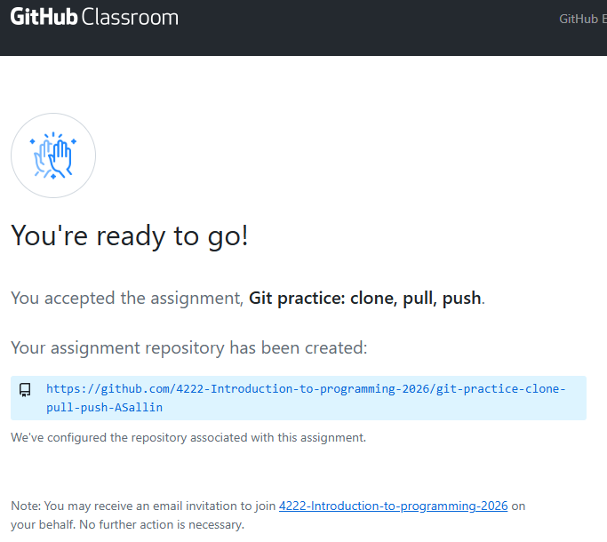

## To do before the exercise session:

1. Create a Github account if you don't have one already.
2. Authenticate GitHub by following the instructions in the class slides.


## Exercise 1: Cloning a repository: course repo

1. Navigate to your course directory [Introduction_to_programming]{.path} using the terminal. Remember our course structure:
```
Introduction_to_programming/
├── github_course_materials/ # is empty for now, you will clone the git repo in week 3
├── exercises/               # Student's own work
│   ├── week_01/
│   ├── week_02/
│   ├── ...
│   ├── week_12/
├── group_project/
│   ├── ...
```
2. Clone the course repo in your working directory [Introduction_to_programming]{.path}. The address of the repo is [https://github.com/ASallin/BECON_4222_Introduction_Programming](https://github.com/ASallin/BECON_4222_Introduction_Programming).
3. Explore the repo briefly using `git status` and call for the `log` to see the history of commits.

::: {.callout-tip collapse="true" title="Solution"}
See class slides. Go on the repo and click on **<>Code**. Copy the https-address of the repo.


Then test that you are in the right directory and clone the repo using the following command:

```bash
pwd
git clone https://github.com/ASallin/BECON_4222_Introduction_Programming.git
```

You should observe something like this:

```sh
git clone https://github.com/ASallin/BECON_4222_Introduction_Programming.git
/c/Users/aurel/OneDrive/Documents/Introduction_to_programming
Cloning into 'BECON_4222_Introduction_Programming'...
remote: Enumerating objects: 1070, done.
remote: Counting objects: 100% (36/36), done.
remote: Compressing objects: 100% (24/24), done.
remote: Total 1070 (delta 11), reused 22 (delta 6), pack-reused 1034 (from 1)
Receiving objects: 100% (1070/1070), 120.89 MiB | 27.81 MiB/s, done.
Resolving deltas: 100% (426/426), done.
Updating files: 100% (350/350), done.
```

Navigate to the repo and check the status and log. Use `--oneline` to have a more compact log... if you don't want to see the full commit messages back to the Ancient Roman times.

```bash
cd BECON_4222_Introduction_Programming
git status
git log --oneline
```

Use Git Graph to visualize the history of commits. You should see the different branches from our contributors.

Finally, the directory should now look like this:
```
Introduction_to_programming/
├── github_course_materials/ # is empty for now, you will clone the git repo in week 3
├── BECON_4222_Introduction_Programming/ # GitHub repo with all course materials
├── exercises/               # Student's own work
│   ├── week_01/
│   ├── week_02/
│   ├── ...
│   ├── week_12/
├── group_project/
│   ├── ...
```

You can remove the directory [github_course_materials]{.path} if you want, since the repo is now in [BECON_4222_Introduction_Programming]{.path}. Do it in VSCode or in the terminal with `rm -r github_course_materials` (be careful with this command, it deletes the directory and all its content without asking for confirmation).
:::


<!------------------------------------------------
--------------------------------------------------
--------------------------------------------------
------------------------------------------------->


<div style="margin-top: 8em;"></div>


## Exercise 2: ## Authenticating with GitHub 🗝️

**Try to execute these steps before the exercise session. If you have any problem, we will try to solve it together during the session (if time permits)**

When you connect to a GitHub repository, GitHub needs to verify who you are using a username and password. Since August 2021 stronger authentication is required, and there are several secure methods available.

- We'll use **SSH keys**: you keep a private key on your computer and upload the matching public key to GitHub; when they match correctly, GitHub grants access.
- Using SSH keys is more secure than passwords, avoids repeated credential prompts, and is a common, portable method for authenticating to remote services.

### Instructions

- Please go to this [website from LMU Munich](https://lmu-osc.github.io/Introduction-RStudio-Git-GitHub/SSH.html) and follow the steps to authenticate with GitHub.<br>*Credits*: Open Science Center at LMU Munich (Mike Croucher & Malika Ihle)


### Test your connection

Test your connection using the following code.

```bash
ssh -T git@github.com
> Hi ASallin! You've successfully authenticated, but GitHub does not provide shell access.
```


<!------------------------------------------------
--------------------------------------------------
--------------------------------------------------
------------------------------------------------->


<div style="margin-top: 8em;"></div>


## Exercise 2: Cloning a repository on GitHub Classroom

For this exercise, we've prepared a **GitHub Classroom**. A GitHub Classroom is a special type of repository created for a class, where each student gets their own copy to complete and submit assignments. It simulates real repositories on GitHub, and works like a normal GitHub repository. We will use it for the group project.

### Connect to the repo
With the following link https://classroom.github.com/a/Gq3_1PtS, accept the invitaton to connect. Once you've accepted the invitation, you should see a link to a repository:




And click on the link to the repository.

### Clone
1. Clone the repository using either HTTPS or SSH in the directory [Introduction_to_programming/exercises/week03]{.path}. If needed, create the directory:

```
Introduction_to_programming/
├── BECON_4222_Introduction_Programming/ # GitHub repo with all course materials
├── exercises/               # Student's own work
│   ├── week_01/
│   ├── week_02/
│   ├── week_03/ # <- here!
│   ├── ...
│   ├── week_12/
├── group_project/
│   ├── ...
```

::: {.callout-tip collapse="true" title="Solution"}
Solution:

```bash
cd exercises
mkdir week_03
cd week_03
git clone https://github.com/<org>/<your_repo>.git
cd <your_repo>
git status
```

You should see something like this (with your name):
```sh
$ ls
git-practice-clone-pull-push-ASallin/
```
:::

2. Check that your repo has been downloaded using `git status`. Observe the content of the remote repository.

::: {.callout-tip collapse="true" title="Solution"}
The `git status` should show:
```sh
On branch main
Your branch is up to date with 'origin/main'.

nothing to commit, working tree clean
```

The repository contains a python file and a README.md file.
:::


### Pushing and pulling

3. Open `some_arithmetic.py`. Edit the equation in line 6 to define `a` with your favorite expression. Then push your changes to remote.

::: {.callout-tip collapse="true" title="Solution"}

Personally, I changed the line to
```
a = 6 * 6
```

Then add, commit and push your changes to remote:
```bash
git status
git add some_arithmetic.py
git commit -m "Fill in exercise"
git push
```
:::


### Check changes in remote

4. After your first push, do nothing for a moment. Something changes on GitHub (your colleague pushed a change). GitHub will automatically add a new line to `some_arithmetic.py`. In this simulated situation, your local files are unchanged but the the remote repository is ahead. After 1 minute, pull again. You should notice the change. Look at git status to follow the difference.

::: {.callout-tip collapse="true" title="Solution"}
```bash
git pull
git status
```

The pull should show something like this:
```sh
remote: Enumerating objects: 5, done.
remote: Counting objects: 100% (5/5), done.
remote: Compressing objects: 100% (1/1), done.
remote: Total 3 (delta 2), reused 3 (delta 2), pack-reused 0 (from 0)
Unpacking objects: 100% (3/3), 390 bytes | 32.00 KiB/s, done.
From https://github.com/4222-Introduction-to-programming-2026/git-practice-clone-pull-push-ASallin
   0b58290..7fe4aac  main       -> origin/main
Updating 0b58290..7fe4aac
Fast-forward
 some_arithmetic.py | 5 +++++
 1 file changed, 5 insertions(+)
```

A test has been added to the file. Now you should have an `some_arithmetic.py` file that looks like this:

```{python}
# | eval : false
"""
Some Arithmetic
==========================
"""

a = 6 * 6
b = 14 * 3
c = sum([40, 2])

# Print the results

print("Result for a:", a)
print("Result for b:", b)
print("Result for c:", c)

# Test

if a == b == c:
    print("All values are equal to 42!")
```

Everything is synchronized. Git would send you the following message: "Your branch is up to date with 'origin/main'. Nothing to commit, working tree clean".
:::

5. Check if you pass the test on python (you don't need to execute the code, just looking at it). Since you now know how to pass the test, change your definition of `a` in `some_arithmetic.py` and push your changes. Observe your commit tree.

::: {.callout-tip collapse="true" title="Solution"}
```bash
git add some_arithmetic.py
git commit -m "Change the answer to 42"
git push
```
:::

6. Let's simulate another situation in which your local version conflicts with the remote version. Change the definition of `b` in the file `some_arithmetic.py` with another number:

```{python}
# | eval : false
"""
Some Arithmetic
==========================
"""

a = 5 * 8 + 2
b = 15 * 3
c = sum([40, 2])

# Print the results

print("Result for a:", a)
print("Result for b:", b)
print("Result for c:", c)

# Test

if a == b == c:
    print("All values are equal to 42!")
```

Then add and commit locally, but do not push.

```bash
git add some_arithmetic.py
git commit -m "Change the answer of b to 45"
```

### Reflection

Before running any code, reflect on the situation you are in. What is happening? What could have happened? Use `git status` to understand what is happening.

Solution: the danger is that at this moment, it could be that my colleagues have pushed conflicting changes to the repo.

### Action

Now pull the remote repo again. You should see a conflict: "CONFLICT (content): Merge conflict in `theMeaningOfEverything.py`" Explain why. How do you solve the conflict?

```bash
<<<<<<< HEAD
I agree.
=======
you are now closer to the TRUTH
>>>>>>> f4b343b02f6bfc29d7fe78f2551a6ba90e2b172d
```

The conflict must be solved. In this case, you can easily choose between the two lines. In longer code, this requires going through each line. For this exercise, please choose "Accept both changes", and have the following file:

```
Step 1:
Aurelien.

Step 2:
Complete the following sentence: “The answer to everything is 42.”

The answer is close to 42 🤖

I agree.
you are now closer to the TRUTH
```


## Branching and a first merge conflict

### Create a new branch

Create and switch to a new branch called `answer-42`. Check where you are.

Solution:
```bash
git checkout -b answer-42
git branch
```

You should see `answer-42` marked with *.


### Changes on the branch

Open ``theMeaningOfEverything.py``. Find the sentence: "The answer is close to 42 🤖". Replace it with "The answer is equal to 42 🤖".

Save the file and commit with a meaningful commit message.

Solution:
```bash
git add `theMeaningOfEverything.py`
git commit -m "Answer the ultimate question"
```


### Push the branch

Push the branch to GitHub. Open the repository on GitHub. You should now see two branches.

Solution:
```bash
git push -u origin answer-42
```

You can now continue to push on your branch. You notice that the text file on exercise contains the merged conflicts. In some way, you are ahead of main with your branch: "This branch is 1 commit ahead of main".


### Conflicting change (more advanced)
Now merge both branches, from `answer-42` into main.

```
git checkout main
git merge answer-42
git status
```

Notice the message: On branch main- Your branch and 'origin/main' have diverged, and have 2 and 1 different commits each, respectively. (use "git pull" if you want to integrate the remote branch with yours).

If you try to push, you'll receive the following message:

```
hint: Updates were rejected because the tip of your current branch is behind
hint: its remote counterpart. If you want to integrate the remote changes,
hint: use 'git pull' before pushing again.
hint: See the 'Note about fast-forwards' in 'git push --help' for details.
```

#### Reflection: what has happened?

#### Action

As suggested, pull remote main. Now you'll have a conflict to solve (The answer is equal to 42 🤖 <-> The answer is close to 42 🤖). Solve the conflict by chosing "The answer is equal to 42 🤖" and push to remote.


## Bonus Adding your own repository to Github

1. Create a new repository on GitHub with the name `git-intro-example`
    - Make sure NOT to add a README or any other file when creating it
2. Create an empty dir in your week_03 folder.
2. Ad the just created GitHub repo as a remote
    - `git remote add origin <URL>`
3. Push you changes so far to GitHub
   - `git push -u origin main`

