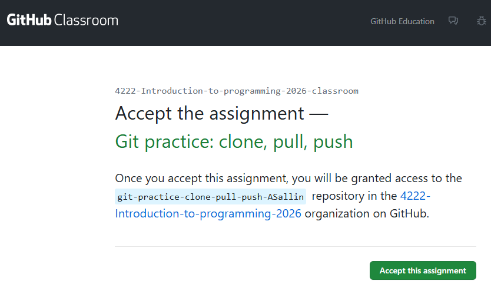
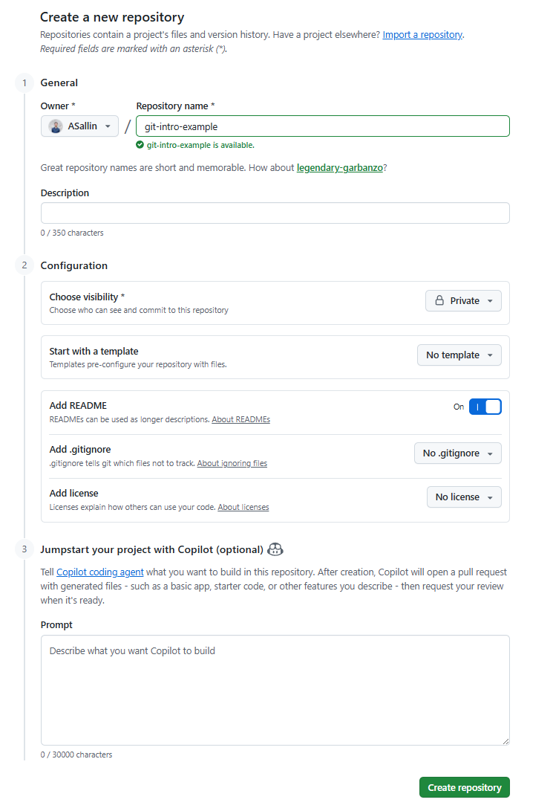
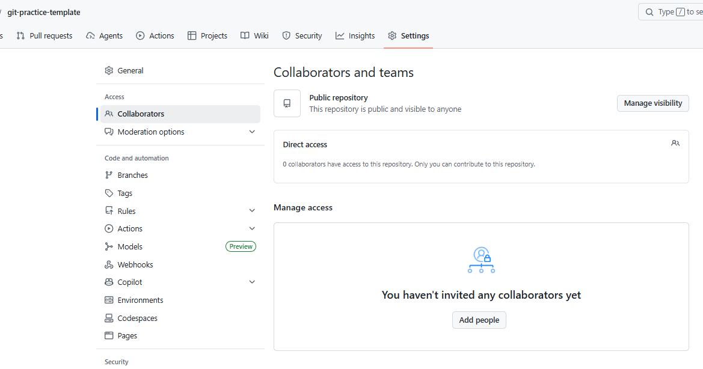
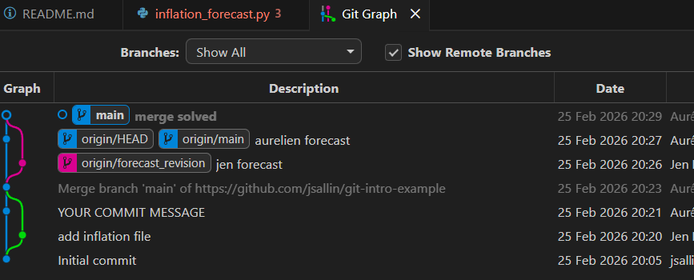

## To do before the exercise session:

[Create a Github account](https://docs.github.com/en/get-started/start-your-journey/creating-an-account-on-github) if you don't have one already. Preferably, use the email address you've used to set up your git config.


## Exercise 1: Authenticating with GitHub 🗝️

**Try to execute these steps before the exercise session. If you have any problem, we will try to solve it together during the session (if time permits)**

When you connect to a GitHub repository, GitHub needs to verify who you are using a username and password. Since August 2021 stronger authentication is required, and there are several secure methods available.

- We'll use **SSH keys**: <!--- @Aurelien: do students know what a SSH key is or should we inlcude a brief explanation on that topic? ---> you keep a private key on your computer and upload the matching public key to GitHub; when they match correctly, GitHub grants access.
- Using SSH keys is more secure than passwords, avoids repeated credential prompts, and is a common, portable method for authenticating to remote services.

### Instructions

- Please go to this [website from LMU Munich](https://lmu-osc.github.io/Introduction-RStudio-Git-GitHub/SSH.html) and follow the steps to authenticate with GitHub.<br>*Credits*: Open Science Center at LMU Munich (Mike Croucher & Malika Ihle)


### Test your connection

Test your connection using the following code.

```bash
ssh -T git@github.com
> Hi ASallin! You've successfully authenticated, but GitHub does not provide shell access.
```


<!------------------------------------------------
--------------------------------------------------
--------------------------------------------------
------------------------------------------------->


<div style="margin-top: 8em;"></div>


## Exercise 2: Cloning a repository: course repo

1. Navigate to your course directory [Introduction_to_programming]{.path} using the terminal. Remember our course structure:
```
Introduction_to_programming/
├── github_course_materials/ # is empty for now, you will clone the git repo in week 3
├── exercises/               # Student's own work
│   ├── week_01/
│   ├── week_02/
│   ├── ...
│   ├── week_12/
├── group_project/
│   ├── ...
```
2. Clone the course repo in your working directory [Introduction_to_programming]{.path}. The address of the repo is [https://github.com/ASallin/BECON_4222_Introduction_Programming](https://github.com/ASallin/BECON_4222_Introduction_Programming). <!--- @Aurelien: do you want students to see all previous commits and all the included folders? I would setup a "mock" project with fewer folders and content and a very simple structure. E.g. one folder called "Code", one "Figures" and one "Papers" or something similar. I am writing this because I am uncertain about the purpose of this action. Students get the material via Canvas/Studynet - so why would they need tho see our work? --->
3. Explore the repo briefly using `git status` and call for the `log` to see the history of commits.

::: {.callout-tip collapse="true" title="Solution"}
See class slides. Go on the repo and click on **<>Code**. Copy the https-address of the repo.

. If you clone a repository for the first time, GitHub will prompt you to authenticate with your GitHub account. Follow the instructions to complete the authentication process on your browser.

Then test that you are in the right directory and clone the repo using the following command:

```bash
pwd
git clone https://github.com/ASallin/BECON_4222_Introduction_Programming.git
```

You should observe something like this:

```sh
git clone https://github.com/ASallin/BECON_4222_Introduction_Programming.git
/c/Users/aurel/OneDrive/Documents/Introduction_to_programming
Cloning into 'BECON_4222_Introduction_Programming'...
remote: Enumerating objects: 1070, done.
remote: Counting objects: 100% (36/36), done.
remote: Compressing objects: 100% (24/24), done.
remote: Total 1070 (delta 11), reused 22 (delta 6), pack-reused 1034 (from 1)
Receiving objects: 100% (1070/1070), 120.89 MiB | 27.81 MiB/s, done.
Resolving deltas: 100% (426/426), done.
Updating files: 100% (350/350), done.
```

Navigate to the repo and check the status and log. Use `--oneline` to have a more compact log... if you don't want to see the full commit messages back to the Ancient Roman times.

```bash
cd BECON_4222_Introduction_Programming
git status
git log --oneline
```

Use Git Graph in VS Code to visualize the history of commits. You should see the different branches from our contributors.

Finally, the directory should now look like this:
```
Introduction_to_programming/
├── github_course_materials/ # is empty for now, you will clone the git repo in week 3
├── BECON_4222_Introduction_Programming/ # GitHub repo with all course materials
├── exercises/               # Student's own work
│   ├── week_01/
│   ├── week_02/
│   ├── ...
│   ├── week_12/
├── group_project/
│   ├── ...
```

You can remove the directory [github_course_materials]{.path} if you want, since the repo is now in [BECON_4222_Introduction_Programming]{.path}. Do it in VSCode or in the terminal with `rm -r github_course_materials` (be careful with this command, it deletes the directory and all its content without asking for confirmation).
:::


<!------------------------------------------------
--------------------------------------------------
--------------------------------------------------
------------------------------------------------->


<div style="margin-top: 8em;"></div>


## Exercise 3: GitHub Classroom - your first push and pulls

For this exercise, we've prepared a **GitHub Classroom**. A GitHub Classroom is a special type of repository created for a classroom, where each student gets their own copy to complete and submit assignments. It simulates real repositories on GitHub, and works like a normal GitHub repository. We will use it for the group project.


### Accept invitation and clone

**1. Accept the classroom invitation**

Visit the invitation link: [https://classroom.github.com/a/xqcl3xcb](https://classroom.github.com/a/xqcl3xcb)

After accepting, you'll see a link to your personal repository. Click on it. **If it says something like "repository access issues you nos longer have access to your assignment repository contact your teacher for support", please open your email address and click on the link in the email to accept the invitation. If you don't see an email, check your spam folder. If you still don't see it, please contact us.**




2. Clone the repository in [Introduction_to_programming/exercises/week_03]{.path}. Create the directory if needed:

```bash
cd exercises
mkdir week_03
cd week_03
git clone https://github.com/<org>/<your-repo-name>.git
cd <your-repo-name>
```

3. Check the initial state of the repo using `git status`. You should see a text file `trivia.txt` and a README file when printing the folder's contents via `ls`.

::: {.callout-tip collapse="true" title="Solution"}
```bash
git status
ls
```

```sh
On branch main
Your branch is up to date with 'origin/main'.

nothing to commit, working tree clean
```

The file contains a simple trivia game:

```bash
Learning Remotes in Git
================================

Answer Questions A, B, and C below, then push your answers.

...
```

:::

4. Answer the questions in the text file (give your best guess...), save, commit and push your changes to GitHub.

::: {.callout-tip collapse="true" title="Solution"}
```bash
git status
git add trivia.txt
git commit -m "Add answers to trivia questions"
git push
```

The push should give you output like this:
```sh
Enumerating objects: 5, done.
Counting objects: 100% (5/5), done.
Delta compression using up to 16 threads
Compressing objects: 100% (3/3), done.
Writing objects: 100% (3/3), 328 bytes | 328.00 KiB/s, done.
Total 3 (delta 2), reused 0 (delta 0), pack-reused 0
remote: Resolving deltas: 100% (2/2), completed with 2 local objects.
To https://github.com/4222-Introduction-to-programming-2026/git-practice-clone-pull-push-ASallin.git
   2954ce9..989ec79  main -> main
```
:::

6. Wait about 30-60 seconds before pulling the changes again 🥁🥁🥁. (A GitHub Action will run automatically and add the answers to your file. This simulates a colleague pushing changes while you work. It won't be triggered if you don't answer.)

::: {.callout-tip collapse="true" title="Solution"}
```bash
git pull
```

You should see output like:
```sh
remote: Enumerating objects: 5, done.
remote: Counting objects: 100% (5/5), done.
remote: Compressing objects: 100% (2/2), done.
remote: Total 3 (delta 1), reused 3 (delta 1), pack-reused 0 (from 0)
Unpacking objects: 100% (3/3), 668 bytes | 60.00 KiB/s, done.
From https://github.com/4222-Introduction-to-programming-2026/git-practice-clone-pull-push-ASallin
   b8a0f6d..ff186cd  main       -> origin/main
Updating b8a0f6d..ff186cd
Fast-forward
 trivia.txt | 20 ++++++++++++++++++++
 1 file changed, 20 insertions(+)
```
:::

7. Check what changed in the file `trivia.txt`. You should see that the answers to the questions have been added by the automation. Did you get the weight of the OLMA-sausage right?

::: {.callout-tip collapse="true" title="Solution"}
```bash
cat trivia.txt
```
:::


<!------------------------------------------------
--------------------------------------------------
--------------------------------------------------
------------------------------------------------->


<div style="margin-top: 8em;"></div>

## Exercise 4: Economists Always Disagree

Economists are famous for disagreeing on everything, especially when it comes to macroeconomists and forecasts... Let's see how this can lead to conflicts in GitHub.

**Create groups of 2 students and work together. Each student shows what they are doing to their colleague.**

<!--- @Aurelien: I removed the numbered lists - the indentation was off and didn't look nice. --->

**Student 1**: Create a new repository on GitHub with the name `git-intro-example`. Create a README file as asked by Github. Notice the other options when creating a repository, such as adding a .gitignore file or a license. You can ignore these for now.

In the settings of the repository, make sure to add your colleagues as collaborators, so that they can access the repository and push changes.

::: {.callout-tip collapse="true" title="Solution"}



To add collaborators, go to the repository, click on "Settings" (the gear icon), then click on "Collaborators" in the left sidebar. Click on "Add people", search for your colleague's GitHub username, and click "Add" to give them access to the repository.

The person added will receive an email with the invitation. Click on the link "Accept the invitation". If you don't see an email, check your spam folder.
:::

**All students**: Clone the repository in your local directory [Introduction_to_programming/exercises/week_03]{.path}.

::: {.callout-tip collapse="true" title="Solution"}
```bash
cd week_03
git clone <URL>
cd git-intro-example
git status
```
:::

**Student 1**: Create a new file called `inflation_forecast.py` in the repository and add the following code:

```python
def forecast_inflation():
    return "Inflation will be 2% next year in Switzerland."

# Run the function and print the result
result = forecast_inflation()
print(result)
```

Then add and commit your changes. Finally push your changes.

::: {.callout-tip collapse="true" title="Solution"}
```bash
git add inflation_forecast.py
git commit -m "YOUR COMMIT MESSAGE"
git status
git push
```
:::

**Student 2**: change the README file and add the following line: "This repository contains a simple inflation forecasting model" and the title "## Inflation Forecasting".

```
## Inflation Forecasting
This repository contains a simple inflation forecasting model.
```
Then add and commit. Now try to push and observe what happens. Do you get an error message? Why? Explain what is happening. Then proceed to push.

::: {.callout-tip collapse="true" title="Solution"}
Open the README file in VSCode, add the following lines and save. Then

```bash
git add README.md
git commit -m "YOUR COMMIT MESSAGE"
git status
git push
```

You should get an error message prompting you to pull the changes before pushing.

```bash
On branch main
Your branch is ahead of 'origin/main' by 1 commit.
  (use "git push" to publish your local commits)

nothing to commit, working tree clean
hint: have locally. This is usually caused by another repository pushing to
hint: the same ref. If you want to integrate the remote changes, use
hint: 'git pull' before pushing again.
hint: See the 'Note about fast-forwards' in 'git push --help' for details.

```

```bash
git pull
git push
```
:::

**Student 1**: pull the changes. All students: observe the commit history and the files changed.

::: {.callout-tip collapse="true" title="Solution"}
```bash
git pull
```
:::

Now, let's simulate a real-life economist situation:

**Student 1**: create a new branch called `forecast_revision`. Switch to the branch and change the function in the python file with your own forecast (do not show it to your colleague). Commit and push. Notice that Git might ask you to add arguments to `git push`, such as `-u origin forecast_revision`.

**Student 2**: remain on main, change the inflation forecast in the python file, stage, commit, and push.

::: {.callout-tip collapse="true" title="Solution"}
**Student 1**:

```bash
git switch -c forecast_revision
# Edit inflation_forecast.py - change the forecast
git add inflation_forecast.py
git commit -m "YOUR COMMIT MESSAGE"
git push
git status
```

When you try to push, you should get an error message like this:

```sh
fatal: The current branch forecast_revision has no upstream branch.
To push the current branch and set the remote as upstream, use

    git push --set-upstream origin forecast_revision

To have this happen automatically for branches without a tracking
upstream, see 'push.autoSetupRemote' in 'git help config'.
```

You have to push using

```bash
git push --set-upstream origin forecast_revision
```

because the branch `forecast_revision` does not exist on GitHub yet. This command will create the branch on GitHub and set it as the upstream branch for your local branch.
:::

Now, both students pull the changes from GitHub. You have to find an agreement on the forecast and merge the two branches. To proceed: decide on a common forecast, solve the merge conflict, and push the changes to GitHub. Observe the commit history and the files changed.

::: {.callout-tip collapse="true" title="Solution"}
Either student can pull the changes and solve the conflict. For example, if student 1 pulls the changes, they will have to merge the main branch into their current branch "forecast_revision". If student 2 pulls the changes, they will have to merge the "forecast_revision" branch into main.

Student 1 (who is on the branch "forecast_revision"):

```bash
git pull
git switch main
git pull
git merge forecast_revision
```

Or student 2 (who is on the branch "main"):
```bash
git pull
git merge forecast_revision
```

Then, solve the conflict in the file `inflation_forecast.py` and push the changes to GitHub.

You should see something like this in your Git Graph (WARNING: in the picture below, you'll find the WORST commit messages you could think of. DO NOT REPEAT THIS.)



:::

Now, in the rare case where both students agreed on the forecast, what would have happened? Would there have been a conflict? Why?

<!------------------------------------------------
--------------------------------------------------
--------------------------------------------------
------------------------------------------------->


<div style="margin-top: 8em;"></div>


## Bonus: Adding your own repository to GitHub

If you finish early, practice creating a repository from scratch.

1. Create a new repository on GitHub with the name `git-intro-addrepo`
   - Make sure NOT to add a README or any other file when creating it
2. Create a local Git repository in your week_03 folder
3. Add the GitHub repo as a remote
   - `git remote add origin <URL>`
4. Push your changes to GitHub
   - `git push -u origin main`

